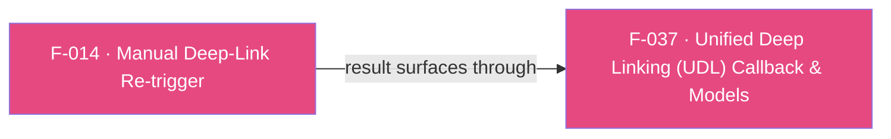

## Business Purpose
Apps that defer `start()` (SDK 7 session model) can miss deep-link resolution for a link that arrived from a non-standard source, or when the launch URL was captured before the SDK was ready. `performDeepLinking(url, ...)` lets the host app hand a specific URL (a full URL, a OneLink, or an Android intent-data string) to the native SDK on demand and route the resolved result to the registered `registerDeepLinkListener` callback. It works for both intent and non-intent sources (for example a URL pulled from Firebase Messaging), so a OneLink that the SDK's own lifecycle hooks did not resolve is still delivered to the app.

---

## Trigger
Awaited explicitly by the host app whenever it holds a URL it wants the SDK to resolve as a deep link — for example after extracting a link from a push payload handled outside the AppsFlyer flow, or when re-processing a launch URL after gating `start()` on consent or configuration. The app must already have called `registerDeepLinkListener(onDeepLink)`, otherwise the resolved result has nowhere to surface.

---

## Call Chain
This is a generic RPC call (no per-method channel handler). The Dart method name is `performDeepLinking` and it routes to a **different native RPC per platform**: Android uses `performDeepLinking`; iOS uses `performOnAppAttributionWithURL`. `shouldTriggerSession` is Android-only and is not sent on iOS.

```
AppsFlyerSdk.performDeepLinking(String url, {bool shouldTriggerSession = false})    [lib/src/appsflyer_sdk.dart]
  → Android: _invokeVoidRpc('performDeepLinking', {'url': url, 'shouldTriggerSession': shouldTriggerSession})
      → _invokeRpc → MethodChannel('af-api').invokeMethod('executeRpc', {method, params})
        → AppsflyerSdkPlugin.dispatchRpc → AppsFlyerRpcHandler
          → AppsFlyerLib.getInstance().performOnDeepLinking(...)
  → iOS: _invokeVoidRpc('performOnAppAttributionWithURL', {'url': url})   // shouldTriggerSession omitted
      → AppsflyerSdkPlugin.dispatchRpc → AppsFlyerRPCBridge
        → [[AppsFlyerLib shared] performOnAppAttributionWithURL:]
  → successful reply completes Future<void>
  → PlatformException is converted to AppsFlyerException
```
The resolved deep link surfaces asynchronously over the `af-events` EventChannel as a `_AppsFlyerEvent` (`onDeepLinking` on Android, `onDeepLinkReceived` on iOS), which `DeepLinkResult._fromEvent` maps and delivers to the registered `onDeepLink` callback (see F-037). The `Future` returned by this method only reports acceptance of the request, not the resolution outcome.

---

## Files
| File | Role |
|------|------|
| `lib/src/appsflyer_sdk.dart` | `performDeepLinking(String url, {bool shouldTriggerSession = false})` — platform-branching wrapper: Android sends the `performDeepLinking` RPC with `{url, shouldTriggerSession}`; iOS sends `performOnAppAttributionWithURL` with `{url}`. Returns `Future<void>`. |
| `lib/src/udl/deep_link_result.dart` | `DeepLinkResult._fromEvent` maps the resulting native event into `DeepLinkStatus` plus an optional `DeepLink` payload and `DeepLinkFailure` |
| `android/src/main/kotlin/com/appsflyer/appsflyersdk/AppsflyerSdkPlugin.kt` / `ios/appsflyer_sdk/Sources/appsflyer_sdk/AppsflyerSdkPlugin.swift` | No per-method handler — the generic `executeRpc` dispatch forwards the JSON envelope to the native RPC bridge |

---

## Input / Output
| | |
|--|--|
| **Input** | `url` (`String`, required) — full URL, OneLink, or Android intent-data string. `shouldTriggerSession` (`bool`, default `false`) — when `true`, Android also enqueues a Launch for re-engagement; the parameter is not included in the iOS RPC params. |
| **Output** | `Future<void>` completes after native RPC validation and the synchronous SDK invocation; it does not report the resolution result. Validation or bridge failures throw `AppsFlyerException`. Any resolved deep link is delivered asynchronously to the registered `onDeepLink` callback (F-037). |

---

## Tests
`test/appsflyer_sdk_test.dart` → `'maps deep-link, sharing, push, and uninstall APIs'` verifies both platform routes: the Android call dispatches `performDeepLinking` with `{'url': 'https://example.com/path', 'shouldTriggerSession': true}`, and the iOS call dispatches `performOnAppAttributionWithURL` with `{'url': 'https://example.com/path'}` only. `'normalizes Android and iOS deep-link status without hiding errors'` covers the `DeepLinkResult` mapping the resolved link travels through, and `'PlatformException becomes AppsFlyerException'` covers the shared error conversion.

---

## Known Limitations
- **`shouldTriggerSession` is Android-only**: the default is `false`, so a bare `performDeepLinking(url)` does not trigger a session. On iOS the parameter is dropped before the RPC is sent, because `performOnAppAttributionWithURL` has no session-trigger option.
- **Different native API per platform**: Android resolves via `performOnDeepLinking`; iOS via `performOnAppAttributionWithURL`. The Dart surface hides this, but the two native paths can differ in edge-case behavior.
- **The awaited `Future` says nothing about resolution**: it completes as soon as the native RPC accepts the request. A URL that resolves to nothing, or fails resolution, is reported only through the `onDeepLink` callback as `DeepLinkStatus.notFound` or `DeepLinkStatus.error`.

---

## Dependencies

