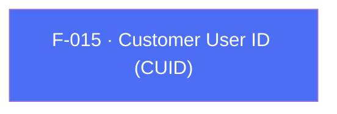

## Business Purpose
AppsFlyer generates its own device-scoped unique ID (`getAppsFlyerUID`), but businesses need to join AppsFlyer's attribution/reporting data against their own internal user records. `setCustomerUserId` registers the app's developer-defined ID alongside AppsFlyer's, so every report and postback can be cross-referenced against the app's user database. In SDK 7, await the CUID **before** `start()` to attribute the first session with it (the SDK-6 `setCustomerIdAndLogSession` / `waitForCustomerUserId` pair has been removed — see [`doc/migration-guide.md`](../../doc/migration-guide.md) and F-021).

---

## Trigger
The host app awaits `AppsFlyerSdk.instance.setCustomerUserId(id)` whenever it knows the user's internal identifier — typically right after login/signup, or before `start()` to gate the first session on the CUID.

---

## Call Chain
Generic RPC on both platforms.

```
AppsFlyerSdk.setCustomerUserId(customerId)                            [lib/src/appsflyer_sdk.dart]
  → _invokeVoidRpc('setCustomerUserId', {'customerId': customerId})
    → _invokeRpc → MethodChannel('af-api').invokeMethod('executeRpc', {method, params})
      → Android: AppsflyerSdkPlugin.dispatchRpc → AppsFlyerRpcHandler
        → AppsFlyerLib.setCustomerUserId(...)
      → iOS: AppsflyerSdkPlugin.dispatchRpc → AppsFlyerRPCBridge
        → [AppsFlyerLib shared] setCustomerUserID:
  → PlatformException is converted to AppsFlyerException
```

---

## Files
| File | Role |
|------|------|
| `lib/src/appsflyer_sdk.dart` | `setCustomerUserId(String customerId)` — dispatches the RPC with the `customerId` param |
| `android/src/main/kotlin/com/appsflyer/appsflyersdk/AppsflyerSdkPlugin.kt` | generic `setCustomerUserId` dispatch over `AppsFlyerRpcHandler` |
| `ios/appsflyer_sdk/Sources/appsflyer_sdk/AppsflyerSdkPlugin.swift` | generic `setCustomerUserId` dispatch over `AppsFlyerRPCBridge` |

---

## Input / Output
| | |
|--|--|
| **Input** | `customerId` (`String`) — the developer-defined customer user ID. Android RPC rejects an empty value; iOS RPC requires a string but does not reject an empty string. RPC param key `customerId`. |
| **Output** | `Future<void>` completes after native RPC validation and the synchronous SDK setter invocation. Validation or bridge failures throw `AppsFlyerException`; there is no native completion callback or request timeout. |

---

## Tests
`test/appsflyer_sdk_test.dart` — `maps cross-platform configuration and identity APIs` verifies that `setCustomerUserId` dispatches the `setCustomerUserId` RPC with the value under the `customerId` param.

---

## Known Limitations
- Dart performs no value validation. Android RPC rejects an empty string, while iOS RPC accepts one; neither bridge rejects whitespace-only values.
- To associate the first session with the CUID, await it before `start()`; there is no dedicated "set CUID and log session" API in SDK 7.

---

## Dependencies

