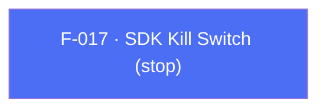

## Business Purpose
Some legal, privacy, or contractual situations (e.g. a "right to be forgotten," a regulator order, a licensing dispute) require the app to fully halt all AppsFlyer network activity immediately, for the whole SDK instance. `stop(true)` tells the native SDK to stop communicating with AppsFlyer's servers entirely, and is reversible with `stop(false)`. This is an "extreme case" API for legal/privacy compliance, distinct from the narrower per-user `anonymizeUser` (F-013). `isStopped()` reads the current state (Android only).

---

## Trigger
Called by the host app at any point — typically in response to a privacy/legal requirement (a remote "kill switch" flag, a consent-withdrawal flow, or compliance testing) — to start or stop all SDK network communication.

---

## Call Chain
Generic RPC on both platforms.

```
AppsflyerSdk.stop(isStopped)                                          [lib/src/appsflyer_sdk.dart]
  → _executeRpc('stop', {shouldStop: isStopped})
    → af-api "executeRpc" {method:'stop', params}
      → Android: dispatchRpc → AppsFlyerRpcHandler → AppsFlyerLib.stop(...)   [android/.../AppsflyerSdkPlugin.java]
      → iOS: dispatchRpc → AppsFlyerRPCBridge → [AppsFlyerLib shared] ...      [ios/.../AppsflyerSdkPlugin.m]

AppsflyerSdk.isStopped()   (Android only; returns null on iOS)
  → Platform.isAndroid ? _executeRpc<bool>('isStopped') : null
    → Android: dispatchRpc → AppsFlyerRpcHandler → AppsFlyerLib.isStopped()
```

---

## Files
| File | Role |
|------|------|
| `lib/src/appsflyer_sdk.dart` | `stop(bool)` (both platforms), `isStopped()` (Android-gated) |
| `android/src/main/java/com/appsflyer/appsflyersdk/AppsflyerSdkPlugin.java` | generic `stop` / `isStopped` dispatch over `AppsFlyerRpcHandler` |
| `ios/appsflyer_sdk/Sources/appsflyer_sdk/AppsflyerSdkPlugin.m` | generic `stop` dispatch over `AppsFlyerRPCBridge` |

---

## Input / Output
| | |
|--|--|
| **Input** | `stop`: `isStopped` (bool) — `true` halts all SDK network activity, `false` re-enables it. RPC param key `shouldStop`. `isStopped()`: none. |
| **Output** | `stop` → `void` (fire-and-forget). `isStopped()` → `Future<bool?>` on Android; **`null` on iOS**. |

---

## Tests
`test/appsflyer_sdk_test.dart` verifies that `stop(true)` dispatches the `stop` RPC with `shouldStop: true`, and that `isStopped()` is Android-only (returns `null` without dispatching on the test host).

---

## Known Limitations
- `isStopped()` is Android-only and resolves to `null` on iOS.
- Distinct from `anonymizeUser` (F-013): `stop` disables the entire SDK instance for all users/sessions, while `anonymizeUser` scopes an opt-out to the current user only.

---

## Dependencies

