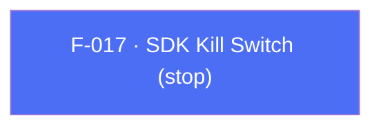

## Business Purpose
Some legal, privacy, or contractual situations (e.g. a "right to be forgotten," a regulator order, a licensing dispute) require the app to fully halt all AppsFlyer network activity immediately, for the whole SDK instance. `stop(true)` tells the native SDK to stop communicating with AppsFlyer's servers entirely, and is reversible with `stop(false)`. This is an "extreme case" API for legal/privacy compliance, distinct from the narrower per-user `anonymizeUser` (F-013). `isStopped()` reads the current state and is available only on Android.

---

## Trigger
The host app awaits `AppsFlyerSdk.instance.stop(...)` at any point — typically in response to a privacy/legal requirement such as a remote "kill switch" flag, a consent-withdrawal flow, or compliance testing — to halt or resume all SDK network communication.

---

## Call Chain
`stop` is an awaitable RPC setter on both platforms. `isStopped` is an awaitable Android-only getter guarded by an Android platform check.

```
AppsFlyerSdk.stop(shouldStop)                                         [lib/src/appsflyer_sdk.dart]
  → _invokeVoidRpc('stop', {'shouldStop': shouldStop})
    → _invokeRpc → MethodChannel('af-api').invokeMethod('executeRpc', {method, params})
      → Android: AppsflyerSdkPlugin.dispatchRpc → AppsFlyerRpcHandler
        → AppsFlyerLib.stop(...)
      → iOS: AppsflyerSdkPlugin.dispatchRpc → AppsFlyerRPCBridge
  → PlatformException is converted to AppsFlyerException

AppsFlyerSdk.isStopped()                                              [Android only]
  → not Android: log warning, return false (no RPC dispatched)
  → _invokeRpc<bool>('isStopped') ?? false
    → Android: dispatchRpc → AppsFlyerRpcHandler → AppsFlyerLib.isStopped()
```

---

## Files
| File | Role |
|------|------|
| `lib/src/appsflyer_sdk.dart` | `stop(bool shouldStop)` on both platforms; `isStopped()` guarded by an Android platform check |
| `android/src/main/kotlin/com/appsflyer/appsflyersdk/AppsflyerSdkPlugin.kt` | Forwards `stop` and `isStopped` through the Android RPC handler |
| `ios/appsflyer_sdk/Sources/appsflyer_sdk/AppsflyerSdkPlugin.swift` | Forwards `stop` through the iOS RPC bridge |

---

## Input / Output
| | |
|--|--|
| **Input** | `stop`: `shouldStop` (`bool`) — `true` halts all SDK network activity, `false` re-enables it. RPC param key `shouldStop`. `isStopped()`: no parameters. |
| **Output** | `stop` → `Future<void>` that completes after RPC validation and the synchronous native setter invocation; it has no completion callback or timeout. `isStopped()` → `Future<bool>`; a missing native value resolves to `false`, and calling it off Android logs a warning and returns `false` without dispatching an RPC. Bridge or validation failures surface as `AppsFlyerException`. |

---

## Tests
`test/appsflyer_sdk_test.dart` verifies in the cross-platform RPC mapping test that `stop(true)` dispatches RPC method `stop` with `{'shouldStop': true}`, and in the native-return-value test that `isStopped()` dispatches `isStopped` and returns the native `true`. `'platform-only value calls return a safe default off-platform'` asserts that `isStopped()` on iOS returns `false` without dispatching an RPC.

---

## Known Limitations
- `isStopped()` is Android-only. On iOS it logs a warning and returns `false` without dispatching an RPC, so the value cannot be distinguished from a genuine "not stopped" state.
- Distinct from `anonymizeUser` (F-013): `stop` disables the entire SDK instance for all users/sessions, while `anonymizeUser` scopes an opt-out to the current user only.
- `stop(false)` resumes SDK operation, but does not itself send a Launch. Normal per-foreground `start()` handling still applies after resumption.

---

## Dependencies

