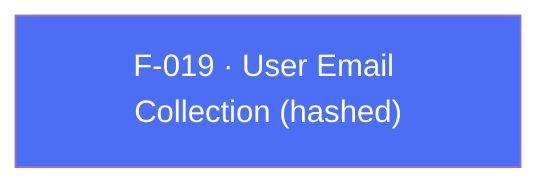

## Business Purpose
Some attribution and cross-device matching scenarios benefit from AppsFlyer knowing the user's email (e.g. matching web and app sessions for the same customer). Sending raw emails over the network is a privacy concern, so in SDK 7 the plugin exposes a single `setUserEmail(String)` and the native SDK hashes the value (SHA-256) internally before it leaves the device. The old SDK 6 `setUserEmails(List, cryptType)` variant — with its caller-selected encryption/crypt-type — has been **removed**; callers no longer choose a hashing mode. Without this API, integrators wanting to correlate identities by email would have no supported channel to hand that data to the native SDK.

---

## Trigger
Called by the host app once the user's email becomes known — typically right after login/signup, or whenever the app wants to (re)associate the current session with an email address.

---

## Call Chain
```
AppsflyerSdk.setUserEmail(email)                                       [lib/src/appsflyer_sdk.dart]
  → _executeRpc('setUserEmail', {'email': email})
    → MethodChannel "af-api".invokeMethod('executeRpc', {method:'setUserEmail', params:{email}})
      → Android: AppsflyerSdkPlugin.executeRpc → dispatchRpc → AppsFlyerRpcHandler   [android/.../AppsflyerSdkPlugin.java]
        → native SDK hashes the email (SHA-256) internally, then stores/forwards it
      → iOS: AppsflyerSdkPlugin executeRpc → AppsFlyerRPCBridge                       [ios/appsflyer_sdk/Sources/appsflyer_sdk/AppsflyerSdkPlugin.m]
        → native SDK hashes the email (SHA-256) internally, then stores/forwards it
```

---

## Files
| File | Role |
|------|------|
| `lib/src/appsflyer_sdk.dart` | `setUserEmail(String)` — dispatches the `setUserEmail` RPC |
| `android/src/main/java/com/appsflyer/appsflyersdk/AppsflyerSdkPlugin.java` | RPC bridge entry (`executeRpc`) routing `setUserEmail` to `AppsFlyerRpcHandler` |
| `ios/appsflyer_sdk/Sources/appsflyer_sdk/AppsflyerSdkPlugin.m` | RPC bridge entry (`executeRpc`) forwarding `setUserEmail` to `AppsFlyerRPCBridge` |

---

## Input / Output
| | |
|--|--|
| **Input** | `email` (`String`, required) — a single user email address. The SDK hashes it (SHA-256) internally; there is no caller-selectable crypt type. |
| **Output** | `void` — fire-and-forget; no confirmation returned to Dart. |

---

## Tests
`test/appsflyer_sdk_test.dart` — `check setUserEmail call` asserts the mocked `af-api` channel receives `executeRpc` with method `setUserEmail` and params `{'email': ...}`.

---

## Known Limitations
- Hashing is performed by the native SDK, not the plugin — the plugin passes the raw string across the channel, so it relies on the native SDK's SHA-256 implementation for the privacy guarantee.
- No corresponding getter exists to read back the email that was last set.

---

## Dependencies

