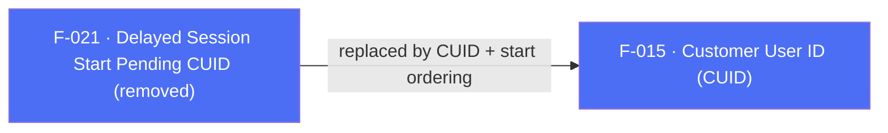

## Business Purpose
In SDK 6 the plugin exposed `waitForCustomerUserId(bool)` and `setCustomerIdAndLogSession(String)` so an app could hold the first session until it supplied a customer user ID after login.

> **Removed in SDK 7.** Both APIs no longer exist in the Flutter plugin. SDK 7 replaces this pattern with the app-driven session model: `init()` does not send a session, so the app simply awaits `setCustomerUserId()` **before** `start()` to guarantee a CUID-attributed first session. See [`doc/migration-guide.md`](/doc/migration-guide.md) and F-002 (SDK Start).

---

## Trigger
None. The APIs have been removed. To gate the first session on a CUID, defer `start()` — called from the `onSessionReady` stream listener registered with `registerSessionReadyListener()` — until after `setCustomerUserId()` has completed.

---

## Call Chain
There is no current call chain. Neither `waitForCustomerUserId` nor `setCustomerIdAndLogSession` exists in `lib/src/appsflyer_sdk.dart`, and neither is handled by the `executeRpc` dispatch on Android or iOS. The SDK 7 equivalent is call ordering:

```
AppsFlyerSdk.setCustomerUserId(id)   → RPC setCustomerUserId {customerId}   [F-015]
AppsFlyerSdk.start()                 → RPC start {awaitResponse: false}     [F-002]
  (await setCustomerUserId() first, then call start() from the onSessionReady listener)
```

---

## Files
| File | Role |
|------|------|
| — | No implementation remains. Removal is documented in [`doc/migration-guide.md`](/doc/migration-guide.md) and `CHANGELOG.md`. |

---

## Input / Output
| | |
|--|--|
| **Input** | Removed: `waitForCustomerUserId(bool)` / `setCustomerIdAndLogSession(String)` |
| **Output** | None. Use F-015 and F-002, which each return `Future<void>`. |

---

## Tests
No tests target the removed APIs. `test/appsflyer_sdk_test.dart` contains no references to `waitForCustomerUserId` or `setCustomerIdAndLogSession`; it separately verifies the current `setCustomerUserId` mapping and both `start()` values of `awaitResponse`, but does not run an end-to-end ordering test.

---

## Known Limitations
- The delayed-session guarantee is now expressed through call ordering (`await setCustomerUserId()` before `start()`), not a dedicated API.
- The removed APIs must not be restored or simulated in Dart, because the SDK 7 session model already lets the app decide when the first session is sent.

---

## Dependencies

