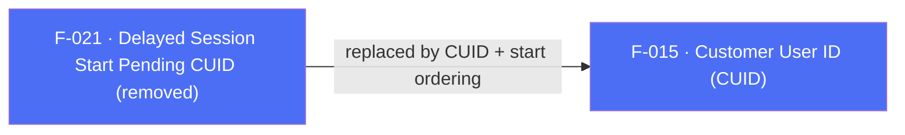

## Business Purpose
In SDK 6 the plugin exposed `waitForCustomerUserId(bool)` and `setCustomerIdAndLogSession(String)` so an app could hold the first session until it supplied a customer user ID after login.

> **Removed in SDK 7.** Both APIs no longer exist in the Flutter plugin. SDK 7 replaces this pattern with the app-driven session model: initialization no longer auto-starts, so the app simply calls `setCustomerUserId()` **before** `startSDK()` to guarantee a CUID-attributed first session. See [`doc/migration-guide.md`](/doc/migration-guide.md) and F-002 (SDK Start).

---

## Trigger
N/A — the APIs have been removed. To gate the first session on a CUID, defer `startSDK()` (called from `registerSessionReadyListener`) until after `setCustomerUserId()` has run.

---

## Call Chain
N/A — removed. Neither `waitForCustomerUserId` nor `setCustomerIdAndLogSession` exists in `lib/src/appsflyer_sdk.dart`, and neither is handled by the `executeRpc` dispatch on Android or iOS. The SDK 7 equivalent is:

```
AppsflyerSdk.setCustomerUserId(id)   → _executeRpc('setCustomerUserId', {customerId})  [F-015]
AppsflyerSdk.startSDK(...)           → _executeRpc('start', ...)                        [F-002]
  (call startSDK() after setCustomerUserId(), from registerSessionReadyListener)
```

---

## Files
| File | Role |
|------|------|
| — | No implementation remains. Removal is documented in [`doc/migration-guide.md`](/doc/migration-guide.md) and `CHANGELOG.md`. |

---

## Input / Output
| | |
|--|--|
| **Input** | N/A (removed) |
| **Output** | N/A (removed) |

---

## Tests
No tests — the APIs no longer exist. `test/appsflyer_sdk_test.dart` contains no references to `waitForCustomerUserId` / `setCustomerIdAndLogSession`.

---

## Known Limitations
- The delayed-session guarantee is now expressed through call ordering (`setCustomerUserId()` before `startSDK()`), not a dedicated API.

---

## Dependencies

