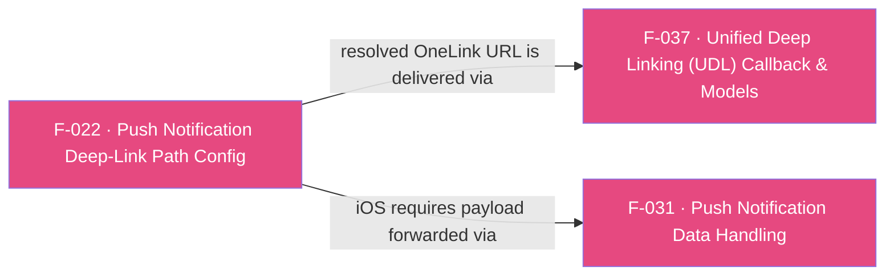

## Business Purpose
Push-notification re-engagement campaigns often embed a OneLink URL somewhere inside a custom, nested JSON payload rather than in a fixed top-level field — the exact location varies per app. `addPushNotificationDeepLinkPath` tells the native AppsFlyer SDK the JSON key-path where that OneLink URL lives, so the SDK can extract and resolve it as a deep link when the push payload is later handed to it. Without configuring this path, the SDK has no way to find the OneLink URL inside an arbitrarily-shaped push payload, and push-driven deep links silently fail to route users to the right in-app destination.

---

## Trigger
Awaited once by the host app during startup configuration, **before** `init()`. The dartdoc states this ordering requirement; nothing in the Flutter layer enforces it. Registering the path early puts it in place before any push payload is later delivered (see F-031).

---

## Call Chain
This is a generic RPC call (no per-method channel handler): the Dart wrapper sends `{method: 'addPushNotificationDeepLinkPath', params: {deepLinkPath: [...]}}` through the single `executeRpc` entry point (the list is **wrapped under the `deepLinkPath` map key**, not passed as the raw argument), and each platform's native RPC bridge parses it into a typed request and forwards it to the SDK.

```
AppsFlyerSdk.addPushNotificationDeepLinkPath(List<String> deepLinkPath)               [lib/src/appsflyer_sdk.dart]
  → _invokeVoidRpc('addPushNotificationDeepLinkPath', {'deepLinkPath': deepLinkPath})
    → _invokeRpc → MethodChannel('af-api').invokeMethod('executeRpc', {method, params})
      → Android: AppsflyerSdkPlugin.dispatchRpc → AppsFlyerRpcHandler
        → AddPushNotificationDeepLinkPathRequest(deepLinkPath)  // init: require(deepLinkPath.isNotEmpty())
        → AppsFlyerLib.getInstance().addPushNotificationDeepLinkPath(*deepLinkPath.toTypedArray())
      → iOS: AppsflyerSdkPlugin.dispatchRpc → AppsFlyerRPCBridge
        → AFRPCAddPushNotificationDeepLinkPathRequest(path)  // guard: [String] && !isEmpty else missingParameter
        → sdk.addPushNotificationDeepLinkPath(path)  ([AppsFlyerLib shared])
  → successful reply completes Future<void>
  → PlatformException is converted to AppsFlyerException
```
The configured path is later consulted when a push payload reaches the native SDK — on Android automatically from the launch/new-intent extras, and on iOS when the app forwards the payload with `handlePushNotification(pushPayload)` (see F-031). Any OneLink URL found at that path is resolved and delivered on the `onDeepLinkReceived` stream (F-037).

---

## Files
| File | Role |
|------|------|
| `lib/src/appsflyer_sdk.dart` | `addPushNotificationDeepLinkPath(List<String> deepLinkPath)` — awaitable passthrough that sends the generic RPC `addPushNotificationDeepLinkPath` with `{deepLinkPath}`; performs no Dart-side validation. Also hosts the two deliberately non-unified push entry points: Android-only `sendPushNotificationData(...)` and iOS-only `handlePushNotification(pushPayload)`. |
| `android/src/main/java/com/appsflyer/appsflyersdk/AppsflyerSdkPlugin.java` | Generic `executeRpc` dispatch — forwards the JSON envelope to the Android RPC handler |
| `ios/appsflyer_sdk/Sources/appsflyer_sdk/AppsflyerSdkPlugin.m` | Generic `executeRpc` dispatch — forwards the JSON envelope to the iOS RPC bridge |

---

## Input / Output
| | |
|--|--|
| **Input** | `deepLinkPath` (`List<String>`) — ordered JSON keys describing where in the push payload the OneLink URL is nested (for example `["deeply", "nested", "link"]`), sent wrapped under the `deepLinkPath` RPC params key. The native bridges require a non-empty list. |
| **Output** | `Future<void>` completes after native RPC validation and the synchronous SDK configuration call. An empty list or bridge failure throws `AppsFlyerException`; there is no native completion callback or request timeout. |

---

## Tests
`test/appsflyer_sdk_test.dart` → `'maps deep-link, sharing, push, and uninstall APIs'` verifies that `addPushNotificationDeepLinkPath(['data', 'link'])` dispatches RPC method `addPushNotificationDeepLinkPath` with params `{'deepLinkPath': ['data', 'link']}`, and covers the companion push APIs (`sendPushNotificationData` on Android, `handlePushNotification` on iOS). `'platform-only void calls are ignored without reaching the native RPC'` covers both push APIs on the wrong platform and asserts that no RPC is dispatched. Native contract enforcement (empty-list rejection, SDK forwarding) is covered by the native SDKs' own bridge tests.

---

## Known Limitations
- Must be called before `init()` per the public Dart contract; nothing in Dart or RPC enforces the ordering. The implementation does not expose enough state to prove what a late call affects, so it must not be treated as supported for the current launch.
- On Android this path config is sufficient on its own (the SDK auto-extracts from intent extras). On iOS it configures the path but does nothing until the payload is separately forwarded with `handlePushNotification(pushPayload)` (F-031) — an integrator who configures the path on iOS but skips that step will see push deep links silently fail to resolve.
- **The push forwarding APIs are deliberately not unified**: `sendPushNotificationData({campaign, pid, isRetargeting, additionalParameters})` is Android-only and `handlePushNotification(Map<String, dynamic> pushPayload)` is iOS-only, because the native parameter shapes have nothing in common. Calling either on the wrong platform is ignored with a logged warning and no RPC is dispatched, so a misplaced call is harmless but silent apart from the log line. Branching is not required for correctness, but because the two APIs take different inputs a cross-platform app will normally branch anyway.
- **Empty list fails at the native bridge, not in Dart**: both bridges reject an empty `deepLinkPath` (Android `require(deepLinkPath.isNotEmpty())`; iOS `guard [String] && !isEmpty else missingParameter`). Because the method is awaitable, that rejection now surfaces as `AppsFlyerException`, but only after a round trip — Dart does not pre-validate. iOS also conflates missing and empty into `missingParameter`, so the two platforms report the same mistake with different error text.

---

## Dependencies

