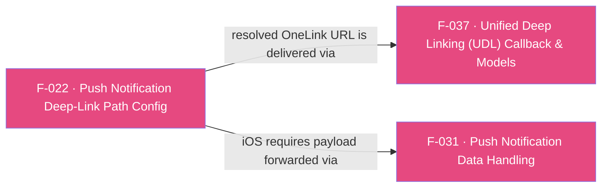

## Business Purpose
Push-notification re-engagement campaigns often embed a OneLink URL somewhere inside a custom, nested JSON payload rather than in a fixed top-level field — the exact location varies per app. `addPushNotificationDeepLinkPath` tells the native AppsFlyer SDK the JSON key-path where that OneLink URL lives, so the SDK can extract and resolve it as a deep link when the push payload is later handed to it. Without configuring this path, the SDK has no way to find the OneLink URL inside an arbitrarily-shaped push payload, and push-driven deep links silently fail to route users to the right in-app destination.

---

## Trigger
Called once by the host app during startup configuration, **before** `initSdk()`/`startSDK()` is invoked — per `doc/deep-linking.md`, calling it after SDK start is unsupported. This registers the path so it's in place before any push payload is later delivered (see F-031).

---

## Call Chain
Since the SDK 7 / RPC migration this is a generic RPC call (no per-method channel handler): the Dart wrapper sends `{method:'addPushNotificationDeepLinkPath', params:{deepLinkPath:[...]}}` through the single `executeRpc` entry point (the list is **wrapped under the `deepLinkPath` map key**, not passed as the raw argument), and each platform's native RPC bridge parses it into a typed request and forwards it to the SDK.
```
AppsflyerSdk.addPushNotificationDeepLinkPath(List<String> deeplinkPath)              [lib/src/appsflyer_sdk.dart]
  → _executeRpc('addPushNotificationDeepLinkPath', {'deepLinkPath': deeplinkPath})   // MethodChannel af-api → executeRpc
    → Android: AppsFlyerRpcHandler.execute(json)                                          [plugin_bridge/.../AppsFlyerRpcHandler.kt]
      → JsonRpcRequestParser → AddPushNotificationDeepLinkPathRequest(deepLinkPath)  // init: require(deepLinkPath.isNotEmpty())
      → AppsFlyerLib.getInstance().addPushNotificationDeepLinkPath(*deepLinkPath.toTypedArray())
      → RpcResponse.Success
    → iOS: AppsFlyerRPCBridge / AFRPCRequestHandler                                        [AppsFlyerRPC framework]
      → AFRPCParser → AFRPCAddPushNotificationDeepLinkPathRequest(path)  // guard: [String] && !isEmpty else missingParameter
      → AFRPCDeepLinkHandler → sdk.addPushNotificationDeepLinkPath(path)  ([AppsFlyerLib shared])
```
The configured path is later consulted when a push payload reaches the native SDK (Android: automatically, from the launch/new intent extras; iOS: when `sendPushNotificationData`/`handlePushNotification` is called — see F-031), and any OneLink URL found at that path is resolved and delivered through the UDL `onDeepLinking` callback (F-037).

---

## Files
| File | Role |
|------|------|
| `lib/src/appsflyer_sdk.dart` | `addPushNotificationDeepLinkPath(List<String> deeplinkPath)` — thin passthrough that sends the generic RPC `addPushNotificationDeepLinkPath` with `{deepLinkPath}`. Fire-and-forget (`void`); does not validate the list (see CR-038). |
| `android/.../plugin_bridge` (native SDK, not the Flutter plugin) | `AddPushNotificationDeepLinkPathRequest(deepLinkPath)` — `init { require(deepLinkPath.isNotEmpty()) }`; handler → `AppsFlyerLib.getInstance().addPushNotificationDeepLinkPath(*deepLinkPath.toTypedArray())` |
| `AppsFlyerRPC` framework (native iOS SDK, not the Flutter plugin) | `AFRPCAddPushNotificationDeepLinkPathRequest(path)` — guards `[String] && !isEmpty` else `missingParameter`; `AFRPCDeepLinkHandler` → `sdk.addPushNotificationDeepLinkPath(path)` |
| `android/.../AppsflyerSdkPlugin.java` / `ios/.../AppsflyerSdkPlugin.m` | No per-method handler — the generic `executeRpc` dispatch forwards the JSON envelope to the native RPC bridge above. |

---

## Input / Output
| | |
|--|--|
| **Input** | `deeplinkPath` (`List<String>`) — ordered JSON keys describing where in the push payload the OneLink URL is nested (e.g. `["deeply", "nested", "deep_link"]`), sent wrapped under the `deepLinkPath` RPC params key |
| **Output** | `void` — the Dart wrapper discards the `_executeRpc` Future (fire-and-forget). Native returns an RPC success/error, but Dart does not surface it (see CR-038). |

---

## Tests
`test/appsflyer_sdk_test.dart` → `'addPushNotificationDeepLinkPath maps to deepLinkPath'` verifies the Dart wrapper dispatches the `addPushNotificationDeepLinkPath` RPC with the `deepLinkPath` param. Native contract (empty-list rejection, SDK forwarding) is covered by the native SDK's own bridge tests (`RpcRequestValidationTest` / `AppsFlyerRPCParseNewMethodsTests`).

---

- Must be called before SDK init/start per documentation; nothing enforces or warns about ordering — calling it late is a silent no-op for that launch. The dartdoc now states the "before `initSdk`" requirement (CR-039).
- On Android this path config is sufficient on its own (the SDK auto-extracts from intent extras); on iOS it configures the path but does nothing until the payload is separately forwarded to the SDK via F-031's `sendPushNotificationData`/`handlePushNotification` — an integrator who configures the path on iOS but skips that step will see push deep links silently fail to resolve. The dartdoc now calls out the iOS `sendPushNotificationData` requirement (CR-039).
- **Empty list is rejected, but the Dart wrapper swallows it (CR-038)**: both bridges reject an empty `deepLinkPath` (Android `require(deepLinkPath.isNotEmpty())`; iOS `guard [String] && !isEmpty else missingParameter`). Because the Dart method is fire-and-forget `void` (CR-007 class), `addPushNotificationDeepLinkPath([])` surfaces only as a swallowed unhandled async error, and nothing is set. Dart does not pre-validate. (Note: iOS conflates missing + empty into `missingParameter`, whereas Android and the sibling list setters use distinct "cannot be empty"/`validationError` messages — an upstream cosmetic inconsistency, immaterial here since Dart swallows it.)

---

## Dependencies

