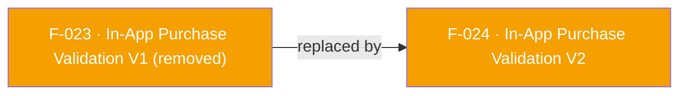

## Status: REMOVED in SDK 7

The legacy V1 in-app purchase validation APIs — `validateAndLogInAppAndroidPurchase` (Android) and `validateAndLogInAppIosPurchase` (iOS) — have been **removed from the Flutter plugin** in the SDK 7 migration. The underlying native V1 validation entry points (Google Play `publicKey`/`signature`/`purchaseData` triple; the iOS 6-parameter `validateAndLogInAppPurchase`) were removed from the native AppsFlyer SDK 7, so per the [API Removal Rule](/doc/migration-guide.md#api-removal-rule) the plugin does not keep or emulate them.

There is no fire-and-forget V1 method and no separate result listener (F-038) in the plugin anymore.

**Replacement:** use `validateAndLogInAppPurchaseV2(AFPurchaseDetails, {additionalParameters})` (F-024), a single cross-platform call that returns the validation result directly on its `Future`.

See [`doc/migration-guide.md`](/doc/migration-guide.md#removed-apis-and-their-replacements) and the [CHANGELOG](/CHANGELOG.md).

---

## Dependencies

