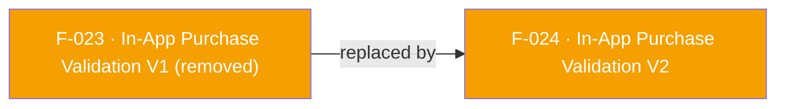

## Status: REMOVED in SDK 7

The legacy V1 in-app purchase validation APIs — `validateAndLogInAppAndroidPurchase` (Google Play `publicKey`/`signature`/`purchaseData` triple) and `validateAndLogInAppIosPurchase` (the iOS six-parameter form) — are **not part of the plugin's public API**. Neither symbol exists in `lib/`. The underlying native V1 validation entry points were removed from the native AppsFlyer SDK 7, so per the [API Removal Rule](/doc/migration-guide.md#api-removal-rule) the plugin does not keep or emulate them.

There is no separate V1 result listener either; the legacy notification-based callback is tombstoned as F-038.

**Replacement:** `validateAndLogInAppPurchase(AFPurchaseDetails purchase, {Map<String, String>? additionalParameters})` (F-024) — a single cross-platform call that returns the validation result directly on its `Future` and throws `AppsFlyerException` on failure when the native RPC reports it.

See [`doc/migration-guide.md`](/doc/migration-guide.md#removed-apis-and-their-replacements) and the [CHANGELOG](/CHANGELOG.md).

---

## Business Purpose
This entry is retained as a tombstone for the former platform-split V1 validation APIs. Server-side purchase validation itself is still supported — it moved to the single cross-platform entry point documented by F-024, which selects the Android or App Store contract from the supplied `AFPurchaseDetails` implementation instead of exposing one Dart method per store.

---

## Trigger
None. The V1 methods are not part of the current public API and are not reachable through either platform's RPC bridge.

---

## Call Chain
There is no current call chain. The replacement is documented by F-024:

```
AppsFlyerSdk.validateAndLogInAppPurchase(AFAndroidPurchaseDetails | AFIOSPurchaseDetails)
  → RPC validateAndLogInAppPurchase (platform-specific params)
```

---

## Files
| File | Role |
|------|------|
| `lib/src/appsflyer_sdk.dart` | Contains the active `validateAndLogInAppPurchase` API; no V1 method remains |
| `lib/src/af_purchase_details.dart` | `AFPurchaseDetails` with the `AFAndroidPurchaseDetails` / `AFIOSPurchaseDetails` implementations used by the replacement |
| `doc/migration-guide.md` | Documents both removed V1 methods and their replacement |

---

## Input / Output
| | |
|--|--|
| **Input** | Removed: the Android `publicKey`/`signature`/`purchaseData`/`price`/`currency` parameters and the iOS six-parameter form |
| **Output** | None. Use F-024, which returns `Future<Map<String, dynamic>>`. |

---

## Tests
No test references a V1 method. `test/appsflyer_sdk_test.dart` covers the replacement through `purchase validation sends the Android contract`, `purchase validation sends the iOS contract`, `purchase detail factories use the dedicated implementations`, and `purchase details reject the wrong platform`.

---

## Known Limitations
- Existing SDK 6 integrations must rewrite each store-specific call site to build an `AFAndroidPurchaseDetails` or `AFIOSPurchaseDetails` and await `validateAndLogInAppPurchase`.
- The removed methods must not be restored or simulated in Dart, because the native V1 validation entry points no longer exist to forward to.

---

## Dependencies

