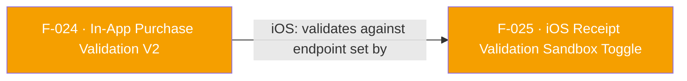

## Business Purpose
`validateAndLogInAppPurchaseV2` is the single cross-platform entry point for server-side purchase validation, built around the `AFPurchaseDetails` model, so app developers write one call site instead of branching on `Platform.isAndroid`/`Platform.isIOS`. It lets AppsFlyer verify purchase/subscription revenue against the store (Google Play or App Store) and returns the actual validation result (or throws a structured error) directly on the `Future`, so the app can react to a failed validation (e.g. refuse to unlock content) at the call site. It replaces the removed V1 APIs (F-023).

---

## Trigger
Called by the host app after it detects a completed purchase or subscription renewal from the platform store, whenever it wants an awaited validation result back from AppsFlyer.

---

## Call Chain
Routed through the generic RPC with `awaitResponse` so the native reply carries the validation result. The Dart layer shapes the params differently per platform, but both dispatch the same RPC method name, `validateAndLogInAppPurchase`.
```
AppsflyerSdk.validateAndLogInAppPurchaseV2(purchaseDetails, {additionalParameters})   [lib/src/appsflyer_sdk.dart]
  → iOS params:   {product:{productId}, transaction:{transactionId, purchaseType}, additionalParameters}
  → Android params: {...purchaseDetails.toMap(), additionalParameters, awaitResponse:true}
  → _executeRpc('validateAndLogInAppPurchase', params)                                 // MethodChannel af-api → executeRpc
    → Android: AppsflyerSdkPlugin.executeRpc → dispatchRpc('validateAndLogInAppPurchase', ...)  [android/.../AppsflyerSdkPlugin.java]
      → AppsFlyerRpcHandler.execute(json) → AppsFlyerLib.validateAndLogInAppPurchase(...)       [plugin_bridge module]
    → iOS: AppsflyerSdkPlugin.executeRpc → dispatchRpc:method:@"validateAndLogInAppPurchase"    [ios/.../AppsflyerSdkPlugin.m]
      → [AppsFlyerRPCBridge shared] executeJson:completion: → AFRPCRequestHandler → SDK
      → unwrapValueForMethod: returns the `data` map (or {}) for this method
```
On success the native reply resolves the `Future` with the validation-result map; on failure the reply throws a `PlatformException`.

---

## Files
| File | Role |
|------|------|
| `lib/src/appsflyer_sdk.dart` | `validateAndLogInAppPurchaseV2(AFPurchaseDetails, {Map<String,String>? additionalParameters})` → `Future<Map<String,dynamic>>`; builds platform-specific params and awaits the `validateAndLogInAppPurchase` RPC |
| `lib/src/af_purchase_details.dart` | `AFPurchaseDetails` model (`purchaseType`, `purchaseToken`, `productId`) and `AFPurchaseType` enum (`oneTimePurchase`, `subscription`); `toMap()` serializes `purchaseType` to `"one_time_purchase"` / `"subscription"` |
| `android/.../AppsflyerSdkPlugin.java` | No per-method handler — generic `executeRpc` → `dispatchRpc('validateAndLogInAppPurchase', ...)` |
| `ios/.../AppsflyerSdkPlugin.m` | No per-method handler; generic dispatch, with `unwrapValueForMethod:` returning the `data` map for `validateAndLogInAppPurchase` |

---

## Input / Output
| | |
|--|--|
| **Input** | `purchaseDetails` (`AFPurchaseDetails` — `purchaseType`, `purchaseToken`, `productId`); `additionalParameters` (`Map<String, String>?`, optional). On iOS, `purchaseToken` is sent as the transaction id and only one-time vs. subscription is distinguished |
| **Output** | `Future<Map<String, dynamic>>` — resolves with the native SDK's validation-result map on success (empty map if the native reply carries no data); on failure the platform channel throws a `PlatformException` |

---

## Tests
`test/appsflyer_sdk_test.dart` — `validateAndLogInAppPurchaseV2 returns the result map` registers a mock reply for the `validateAndLogInAppPurchase` RPC and asserts the awaited result map is returned.

---

## Known Limitations
- iOS silently defaults any non-`"subscription"` purchase type to a one-time purchase rather than validating and erroring, so a typo'd purchase type on iOS validates as the wrong type instead of failing loudly.
- The Dart field is named `purchaseToken` but is mapped onto the iOS transaction id — functionally correct, but a naming trap for anyone reading only one side of the bridge.
---

## Dependencies

