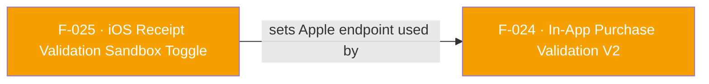

## Business Purpose
Apple's StoreKit sandbox (TestFlight / Xcode debug builds) issues receipts that Apple's production receipt-validation endpoint rejects, and vice versa. `useReceiptValidationSandbox` tells AppsFlyer's native iOS SDK which Apple endpoint to call when it later validates an in-app purchase (F-024 V2), so QA/TestFlight builds can validate sandbox receipts without those calls failing against the production endpoint. Without this toggle, developers testing purchase validation on non-production builds would see every validation call fail against Apple's servers, even though the purchase is legitimate in the sandbox.

The companion `useUninstallSandbox` toggles the equivalent sandbox/production environment for uninstall-measurement validation.

---

## Trigger
Called by the host app during setup/configuration (typically before or alongside SDK init), whenever it needs to toggle whether subsequent iOS purchase-validation calls (F-024) hit Apple's sandbox or production receipt-validation environment.

---

## Call Chain
Both toggles are generic, fire-and-forget RPC calls, guarded to iOS by `Platform.isIOS` on the Dart side.
```
AppsflyerSdk.useReceiptValidationSandbox(bool isSandboxEnabled)                        [lib/src/appsflyer_sdk.dart]
  → Platform.isIOS ? _executeRpc('setUseReceiptValidationSandbox', {'sandbox': isSandboxEnabled}) : no-op
    → iOS: AppsflyerSdkPlugin.executeRpc → dispatchRpc:method:@"setUseReceiptValidationSandbox"  [ios/.../AppsflyerSdkPlugin.m]
      → [AppsFlyerRPCBridge shared] executeJson:completion: → AFRPCRequestHandler → SDK

AppsflyerSdk.useUninstallSandbox(bool isSandboxEnabled)                                [lib/src/appsflyer_sdk.dart]
  → Platform.isIOS ? _executeRpc('setUseUninstallSandbox', {'sandbox': isSandboxEnabled}) : no-op
```

---

## Files
| File | Role |
|------|------|
| `lib/src/appsflyer_sdk.dart` | `useReceiptValidationSandbox(bool)` → RPC `setUseReceiptValidationSandbox` with `{sandbox}`; `useUninstallSandbox(bool)` → RPC `setUseUninstallSandbox` with `{sandbox}`. Both iOS-only (`Platform.isIOS` guard) |
| `ios/.../AppsflyerSdkPlugin.m` | No per-method handler — generic `executeRpc` → `dispatchRpc` forwards to `AppsFlyerRPCBridge` |

---

## Input / Output
| | |
|--|--|
| **Input** | `isSandboxEnabled` (`bool`), sent under the `sandbox` params key |
| **Output** | `void` — fire-and-forget. On Android the Dart method is a no-op (guarded out). The effect is a stateful flag on the native iOS SDK that changes the behavior of subsequent `validateAndLogInAppPurchase` (F-024) / uninstall-measurement calls |

---

## Tests
No dedicated test found for either toggle in `test/`.

---

## Known Limitations
- iOS-only: on Android both methods are Dart-side no-ops (guarded by `Platform.isIOS`).
- No automated or example-app coverage — a regression that stops forwarding the flag would not be caught by CI.

---

## Dependencies

