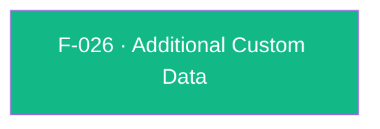

## Business Purpose
Some integrations need to enrich every outbound AppsFlyer SDK request with custom key/value context that doesn't fit any dedicated setter (e.g. app-specific segmentation flags, experiment identifiers, or partner-required metadata) — data that then flows into raw data / Pull-Push API exports alongside attribution and event data for downstream analysis. `setAdditionalData` gives the host app a generic escape hatch to attach arbitrary custom data to the SDK's requests. Without it, any custom context not covered by a named AppsFlyer API would have no way to travel with the SDK's payload.

---

## Trigger
Called by the host app whenever it needs to attach custom key/value context to subsequent AppsFlyer SDK requests — typically once at startup, but callable at any point.

---

## Call Chain
Since the SDK 7 / RPC migration this is a generic, fire-and-forget RPC call.
```
AppsflyerSdk.setAdditionalData(customData)                                          [lib/src/appsflyer_sdk.dart]
  → _executeRpc('setAdditionalData', {'customData': customData})                   // MethodChannel af-api → executeRpc
    → Android: AppsflyerSdkPlugin.executeRpc → dispatchRpc('setAdditionalData', ...) [android/.../AppsflyerSdkPlugin.java]
      → AppsFlyerRpcHandler.execute(json) → AppsFlyerLib.setAdditionalData(...)      [plugin_bridge module]
    → iOS: AppsflyerSdkPlugin.executeRpc → dispatchRpc:method:@"setAdditionalData"   [ios/.../AppsflyerSdkPlugin.m]
      → [AppsFlyerRPCBridge shared] executeJson:completion: → AFRPCRequestHandler → SDK
```

---

## Files
| File | Role |
|------|------|
| `lib/src/appsflyer_sdk.dart` | `setAdditionalData(Map<String, dynamic> customData)` — platform-agnostic Dart API, `void`, non-null `Map` (pass an empty map to clear) |
| `android/.../AppsflyerSdkPlugin.java` | No per-method handler — generic `executeRpc` → `dispatchRpc('setAdditionalData', ...)` |
| `ios/.../AppsflyerSdkPlugin.m` | No per-method handler — generic `executeRpc` → `dispatchRpc` |
| `doc/api-reference.md` | Public documentation for `setAdditionalData` |

---

## Input / Output
| | |
|--|--|
| **Input** | `customData` (`Map<String, dynamic>`, non-null) — arbitrary key/value pairs; pass an empty map to clear |
| **Output** | `void` — fire-and-forget; no result or error is surfaced to Dart |

---

## Tests
`test/appsflyer_sdk_test.dart` — `setAdditionalData` calls `setAdditionalData({'k': 'v'})` and asserts the `setAdditionalData` RPC is dispatched with the map.

---

## Known Limitations
- No documented or enforced key/value shape — arbitrary nested values are passed straight through to the native SDK with no serialization validation in this plugin layer; malformed values only surface as a native SDK-level failure.
- No API to read back previously set additional data; merge-vs-replace semantics live entirely in the native `setAdditionalData` implementation, outside this plugin's code.

---

## Dependencies

