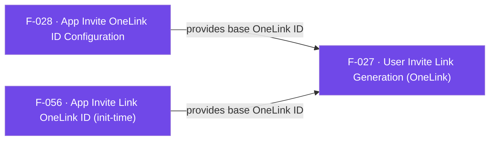

## Business Purpose
Referral/invite growth loops (e.g. "invite a friend and get X") need a personalized, attributable deep link that carries the referrer's identity, campaign, and channel so that when the invited user installs the app, AppsFlyer can attribute the install back to the referrer. `generateInviteLink` wraps the native AppsFlyer User-Invite-API so the Flutter app can build such a OneLink without any native code, and `logInvite` logs the `af_invite` event when the user shares that link. Without this feature, apps would have to drop to native platform channels themselves to construct invite links, losing the plugin's cross-platform convenience and the built-in referrer/customParams mapping.

---

## Trigger
Called by the host app whenever it needs to hand a user a shareable invite/referral link (e.g. tapping an "Invite Friends" button). Requires a base OneLink ID to already be configured, either at init time (`appInviteOneLink` option, F-056) or at runtime via `setAppInviteOneLinkID` (F-028).

---

## Call Chain
`generateInviteLink` is plugin-orchestrated over the full-RPC transport: the Dart layer registers the two callbacks on the `af-events` stream, then sends a single `generateInviteLink` RPC. Both native bridges force `awaitResponse` and deliver the generated URL back as an `af-events` envelope (not on the method-call reply, which resolves immediately).
```
AppsflyerSdk.generateInviteLink(params, success, error)                          [lib/src/appsflyer_sdk.dart]
  → _startListening(success, "generateInviteLinkSuccess")                        [lib/src/callbacks.dart]
  → _startListening(error,   "generateInviteLinkFailure")                        [lib/src/callbacks.dart]
  → _executeRpc('generateInviteLink', _translateInviteLinkParamsToRpc(params))   // MethodChannel af-api → executeRpc
    → Android: AppsflyerSdkPlugin.executeRpc → generateInviteLinkFromRpc(params, result)   [android/.../AppsflyerSdkPlugin.java]
      → params.awaitResponse = true → AppsFlyerRpcHandler.execute("generateInviteLink") → SDK ShareInviteHelper
        → success: deliverEvent {id:"generateInviteLinkSuccess", status:"success", data:{userInviteURL}}
        → error:   deliverEvent {id:"generateInviteLinkFailure", status:"failure", data:"<message>"}
    → iOS: AppsflyerSdkPlugin.executeRpc → generateInviteLinkFromRpc:params:result:        [ios/.../AppsflyerSdkPlugin.m]
      → AppsFlyerRPCBridge executeJson("generateInviteLink") → SDK AppsFlyerShareInviteHelper
        → success (data.url): deliverEventWithId:"generateInviteLinkSuccess" data:{userInviteURL}
        → error/empty url:    deliverEventWithId:"generateInviteLinkFailure" data:"The URL wasn't generated!"
  → Dart: callbacks.dart _dispatchCallListener routes by "id" → success/error callback   [lib/src/callbacks.dart]

AppsflyerSdk.logInvite(channel, [eventParameters])                               [lib/src/appsflyer_sdk.dart]
  → _executeRpc('logInvite', {channel, eventParameters})   // fire-and-forget, generic dispatch
```

---

## Files
| File | Role |
|------|------|
| `lib/src/appsflyer_invite_link_params.dart` | `AppsFlyerInviteLinkParams` — Dart model for channel, campaign, referrerName, referrerImageUrl, customerID, baseDeepLink, brandDomain, customParams |
| `lib/src/appsflyer_sdk.dart` | `generateInviteLink()`, `logInvite()`, and `_translateInviteLinkParamsToRpc()` — registers the two callbacks and sends the RPC (customer-id key is `referrerCustomerId` on iOS, `customerId` on Android; customParams sent as `userParams`) |
| `lib/src/callbacks.dart` | `_startListening()` registers the success/failure callback IDs; `_dispatchCallListener` routes each `af-events` envelope by `id` back to the registered Dart callback |
| `android/src/main/java/com/appsflyer/appsflyersdk/AppsflyerSdkPlugin.java` | `generateInviteLinkFromRpc()` — sets `awaitResponse`, runs the RPC on the executor, and forwards the result as a `generateInviteLinkSuccess`/`generateInviteLinkFailure` event |
| `ios/appsflyer_sdk/Sources/appsflyer_sdk/AppsflyerSdkPlugin.m` | `generateInviteLinkFromRpc:result:` — same orchestration via `AppsFlyerRPCBridge`, delivers the URL (or failure) on the `af-events` stream |

---

## Input / Output
| | |
|--|--|
| **Input** | `AppsFlyerInviteLinkParams?` (all fields optional: `channel`, `campaign`, `referrerName`, `referrerImageUrl`, `customerID`, `baseDeepLink`, `brandDomain`, `customParams`), plus `success` and `error` `MultiUseCallback`s |
| **Output** | `generateInviteLink` is `void`; the result arrives asynchronously via the callbacks. `success` receives `{"status": "success", "payload": {"userInviteURL": "<url>"}}` (the success event is decoded/wrapped in `callbacks.dart`); `error` receives the raw failure `data` (a plain message string) — the failure id is not wrapped. Only the most recent success/error pair is retained. `logInvite` is `void`/fire-and-forget. |

---

## Tests
`test/appsflyer_sdk_test.dart` — `check generateInviteLink call` asserts that `generateInviteLink(null, success, error)` dispatches the `executeRpc` call with `method: "generateInviteLink"` over the mocked `af-api` channel; it does not exercise the success/failure event payload shape, `_translateInviteLinkParamsToRpc`, or either native implementation.

---

## Known Limitations
- **Success and failure callbacks have different payload shapes**: `callbacks.dart` special-cases `"generateInviteLinkSuccess"` (decodes `data` and wraps it as `{"status", "payload"}`), but `"generateInviteLinkFailure"` falls into the default branch and delivers the raw `data` message string. Callers must handle two different shapes for the same feature's two callbacks.
- **No validation that a OneLink ID is configured**: `generateInviteLink` does not check whether `setAppInviteOneLinkID` (F-028) or the `appInviteOneLink` init option (F-056) has been set before invoking the native link generator; behavior in that case is left to the native SDK.
- The Dart method is `void`, not awaitable — callers must rely on the `success`/`error` callbacks routed through the `af-events` stream.

---

## Dependencies

