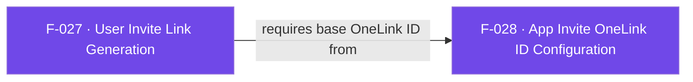

## Business Purpose
Referral and invite flows need a personalized OneLink carrying channel, campaign, referrer, and custom values. `generateInviteLink` delegates link generation to the native User Invite API, while `logInvite` records the `af_invite` event when the user shares the generated link.

---

## Trigger
Called when the host app needs a shareable invite URL. Configure the base OneLink ID first with `setAppInviteOneLink` (F-028).

---

## Call Chain
Both methods use the standard per-call RPC reply. Invite-link success and errors are correlated to the originating `Future`; they are not routed through global callback slots or the event stream.

```
AppsFlyerSdk.generateInviteLink({parameters, awaitResponse})          [lib/src/appsflyer_sdk.dart]
  → AppsFlyerInviteLinkParams.toRpcMap(isIOS: platform)
  → Android only: append {awaitResponse}
  → _invokeRpc<String>('generateInviteLink', params)
    → Android/iOS RPC generateInviteLink
  → non-empty URL completes Future<String>
  → missing URL throws AppsFlyerException (`generateInviteLink returned no value`)

AppsFlyerSdk.logInvite(channel, [eventParameters])                    [lib/src/appsflyer_sdk.dart]
  → _invokeVoidRpc('logInvite', {channel, eventParameters})
    → Android/iOS RPC logInvite
```

---

## Files
| File | Role |
|------|------|
| `lib/src/appsflyer_invite_link_params.dart` | Typed optional invite parameters and platform-specific RPC key mapping |
| `lib/src/appsflyer_sdk.dart` | Awaitable `generateInviteLink` and `logInvite` public APIs |
| Android/iOS RPC modules | Native link generation and invite-event logging |

---

## Input / Output
| | |
|--|--|
| **Input** | Optional named `parameters` (`AppsFlyerInviteLinkParams`) with `channel`, `campaign`, `referrerName`, `referrerImageUrl`, `referrerCustomerId`, `baseDeepLink`, `brandDomain`, and `userParams`; optional `awaitResponse` (`bool`, default `true`; mapped only to Android RPC). `logInvite` accepts `channel` plus optional `eventParameters`; Android RPC requires a non-empty channel, while iOS currently treats it as optional. |
| **Output** | `generateInviteLink` returns `Future<String>` with the generated URL. With `awaitResponse: true`, Android awaits asynchronous generation for up to 10 seconds; `false` returns the synchronously generated long link. The current iOS RPC 7.0.13 does not expose the flag and always awaits asynchronous generation with a 10-second timeout. `logInvite` returns `Future<void>` after validation and synchronous SDK invocation. RPC failures are exposed as `AppsFlyerException`. |

---

## Tests
`test/appsflyer_sdk_test.dart` verifies per-call URL return, Android `customerId` and iOS `referrerCustomerId` mapping, `userParams`, the default Android `awaitResponse: true`, the Android `false` override, and omission of the unsupported field from iOS requests.

---

## Known Limitations
- Dart does not duplicate native validation that a OneLink ID has already been configured.
- Android and iOS use different RPC keys for the same public `referrerCustomerId` field; `toRpcMap` preserves that platform difference.
- The Android RPC honors `awaitResponse`; the current iOS RPC 7.0.13 does not expose it for invite-link generation and always waits for the callback. Full behavioral parity requires iOS RPC support.
- Invite-generation timeout does not cancel native generation. A link produced after timeout is not delivered to the original Dart call.
- `logInvite('')` is platform-asymmetric: Android rejects an empty channel, while iOS forwards an absent/empty channel to the native API.
- `logInvite` has no native network-completion callback; its `Future<void>` confirms RPC acceptance.

---

## Dependencies

