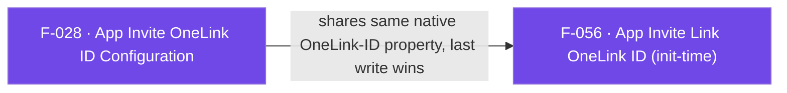

## Business Purpose
The User-Invite-API (F-027) needs to know which OneLink template/ID to base generated invite links on. `setAppInviteOneLinkID` lets the host app set (or change) that base OneLink ID at runtime, independent of SDK initialization — useful for apps that resolve the correct OneLink ID dynamically (e.g. per region, per experiment, or fetched from a remote config) after the SDK has already started. Without it, invite links generated via `generateInviteLink` would have no base link to attach referrer metadata to, and the referral/growth loop would not function.

---

## Trigger
Called explicitly by the host app at any point after SDK initialization, typically before the first call to `generateInviteLink` (F-027), whenever the app determines (or changes) which OneLink ID should back invite links.

---

## Call Chain
Plugin-orchestrated over the full-RPC transport. The `callback` is now **optional**; when supplied it is registered on the `af-events` stream and fired (success only) once the native setter completes.
```
AppsflyerSdk.setAppInviteOneLinkID(oneLinkID, [callback])                        [lib/src/appsflyer_sdk.dart]
  → if callback != null: _startListening(callback, "setAppInviteOneLinkIDCallback")   [lib/src/callbacks.dart]
  → _executeRpc('setAppInviteOneLink', {'oneLinkId': oneLinkID})   // MethodChannel af-api → executeRpc
    → Android: AppsflyerSdkPlugin.executeRpc → setAppInviteOneLinkFromRpc(params, result)   [android/.../AppsflyerSdkPlugin.java]
      → AppsFlyerRpcHandler.execute("setAppInviteOneLink") → SDK setAppInviteOneLink(oneLinkId)
      → on success: deliverEvent {id:"setAppInviteOneLinkIDCallback", status:"success", data:"success"}
    → iOS: AppsflyerSdkPlugin.executeRpc → setAppInviteOneLinkFromRpc:params:result:        [ios/.../AppsflyerSdkPlugin.m]
      → AppsFlyerRPCBridge executeJson("setAppInviteOneLink") → SDK appInviteOneLinkID
      → on success: deliverEventWithId:"setAppInviteOneLinkIDCallback" status:"success"
  → Dart: callbacks.dart _dispatchCallListener → "setAppInviteOneLinkIDCallback" (default route, raw data)   [lib/src/callbacks.dart]
```

---

## Files
| File | Role |
|------|------|
| `lib/src/appsflyer_sdk.dart` | `setAppInviteOneLinkID(String oneLinkID, [MultiUseCallback? callback])` — public API; optionally registers the callback and sends the `setAppInviteOneLink` RPC with `{oneLinkId}` |
| `lib/src/callbacks.dart` | `_startListening()` / `_dispatchCallListener` — generic `af-events` routing shared with other async callbacks |
| `android/src/main/java/com/appsflyer/appsflyersdk/AppsflyerSdkPlugin.java` | `setAppInviteOneLinkFromRpc()` — runs the RPC and, on non-error, forwards a `setAppInviteOneLinkIDCallback` success event |
| `ios/appsflyer_sdk/Sources/appsflyer_sdk/AppsflyerSdkPlugin.m` | `setAppInviteOneLinkFromRpc:result:` — same orchestration via `AppsFlyerRPCBridge` |

---

## Input / Output
| | |
|--|--|
| **Input** | `oneLinkID` (`String`), and an optional `callback` (`MultiUseCallback`) invoked with the async result. The RPC sends it under the `oneLinkId` key. |
| **Output** | `Future<void>` that completes when the RPC dispatch resolves. If a callback was registered, it is fired only on success with the raw `data` (`"success"`); there is no failure callback path. |

---

## Tests
`test/appsflyer_sdk_test.dart` — `check setAppInviteOneLinkID call` asserts that `setAppInviteOneLinkID("oneLinkID", (msg) {})` dispatches the `executeRpc` call with `method: "setAppInviteOneLink"` over the mocked `af-api` channel; it does not assert the `oneLinkId` argument value, the callback payload, or exercise either native implementation.

---

## Known Limitations
- **No failure callback path**: the callback (routed via `"setAppInviteOneLinkIDCallback"`) fires only on success on both platforms; there is no way to be notified of a rejected/invalid OneLink ID from the native SDK.
- **Callback delivers the raw success data**: the id is not in the wrapped-payload case list in `callbacks.dart`, so the callback receives the raw `data` string (`"success"`), not a `{status, payload}` map.
- Shares the same underlying native OneLink-ID property as the init-time `appInviteOneLink` option (F-056); last write wins.

---

## Dependencies

