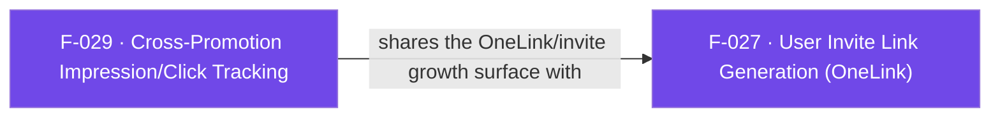

## Business Purpose
Advertisers who own multiple apps often promote one app from within another (cross-promotion). To measure whether these in-house house-ads actually drive installs, AppsFlyer needs to see both the impression (ad shown) and the click-to-store-open event, attributed to the promoted app's own AppsFlyer app ID and campaign. `logCrossPromotionImpression` and `logCrossPromotionAndOpenStore` wrap the native cross-promotion APIs so this measurement and the store-open action can be triggered from Dart. Without this, cross-promotion campaigns between an advertiser's own apps would have no attribution signal distinguishing them from ordinary organic or paid installs.

---

## Trigger
- `logCrossPromotionImpression`: called by the host app whenever a house-ad for another of the advertiser's apps is displayed to the user.
- `logCrossPromotionAndOpenStore`: called by the host app when the user taps/clicks that house-ad, to log the click and send the user to the promoted app's store listing.

---

## Call Chain
Both are generic RPC calls over the single `executeRpc` entry point. `logCrossPromotionAndOpenStore` maps to the `logAndOpenStore` RPC, which iOS orchestrates plugin-side (it generates the click URL via the bridge and opens it with `UIApplication`).
```
AppsflyerSdk.logCrossPromotionImpression(appId, campaign, data)                  [lib/src/appsflyer_sdk.dart]
  → _executeRpc('logCrossPromoteImpression', {appId, campaign, userParams: data})   // af-api → executeRpc
    → Android: dispatchRpc → AppsFlyerRpcHandler.execute("logCrossPromoteImpression") → SDK CrossPromotionHelper
    → iOS: dispatchRpc → AppsFlyerRPCBridge executeJson("logCrossPromoteImpression") → SDK cross-promotion helper

AppsflyerSdk.logCrossPromotionAndOpenStore(appId, campaign, params)              [lib/src/appsflyer_sdk.dart]
  → _executeRpc('logAndOpenStore', {promotedAppId: appId, campaign, userParams: params})   // af-api → executeRpc
    → Android: dispatchRpc → AppsFlyerRpcHandler.execute("logAndOpenStore") → SDK CrossPromotionHelper.logAndOpenStore
    → iOS: AppsflyerSdkPlugin.executeRpc → logAndOpenStoreFromRpc:params:result:   [ios/.../AppsflyerSdkPlugin.m]
      → AppsFlyerRPCBridge executeJson("logAndOpenStore") → result.data.clickURL → [UIApplication openURL:]
```

---

## Files
| File | Role |
|------|------|
| `lib/src/appsflyer_sdk.dart` | `logCrossPromotionImpression()` (RPC `logCrossPromoteImpression`) and `logCrossPromotionAndOpenStore()` (RPC `logAndOpenStore`) — both `void`/fire-and-forget |
| `android/src/main/java/com/appsflyer/appsflyersdk/AppsflyerSdkPlugin.java` | No per-method handler — both methods go through the generic `executeRpc` → `dispatchRpc` path to the native RPC bridge |
| `ios/appsflyer_sdk/Sources/appsflyer_sdk/AppsflyerSdkPlugin.m` | `logAndOpenStoreFromRpc:result:` — plugin-orchestrated: reads `data.clickURL` from the RPC result and opens it with `UIApplication`. `logCrossPromoteImpression` uses the generic dispatch. |

---

## Input / Output
| | |
|--|--|
| **Input** | `logCrossPromotionImpression(String appId, String campaign, Map? data)` — sent as `{appId, campaign, userParams}`. `logCrossPromotionAndOpenStore(String appId, String campaign, Map? params)` — sent as `{promotedAppId, campaign, userParams}`. |
| **Output** | `void` — both discard the `_executeRpc` Future (fire-and-forget). No result is surfaced to Dart. |

---

## Tests
`test/appsflyer_sdk_test.dart` — `check logCrossPromotionAndOpenStore call` asserts the `logAndOpenStore` RPC params (`promotedAppId`/`campaign`/`userParams`) are passed through; `check logCrossPromotionImpression call` asserts the `logCrossPromoteImpression` RPC is dispatched. Neither test exercises native behavior.

---

## Known Limitations
- **iOS store-open is plugin-orchestrated**: iOS does not have a native "log and open store" call in the RPC layer, so `logAndOpenStoreFromRpc` opens the store by reading `clickURL` from the RPC result and calling `UIApplication openURL:`; if the bridge returns no `clickURL`, nothing opens (silent).
- No result/confirmation is surfaced to Dart for either method — both are fire-and-forget.
- No validation in Dart of `appId`/`campaign`; malformed values are the native SDK's responsibility to handle.

---

## Dependencies

