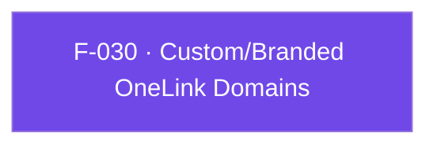

## Business Purpose
Apps that use a custom/branded domain for their OneLinks (instead of the default `*.onelink.me` domain) need the native SDK to recognize those domains as valid AppsFlyer deep-link/OneLink hosts — otherwise links on the branded domain would not be resolved/attributed correctly by the SDK when the app is opened via one of them. `setOneLinkCustomDomain` registers the list of branded domains with the native AppsFlyer SDK so it can correctly parse and attribute links served from them.

---

## Trigger
Awaited by the host app during setup/configuration, before relying on branded-domain OneLinks being correctly resolved. Not tied to any specific runtime event.

---

## Call Chain
An awaitable RPC call with no per-method channel handler. The Dart wrapper sends `{method: 'setOneLinkCustomDomain', params: {domains: [...]}}` through the single `executeRpc` entry point (the list is **wrapped under the `domains` key**, not passed as the raw argument), and each platform's native RPC bridge parses it into a typed request before forwarding it to the SDK.

```
AppsFlyerSdk.setOneLinkCustomDomain(List<String> domains)                       [lib/src/appsflyer_sdk.dart]
  → _invokeVoidRpc('setOneLinkCustomDomain', {'domains': domains})
    → _invokeRpc → MethodChannel('af-api').invokeMethod('executeRpc', {method, params})
      → Android: AppsflyerSdkPlugin.dispatchRpc → AppsFlyerRpcHandler          [plugin_bridge/.../AppsFlyerRpcHandler.kt]
        → JsonRpcRequestParser → SetOneLinkCustomDomainRequest(domains)  // init: require(domains.isNotEmpty())
        → appsFlyerLib.setOneLinkCustomDomain(*domains.toTypedArray())
      → iOS: AppsflyerSdkPlugin.dispatchRpc → AppsFlyerRPCBridge               [AppsFlyerRPC framework]
        → AFRPCParser → AFRPCSetOneLinkCustomDomainsRequest(domains)  // empty list rejected
        → AFRPCComplexConfigHandler → sdk.oneLinkCustomDomains = domains  ([AppsFlyerLib shared])
  → PlatformException is converted to AppsFlyerException
```

---

## Files
| File | Role |
|------|------|
| `lib/src/appsflyer_sdk.dart` | `setOneLinkCustomDomain(List<String> domains)` — awaitable passthrough that sends the RPC `setOneLinkCustomDomain` with `{domains}`; it does not pre-validate the list |
| `android/.../plugin_bridge` (native SDK, not the Flutter plugin) | `SetOneLinkCustomDomainRequest(domains)` — `init { require(domains.isNotEmpty()) }`; handler → `appsFlyerLib.setOneLinkCustomDomain(*domains.toTypedArray())` |
| `AppsFlyerRPC` framework (native iOS SDK, not the Flutter plugin) | `AFRPCSetOneLinkCustomDomainsRequest(domains)` — rejects an empty list; `AFRPCComplexConfigHandler` → `sdk.oneLinkCustomDomains = domains` |
| `android/.../AppsflyerSdkPlugin.java` / `ios/.../AppsflyerSdkPlugin.m` | No per-method handler — the generic `executeRpc` dispatch forwards the JSON envelope to the native RPC bridge above |

---

## Input / Output
| | |
|--|--|
| **Input** | `domains` (`List<String>`) — sent wrapped in the RPC params map under the `domains` key (`{'domains': domains}`). The list must be non-empty. |
| **Output** | `Future<void>` that completes when the native request succeeds and throws `AppsFlyerException` when either bridge rejects the request (including the empty-list case) or the RPC call fails. |

---

## Tests
`test/appsflyer_sdk_test.dart` — `maps deep-link, sharing, push, and uninstall APIs` asserts that `setOneLinkCustomDomain(['links.example.com'])` dispatches RPC `setOneLinkCustomDomain` with `{'domains': ['links.example.com']}`. The native contract (empty-list rejection, SDK forwarding) is covered by the native SDKs' own bridge tests (`RpcRequestValidationTest` / `AppsFlyerRPCParseNewMethodsTests`); no Dart test exercises the empty-list rejection.

---

## Known Limitations
- **Empty list is rejected natively, and the rejection now reaches the caller**: both bridges reject an empty `domains` list (Android `require(domains.isNotEmpty())`, iOS validation error). Because the Dart method is awaitable, `await setOneLinkCustomDomain([])` throws `AppsFlyerException` instead of failing silently — but a caller that does not await the Future still sees nothing.
- Dart does not pre-validate the list, so the empty-list round trip costs a channel hop before the error is raised.
- Neither the plugin nor the bridge validates the domain strings for well-formedness (e.g. valid host names) — malformed entries are the native SDK's responsibility to reject.

---

## Dependencies

