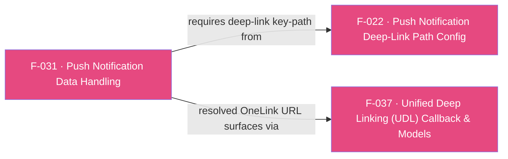

## Business Purpose
Push-notification re-engagement campaigns need to be measured (so their ROI shows up in AppsFlyer reporting) and, when the payload carries a OneLink URL, routed as a deep link into the right in-app screen. `sendPushNotificationData` hands the push payload to the native SDK so it can attribute the re-engagement and, if a deep-link path was configured (F-022), extract and resolve the embedded OneLink URL. Without this, push campaigns cannot be measured for re-engagement and push-embedded deep links never reach the SDK for resolution.

> The legacy `setPushNotification(bool)` toggle was **removed in SDK 7**; `sendPushNotificationData(Map)` is the only push API. See [migration guide](/doc/migration-guide.md).

---

## Trigger
Called by the host app whenever a push notification is received or tapped (foreground, background, or after a cold launch from a terminated state via a persisted "pending push" pattern), passing the notification's data payload.

---

## Call Chain
Since the SDK 7 / RPC migration this is a generic RPC call (no per-method channel handler). The Dart wrapper **branches by platform**: Android reshapes the map into the structured `AFPushData` fields the bridge expects and sends `sendPushNotificationData`; iOS forwards the raw APNs payload under `handlePushNotification`.
```
AppsflyerSdk.sendPushNotificationData(Map? userInfo)                                   [lib/src/appsflyer_sdk.dart]
  → Android: _executeRpc('sendPushNotificationData',
        {'campaign', 'pid', 'isRetargeting', 'additionalParameters'})   // MethodChannel af-api → executeRpc
      → AppsflyerSdkPlugin.executeRpc → dispatchRpc('sendPushNotificationData', ...)   [android/.../AppsflyerSdkPlugin.java]
        → AppsFlyerRpcHandler.execute(json) → AppsFlyerLib.getInstance().sendPushNotificationData(...)   [plugin_bridge]
  → iOS: _executeRpc('handlePushNotification', {'pushPayload': userInfo})              // raw APNs userInfo
      → AppsflyerSdkPlugin executeRpc → dispatchRpc('handlePushNotification')          [ios/.../AppsflyerSdkPlugin.m]
        → AppsFlyerRPCBridge → [AppsFlyerLib shared] handlePushNotification: → onDeepLinking (F-037)
```
Any OneLink URL found at the configured path (F-022) is resolved and delivered asynchronously over the `af-events` EventChannel as the `onDeepLinking` envelope (F-037).

---

## Files
| File | Role |
|------|------|
| `lib/src/appsflyer_sdk.dart` | `sendPushNotificationData(Map? userInfo)` — Android maps the payload into structured `{campaign, pid, isRetargeting, additionalParameters}` fields (reading those keys off `userInfo`); iOS forwards the raw payload under `{pushPayload}` to the `handlePushNotification` RPC. Fire-and-forget (`void`). |
| `android/.../AppsflyerSdkPlugin.java` / `ios/.../AppsflyerSdkPlugin.m` | No per-method handler — the generic `executeRpc` dispatch forwards the JSON envelope to the native RPC bridge. |
| `android/.../plugin_bridge` / `AppsFlyerRPC` framework (native SDKs, not the Flutter plugin) | Parse the request and call `sendPushNotificationData` (Android) / `handlePushNotification:` (iOS). |

---

## Input / Output
| | |
|--|--|
| **Input** | `userInfo` (`Map?`). **Platform-specific shape**: on Android, the wrapper expects a structured map with `campaign` and `pid` plus optional `isRetargeting`/`additionalParameters` (the AFPushData shape); on iOS, the raw APNs `userInfo` dictionary. |
| **Output** | `void` — fire-and-forget; the Dart wrapper discards the RPC Future. Any resolved OneLink URL is delivered asynchronously via the `onDeepLinking` callback (F-037), gated by the path configured in F-022. |

---

## Tests
`test/appsflyer_sdk_test.dart` — `check sendPushNotificationData call` asserts the mocked `af-api` channel receives the `executeRpc` dispatch with the payload; it exercises only the Dart-to-channel dispatch, not native attribution or deep-link extraction.

---

## Known Limitations
- **Platform-specific payload shape**: Android needs the structured `AFPushData` fields (`campaign`, `pid`, …); passing the raw APNs dictionary on Android yields empty `campaign`/`pid`. iOS expects the raw APNs `userInfo`. Callers must supply the correct shape per platform.
- **iOS requires this call for push deep links** (per `doc/deep-linking.md`): configuring `addPushNotificationDeepLinkPath` (F-022) on iOS does nothing until the payload is forwarded here; nothing in code enforces it.
- Fire-and-forget: a native rejection (e.g. empty iOS payload) surfaces only as a swallowed unhandled async error, not to the caller.

---

## Dependencies

