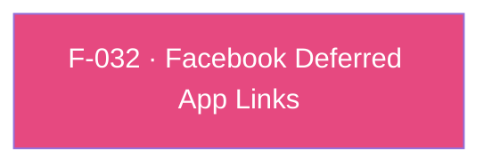

## Business Purpose
Apps that run Facebook Ads alongside AppsFlyer OneLink need deferred deep links to resolve correctly even when Facebook's own SDK has already claimed the deferred-app-link resolution flow. `enableFacebookDeferredApplinks` tells the native AppsFlyer SDK to interoperate with the Facebook SDK's `FBSDKAppLinkUtility` class so both attribution sources can coexist instead of one silently overriding or racing the other. Without enabling this, apps combining Facebook Ads and AppsFlyer OneLink risk deferred deep links resolving incorrectly (or not at all) for users who install after clicking a Facebook ad.

A companion **iOS-only** API, `setFacebookDeferredAppLink(String? url)`, lets an app that already holds the deferred link set (or clear, with `null`) it directly, bypassing the Facebook SDK fetch.

---

## Trigger
Called once by the host app during startup configuration (before/around SDK init), for apps that have integrated the Facebook SDK and want AppsFlyer to interoperate with its deferred app-link resolution.

---

## Call Chain
Since the SDK 7 / RPC migration this is a generic RPC call (no per-method channel handler): the Dart wrapper sends `{method:'enableFacebookDeferredApplinks', params:{isEnabled:<bool>}}` (params key is **`isEnabled`**) through the single `executeRpc` entry point, and each platform's native RPC bridge parses and forwards it.
```
AppsflyerSdk.enableFacebookDeferredApplinks(bool isEnabled)                           [lib/src/appsflyer_sdk.dart]
  → _executeRpc('enableFacebookDeferredApplinks', {'isEnabled': isEnabled})   // MethodChannel af-api → executeRpc
    → Android: AppsFlyerRpcHandler.execute(json)                                          [plugin_bridge/.../AppsFlyerRpcHandler.kt]
      → JsonRpcRequestParser → EnableFacebookDeferredApplinksRequest(isEnabled)  // optBoolean("isEnabled", false)
      → AppsFlyerLib.getInstance().enableFacebookDeferredApplinks(isEnabled)  // true|false forwarded as-is
      → RpcResponse.Success
    → iOS: AppsFlyerRPCBridge / AFRPCRequestHandler                                        [AppsFlyerRPC framework]
      → AFRPCParser → AFRPCEnableFacebookDeferredApplinksRequest(enable)  // requireBool("isEnabled")
      → AFRPCDeepLinkHandler → fbClass = enable ? NSClassFromString("FBSDKAppLinkUtility") : nil
      → sdk.enableFacebookDeferredApplinks(with: fbClass)  ([AppsFlyerLib shared])
```
The iOS-only companion routes the same way:
```
AppsflyerSdk.setFacebookDeferredAppLink(String? url)  // iOS only; no-op on Android      [lib/src/appsflyer_sdk.dart]
  → _executeRpc('setFacebookDeferredAppLink', {'url': url})   // MethodChannel af-api → executeRpc
    → iOS: AppsFlyerRPCBridge / AFRPCRequestHandler → [AppsFlyerLib shared] (unsafe schemes rejected)
```

---

## Files
| File | Role |
|------|------|
| `lib/src/appsflyer_sdk.dart` | `enableFacebookDeferredApplinks(bool isEnabled)` — thin passthrough that sends the generic RPC `enableFacebookDeferredApplinks` with `{isEnabled}`. Fire-and-forget (`void`). Also `setFacebookDeferredAppLink(String? url)` — **iOS only** (`Platform.isIOS` guard); sends the `setFacebookDeferredAppLink` RPC with `{url}`. |
| `android/.../plugin_bridge` (native SDK, not the Flutter plugin) | `EnableFacebookDeferredApplinksRequest(isEnabled)`; handler → `AppsFlyerLib.getInstance().enableFacebookDeferredApplinks(isEnabled)` — `true`/`false` forwarded as-is |
| `AppsFlyerRPC` framework (native iOS SDK, not the Flutter plugin) | `AFRPCEnableFacebookDeferredApplinksRequest(enable)`; `AFRPCDeepLinkHandler` maps `enable → NSClassFromString("FBSDKAppLinkUtility")` (true) / `nil` (false), then `sdk.enableFacebookDeferredApplinks(with:)` |
| `android/.../AppsflyerSdkPlugin.java` / `ios/.../AppsflyerSdkPlugin.m` | No per-method handler — the generic `executeRpc` dispatch forwards the JSON envelope to the native RPC bridge above. |

---

## Input / Output
| | |
|--|--|
| **Input** | `isEnabled` (bool) |
| **Output** | `void` — fire-and-forget; both handlers always call `result.success(null)`/`result(nil)`. Resolved deferred-link data (if any) is not returned here — it surfaces through whichever conversion/attribution channel the app has registered (`onInstallConversionData` (GCD), or UDL `onDeepLinking`), which are native-SDK internal behaviors this plugin does not directly wire to this flag. |

---

## Tests
`test/appsflyer_sdk_test.dart` → `'enableFacebookDeferredApplinks maps to isEnabled'` verifies the Dart wrapper dispatches the `enableFacebookDeferredApplinks` RPC with the `isEnabled` param. Native behavior (true→class / false→nil on iOS, bool forwarding on Android) is covered by the native SDK's own bridge tests.

---

## Known Limitations
- **No more disable asymmetry (RPC migration)**: both platforms now honor `false`. Android forwards the literal bool; the iOS RPC bridge maps `false → nil` and calls `enableFacebookDeferredApplinks(with: nil)`, so the feature can be turned back off on iOS. (The pre-RPC iOS handler treated `false` as a no-op — that limitation no longer applies.)
- **iOS requires the Facebook SDK linked**: the iOS bridge resolves `FBSDKAppLinkUtility` via `NSClassFromString`, so if the Facebook SDK isn't linked into the app, enabling passes a `nil` class and is effectively a no-op. Android's flag is self-contained. This platform difference is now called out in the Dart dartdoc.
- No signal is returned to Dart indicating whether Facebook deferred-app-link interop actually engaged (e.g. class not found) — the Dart wrapper is fire-and-forget `void` and discards the RPC result.

---

## Dependencies

