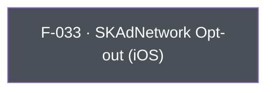

## Business Purpose
Apple's SKAdNetwork is the privacy-preserving attribution framework AppsFlyer's iOS SDK uses automatically post-iOS 14. Some advertisers run their own SKAdNetwork conversion-value scheme, use a different measurement partner for it, or need to suppress AppsFlyer's SKAdNetwork registration and postback handling entirely for compliance or contractual reasons. `setDisableSKAdNetwork` lets the host app flip that behavior off without disabling the rest of AppsFlyer attribution. Without it, an app that needs to hand SKAdNetwork off to another party would have no supported way to do so short of not integrating AppsFlyer's SKAdNetwork handling path at all.

---

## Trigger
Called by the host app during startup configuration, after `init()` and before the first session (`start()`), whenever the app wants to opt out of AppsFlyer's automatic SKAdNetwork conversion-value handling. The method is iOS-only; on Android the call is ignored with a logged warning.

---

## Call Chain
An ordinary fire-and-forget RPC setter returning `Future<void>`. The iOS platform guard runs in Dart before any channel call is made.

```
AppsFlyerSdk.setDisableSKAdNetwork(disable)                           [lib/src/appsflyer_sdk.dart]
  → not iOS: log warning, return (no RPC dispatched)
  → _invokeVoidRpc('setDisableSKAdNetwork', {'disable': disable})
    → _invokeRpc → MethodChannel('af-api').invokeMethod('executeRpc', {method, params})
      → iOS: AppsflyerSdkPlugin.dispatchRpc → AppsFlyerRPCBridge.executeJson
        → native SKAdNetwork handling opt-out
  → PlatformException is converted to AppsFlyerException
```

---

## Files
| File | Role |
|------|------|
| `lib/src/appsflyer_sdk.dart` | `setDisableSKAdNetwork(bool disable)` — guarded by an iOS platform check; sends the `setDisableSKAdNetwork` RPC with `{disable}` |
| `lib/src/appsflyer_exception.dart` | `AppsFlyerException` — the failure type raised for native failures |
| `ios/appsflyer_sdk/Sources/appsflyer_sdk/AppsflyerSdkPlugin.m` | No per-method handler — the generic `executeRpc` → `dispatchRpc` forwards the JSON envelope to `AppsFlyerRPCBridge`, which applies it to the SDK |

---

## Input / Output
| | |
|--|--|
| **Input** | `disable` (`bool`) — `true` disables AppsFlyer's SKAdNetwork handling. Sent under the `disable` param key. |
| **Output** | `Future<void>` completes once the RPC layer accepts the fire-and-forget native call. Native errors throw `AppsFlyerException`; calling on Android logs a warning, dispatches nothing, and returns without throwing. |

---

## Tests
`test/appsflyer_sdk_test.dart` covers both the mapping and the platform guard:
- `maps every iOS-only API` asserts that `iosSdk.setDisableSKAdNetwork(true)` dispatches RPC method `setDisableSKAdNetwork` with `{'disable': true}`.
- `platform-only void calls are ignored without reaching the native RPC` asserts that `androidSdk.setDisableSKAdNetwork(true)` completes without dispatching any RPC.

The Dart harness cannot verify that the native SDK assignment takes effect.

---

## Known Limitations
- **iOS-only**: SKAdNetwork is Apple-specific and no Android implementation exists. Calling the method on Android is a no-op, but a logged one: the plugin emits a `debugPrint` warning, dispatches no RPC, and returns without throwing.
- Disabling SKAdNetwork handling here does not stop iOS from making the OS-level registration calls (`registerAppForAdNetworkAttribution` / `updateConversionValue`); it only stops AppsFlyer's SDK-side processing.
- The native API has no completion callback, so a completed `Future` confirms only that the RPC layer accepted the call.

---

## Dependencies

