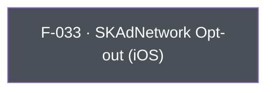

## Business Purpose
Apple's SKAdNetwork is the privacy-preserving attribution framework AppsFlyer's iOS SDK uses automatically post-iOS 14. Some advertisers run their own SKAdNetwork conversion-value scheme, use a different measurement partner for it, or need to suppress AppsFlyer's SKAdNetwork registration/postback handling entirely for compliance or contractual reasons. `disableSKAdNetwork` lets the host app flip that behavior off without disabling the rest of AppsFlyer attribution. Without it, an app that needs to hand SKAdNetwork off to another party would have no supported way to do so short of not integrating the AppsFlyer SDK's SKAdNetwork handling path at all.

---

## Trigger
Called by the host app during startup configuration, before the first session (`startSDK`), whenever the app wants to opt out of AppsFlyer's automatic SKAdNetwork conversion-value handling on iOS.

---

## Call Chain
Generic RPC call over the single `executeRpc` entry point. The Dart method is iOS-guarded (`Platform.isIOS`), so on Android it is a no-op (no RPC is sent).
```
AppsflyerSdk.disableSKAdNetwork(disable)                                 [lib/src/appsflyer_sdk.dart]
  → if (Platform.isIOS) _executeRpc('setDisableSKAdNetwork', {'disable': disable})   // af-api → executeRpc
    → iOS: dispatchRpc → AppsFlyerRPCBridge executeJson("setDisableSKAdNetwork") → SDK disableSKAdNetwork
```

---

## Files
| File | Role |
|------|------|
| `lib/src/appsflyer_sdk.dart` | `disableSKAdNetwork(bool disable)` — iOS-guarded; sends the `setDisableSKAdNetwork` RPC with `{disable}` |
| `ios/appsflyer_sdk/Sources/appsflyer_sdk/AppsflyerSdkPlugin.m` | No per-method handler — the generic `executeRpc` → `dispatchRpc` forwards the JSON envelope to the `AppsFlyerRPC` bridge, which applies it to the SDK |

---

## Input / Output
| | |
|--|--|
| **Input** | `disable` (bool) — `true` disables AppsFlyer's SKAdNetwork handling. Sent under the `disable` param key. |
| **Output** | `void` — fire-and-forget; the `_executeRpc` Future is discarded. |

---

## Tests
`test/appsflyer_sdk_test.dart` — `check disableSKAdNetwork call` asserts the mocked `af-api` channel receives the `executeRpc` call with `method: "setDisableSKAdNetwork"` and the `disable` param. The Dart harness cannot verify the native SDK assignment takes effect.

---

## Known Limitations
- **iOS-only**: no Android implementation exists (SKAdNetwork is Apple/iOS-specific). The Dart API is guarded by `Platform.isIOS`, so calling it on Android is a silent no-op (no RPC is dispatched).
- Disabling SKAdNetwork handling here does not stop iOS from sending the registration call itself (`registerAppForAdNetworkAttribution`/`updateConversionValue` are OS-level) — it only stops AppsFlyer's SDK-side processing.
- Fire-and-forget: no success/error is surfaced to Dart.

---

## Dependencies

