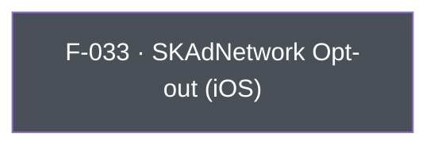

## Business Purpose
Apple's SKAdNetwork is the privacy-preserving attribution framework AppsFlyer's iOS SDK uses automatically post-iOS 14. Some advertisers run their own SKAdNetwork conversion-value scheme, use a different measurement partner for it, or need to suppress AppsFlyer's SKAdNetwork registration and postback handling entirely for compliance or contractual reasons. `setDisableSKAdNetwork` lets the host app flip that behavior off without disabling the rest of AppsFlyer attribution. Without it, an app that needs to hand SKAdNetwork off to another party would have no supported way to do so short of not integrating AppsFlyer's SKAdNetwork handling path at all.

---

## Trigger
Called by the host app during startup configuration, before the first session (`start()`), whenever the app wants to opt out of AppsFlyer's automatic SKAdNetwork handling. The method is iOS-only; on Android the call is still dispatched and throws `AppsFlyerException`. No ordering relative to `init()` is enforced.

---

## Call Chain
An ordinary fire-and-forget RPC setter returning `Future<void>`. There is no Dart platform gate, so the channel call is made on every platform and the native RPC layer decides whether the method exists.

```
AppsFlyerSdk.setDisableSKAdNetwork(disable)                           [lib/src/appsflyer_sdk.dart]
  → off iOS: native RPC reports the method as unavailable → AppsFlyerException
  → _invokeVoidRpc('setDisableSKAdNetwork', {'disable': disable})
    → _invokeRpc → MethodChannel('af-api').invokeMethod('executeRpc', {method, params})
      → iOS: AppsflyerSdkPlugin.dispatchRpc → AppsFlyerRPCBridge.executeJson
        → native SKAdNetwork handling opt-out
  → PlatformException is converted to AppsFlyerException
```

---

## Files
| File | Role |
|------|------|
| `lib/src/appsflyer_sdk.dart` | `setDisableSKAdNetwork(bool disable)` — no Dart platform check; sends the `setDisableSKAdNetwork` RPC with `{disable}` |
| `lib/src/appsflyer_exception.dart` | `AppsFlyerException` — the failure type raised for native failures |
| `ios/appsflyer_sdk/Sources/appsflyer_sdk/AppsflyerSdkPlugin.swift` | No per-method handler — the generic `executeRpc` → `dispatchRpc` forwards the JSON envelope to `AppsFlyerRPCBridge`, which applies it to the SDK |

---

## Input / Output
| | |
|--|--|
| **Input** | `disable` (`bool`) — `true` disables AppsFlyer's SKAdNetwork handling. Sent under the `disable` param key. |
| **Output** | `Future<void>` completes after RPC validation and the synchronous native SDK setter invocation. Validation or bridge failures throw `AppsFlyerException`; there is no native completion callback or timeout. Calling on Android dispatches the RPC anyway and throws `AppsFlyerException` once the Android layer reports the method as unavailable. |

---

## Tests
`test/appsflyer_sdk_test.dart` covers both the mapping and the off-platform behavior:
- `maps every iOS-only API` asserts that `iosSdk.setDisableSKAdNetwork(true)` dispatches RPC method `setDisableSKAdNetwork` with `{'disable': true}`.
- `platform-only calls are forwarded to the native RPC instead of being swallowed in Dart` asserts that `androidSdk.setDisableSKAdNetwork(true)` still dispatches the `setDisableSKAdNetwork` RPC.

The Dart harness cannot verify that the native SDK assignment takes effect.

---

## Known Limitations
- **iOS-only**: SKAdNetwork is Apple-specific and no Android implementation exists. Calling the method on Android is not a no-op: the plugin dispatches the RPC and the Android layer's "unknown method" answer surfaces as `AppsFlyerException`.
- The native implementation disables AppsFlyer's SKAdNetwork object and cancels its timer. The plugin exposes no callback or getter to prove whether any OS-level call had already happened before the setter ran, which is why the call belongs before the first `start()`.
- The native API has no completion callback, so a completed `Future` confirms only that the RPC layer accepted the call.

---

## Dependencies

