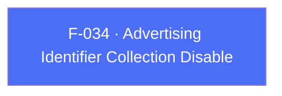

## Business Purpose
Privacy regulations (GDPR, CCPA) and platform policy changes increasingly require apps to be able to fully opt out of collecting device advertising identifiers (GAID/AAID/OAID on Android, IDFA on iOS) rather than just anonymizing individual users. `setDisableAdvertisingIdentifiers` gives the host app a single cross-platform switch for this. Without it, an app could not comply with a user's advertising-ID opt-out request without disabling the SDK entirely (F-017).

---

## Trigger
The host app calls `setDisableAdvertisingIdentifiers(true)` after `init()`, before `start()` when the first session must already omit the identifiers, or at any later point to change the setting. Collection is enabled by default in the native SDK.

---

## Call Chain
A single cross-platform method dispatches the `setDisableAdvertisingIdentifiers` RPC. Dart splits the param key per platform to match each native RPC contract: Android expects `isDisable`, iOS expects `disable`.

```
AppsFlyerSdk.setDisableAdvertisingIdentifiers(disable)                [lib/src/appsflyer_sdk.dart]
  → _invokeVoidRpc('setDisableAdvertisingIdentifiers',
        isIOS ? {'disable': disable} : {'isDisable': disable})
    → _invokeRpc → MethodChannel('af-api').invokeMethod('executeRpc', {method, params})
      → Android: AppsflyerSdkPlugin.executeRpc → dispatchRpc → AppsFlyerRpcHandler
        → native setDisableAdvertisingIdentifiers(isDisable)
      → iOS: AppsflyerSdkPlugin.executeRpc → dispatchRpc → AppsFlyerRPCBridge.executeJson
        → [[AppsFlyerLib shared] setDisableAdvertisingIdentifier:disable]
  → PlatformException is converted to AppsFlyerException
```

---

## Files
| File | Role |
|------|------|
| `lib/src/appsflyer_sdk.dart` | `setDisableAdvertisingIdentifiers(bool disable)` — sends `isDisable` on Android and `disable` on iOS |
| `android/src/main/java/com/appsflyer/appsflyersdk/AppsflyerSdkPlugin.java` | Generic `executeRpc` → `dispatchRpc` routing to `AppsFlyerRpcHandler` |
| `ios/appsflyer_sdk/Sources/appsflyer_sdk/AppsflyerSdkPlugin.m` | Generic `executeRpc` → `dispatchRpc` forwarding to `AppsFlyerRPCBridge` |

---

## Input / Output
| | |
|--|--|
| **Input** | `disable` (`bool`) — `true` disables collection of GAID/AAID/OAID (Android) or IDFA (iOS). Sent under `isDisable` on Android and `disable` on iOS. |
| **Output** | `Future<void>` completes once the RPC layer accepts the fire-and-forget native call; native errors throw `AppsFlyerException`. |

---

## Tests
`test/appsflyer_sdk_test.dart` — `maps cross-platform configuration and identity APIs` asserts both platform payloads for the same Dart call: `androidSdk.setDisableAdvertisingIdentifiers(true)` dispatches `setDisableAdvertisingIdentifiers` with `{'isDisable': true}`, and `iosSdk.setDisableAdvertisingIdentifiers(true)` dispatches it with `{'disable': true}`.

---

## Known Limitations
- The Dart method sends different param keys per platform (`isDisable` on Android, `disable` on iOS) because the two native RPC contracts differ. A future change to either key would break one platform without a compile-time check; the per-platform test assertions are the only guard.
- No getter exists to read back the current disabled state from Dart.
- The native API has no completion callback, so a completed `Future` confirms only that the RPC layer accepted the call.

---

## Dependencies

