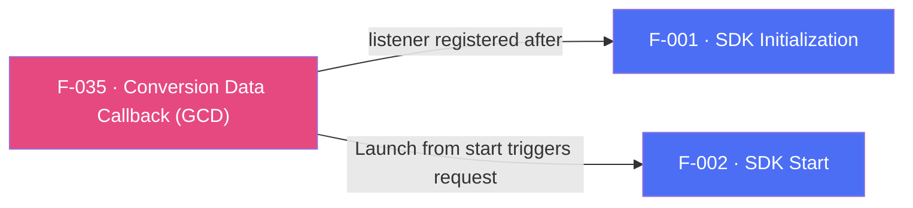

## Business Purpose
When a user installs the app after clicking an attributed link (or organically), the app often needs to know immediately — before the user even signs in — which campaign drove the install and whether it carries a deferred deep link, so it can personalize the very first session (e.g. show a specific onboarding screen or promo). "Get Conversion Data" (GCD) delivers this attribution/conversion payload to Dart right after install, through the `onConversionDataSuccess` and `onConversionDataFail` callbacks passed to `registerConversionListener()`. Without it, apps lose the ability to react to install-time attribution data and deferred-deep-link payloads inside the app itself.

---

## Trigger
The host app calls `registerConversionListener(onConversionDataSuccess:, onConversionDataFail:)` after `init()`, then follows the normal session-ready flow and calls `start()`. Listener registration only installs the delegate; the Launch sent by `start()` triggers the conversion-data request whose result reaches the callbacks. There is no init-time flag.

---

## Call Chain
Registration is an ordinary awaitable RPC. Results arrive on the **`af-events` EventChannel** as a native RPC JSON envelope, are parsed into a `_AppsFlyerEvent` (`name` + `data`), and are dispatched by event name to the registered callback.

```
AppsFlyerSdk.registerConversionListener(onConversionDataSuccess:, onConversionDataFail:)         [lib/src/appsflyer_sdk.dart]
  → _ensureEventsSubscribed() — one af-events subscription for the plugin, attached on first registration
  → _listeners.on('onConversionDataSuccess', …) / .on('onConversionDataFail', …)
      (one callback slot per event, replaced on re-registration)
  → _invokeVoidRpc('registerConversionListener')
    → _invokeRpc → MethodChannel('af-api').invokeMethod('executeRpc', {method, params})
      → Android: AppsflyerSdkPlugin.dispatchRpc → AppsFlyerRpcHandler
      → iOS: AppsflyerSdkPlugin.dispatchRpc → AppsFlyerRPCBridge

Native conversion data arrives (Android RpcEventNotifier / iOS AFRPCBridge event handler):
  → Android: AppsFlyerEventBus.publish(json) → EventChannel('af-events'), buffered until a sink attaches
  → iOS: deliverEvent(json) on EventChannel('af-events'), buffered in pendingEvents until Dart subscribes
    → _AppsFlyerEvent.fromNative(json)                                 [lib/src/appsflyer_event.dart]
      → _AppsFlyerListenerRegistry.dispatch(event)                     [lib/src/appsflyer_listener_registry.dart]
        → event.name == 'onConversionDataSuccess'
            → onConversionDataSuccess(Map<String, dynamic>)
        → event.name == 'onConversionDataFail'
            → onConversionDataFail(Map<String, dynamic>) (raw payload, not an RPC exception)
```

Android also exposes `unregisterConversionListener()`; on iOS it still drops the Dart callbacks first and then throws `AppsFlyerException`, because the iOS RPC layer does not implement the method.

---

## Files
| File | Role |
|------|------|
| `lib/src/appsflyer_sdk.dart` | `registerConversionListener(onConversionDataSuccess:, onConversionDataFail:)`, the `OnConversionDataSuccess` / `OnConversionDataFailure` typedefs, and the Android-only `unregisterConversionListener()` |
| `lib/src/appsflyer_listener_registry.dart` | `_AppsFlyerListenerRegistry` — one callback slot per native event name, replaced on re-registration |
| `lib/src/appsflyer_event.dart` | `_AppsFlyerEvent.fromNative` — parses the RPC envelope (`event`, map-or-null `data`) |
| `android/.../AppsflyerSdkPlugin.kt` | `rpcEventNotifier` hops bridge events to the main thread and publishes them to `AppsFlyerEventBus`; `createEventSink` adapts this engine's `af-events` sink |
| `android/.../AppsFlyerEventBus.kt` | Process-scoped buffer and FIFO replay, so conversion data arriving while no engine is attached reaches the next subscriber |
| `android/.../AppsFlyerRpcBridge.kt` | Process-scoped owner of the `AppsFlyerRpcHandler` that registers the native conversion listener, so it survives engine recreation |
| `ios/.../AppsflyerSdkPlugin.swift` | `deliverEvent` forwards bridge events to the `af-events` sink and buffers them in `pendingEvents` until Dart subscribes |

---

## Input / Output
| | |
|--|--|
| **Input** | The `onConversionDataSuccess` and `onConversionDataFail` callbacks passed to `registerConversionListener()` — both optional, matching the canonical `publicApi.callbacks` contract in `appsflyer-plugins-rpc-schema`; the payload itself originates from AppsFlyer's attribution servers via the native SDK. |
| **Output** | `onConversionDataSuccess` receives `Map<String, dynamic>` (the raw conversion payload). `onConversionDataFail` receives the raw failure payload as `Map<String, dynamic>` — not an RPC exception, since registration itself already succeeded. Payload shape differs by platform: Android sends `{"error": String}` with no error code; iOS sends `{"error": String, "code": int}`. `registerConversionListener()` returns `Future<void>` after synchronous listener registration; it does not wait for conversion data and has no request timeout. |

---

## Tests
`test/appsflyer_sdk_test.dart`:
- `delivers conversion data to the registered success callback` — emits an `onConversionDataSuccess` envelope on `af-events` and asserts the decoded payload reaches `onConversionDataSuccess`.
- `the failure callback passes through the raw native payload (no synthesized RPC exception)` — asserts the native `onConversionDataFail` event payload reaches the registered callback unchanged.
- `a conversion failure without a failure callback is not an error` — asserts a failure event with no `onConversionDataFail` registered is a no-op.
- `registering with no conversion callbacks is not an error` — asserts the RPC is still dispatched and both events are dropped harmlessly when neither callback is supplied.
- `re-registering replaces the callback instead of adding a second one` — asserts the second registration's callback receives the event and the first does not.
- `subscribes to af-events only when the first listener is registered` — asserts the `listen` handshake is sent on the first registration and not repeated for later ones.
- `keeps delivering events after a platform error on the stream` — asserts an error envelope on `af-events` leaves the subscription live: the next event still reaches the callback and no second `listen` is issued.
- `re-subscribes after the platform ends the event stream` — asserts a null platform reply (end of stream) clears the subscription, so the next registration re-issues `listen` and events reach the callback again.
- `rolls back Dart callbacks when native registration RPC fails` — asserts failed `registerConversionListener`, `registerDeepLinkListener`, and `registerSessionReadyListener` RPCs rethrow and leave no Dart callback receiving events.
- `keeps Dart callbacks when the native unregister RPC fails` — asserts failed `unregisterConversionListener`, `unregisterDeepLinkListener`, and `unregisterSessionReadyListener` RPCs rethrow and leave the registered callbacks still receiving events, the iOS case for the first two.
- `listeners are registered explicitly` — asserts `registerConversionListener(onConversionDataSuccess:)` dispatches the `registerConversionListener` RPC.
- `maps every Android-only API` — asserts `unregisterConversionListener` dispatches the matching RPC with no params.
No test covers `unregisterConversionListener` on iOS; the shared off-platform contract is exercised generically by `platform-only calls are forwarded to the native RPC instead of being swallowed in Dart`.

`test/appsflyer_sdk_test.dart` — `ignores transport-only envelope fields on conversion events` covers the `onConversionDataSuccess` envelope shape (`event`, `data`).

---

## Known Limitations
- The plugin holds **one callback per event** and replaces it on re-registration, matching the native SDK; there is no public stream, so a single conversion event cannot fan out to several handlers in the app. A conversion event arriving before `registerConversionListener()` has run is held by `_AppsFlyerListenerRegistry` and replayed when the listener registers — the native replay flushes on the first `register*Listener()` call of any kind, which is often the deep-link listener. After the listener has been registered once, an event arriving while it is unregistered is logged and dropped instead.
- Registering the listener does not issue the conversion-data network request. The app must still call `start()` for the foreground cycle; otherwise no Launch is sent and no conversion result is expected.
- Both platforms buffer native events until Dart attaches to `af-events` (RD-65582), so an install-conversion event emitted before the stream is attached is not lost at the native layer. Android buffers in the process-scoped `AppsFlyerEventBus`, which also covers conversion data arriving while the Flutter engine is torn down; iOS buffers per plugin instance for the lifetime of the engine. Both buffers hold at most 64 events and drop the oldest beyond that.
- Engine recreation does not carry the Dart callbacks: the app must call `registerConversionListener()` again once a new engine attaches. On Android the `AppsFlyerRpcHandler` behind that call is process-scoped (`AppsFlyerRpcBridge`), so re-registration reuses the listener already registered on `AppsFlyerLib` instead of building a new one against an SDK that is already configured.
- `onConversionDataFail` receives the raw native payload unchanged: on Android it never carries a `code` field (the native delegate only supplies an error message), while on iOS it does. Callers that need a `code` must handle its absence on Android rather than relying on a synthesized default.
- `unregisterConversionListener()` is Android-only; iOS integrations cannot stop conversion-data delivery through the RPC bridge. Calling it on iOS is also not free of side effects: the Dart callbacks are dropped locally before the RPC is dispatched, so the app stops receiving conversion data *and* the call throws `AppsFlyerException`.

---

## Dependencies

