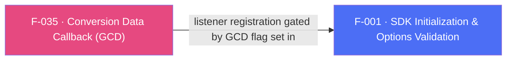

## Business Purpose
When a user installs the app after clicking an attributed link (or organically), the app often needs to know immediately — before the user even signs in — which campaign drove the install and whether it carries a deferred deep link, so it can personalize the very first session (e.g. show a specific onboarding screen or promo). `onInstallConversionData` ("Get Conversion Data", GCD) delivers this attribution/conversion payload to Dart right after install. Without it, apps lose the ability to react to install-time attribution data and deferred-deep-link payloads inside the app itself.

---

## Trigger
Native SDK fires this once conversion data has been fetched from AppsFlyer's servers following an app install/launch — gated end-to-end by the `registerConversionDataCallback` flag passed to `initSdk()` (F-001) and by the Dart app having called `onInstallConversionData(callback)` to subscribe before that init.

---

## Call Chain
Registration is driven from the init orchestration: when `registerConversionDataCallback: true`, the init RPC sequence calls the native `registerConversionListener` RPC. Reverse events return over the **`af-events` EventChannel** as an `{id, status, data}` JSON envelope (there is no `callbacks` MethodChannel).
```
AppsflyerSdk.initSdk(registerConversionDataCallback: true, ...)                        [lib/src/appsflyer_sdk.dart]
  → validatedOptions[AF_GCD] = registerConversionDataCallback
  → _executeRpc('init', validatedOptions)   // MethodChannel af-api → executeRpc
    → Android: initFromRpc → if (getGCD) executeRpcSync('registerConversionListener')  [android/.../AppsflyerSdkPlugin.java]
    → iOS: initFromRpc → if (isGCD) sequence += 'registerConversionListener'           [ios/.../AppsflyerSdkPlugin.m]

AppsflyerSdk.onInstallConversionData(MultiUseCallback callback)                        [lib/src/appsflyer_sdk.dart]
  → _startListening(callback, "onInstallConversionData")                               [lib/src/callbacks.dart]
    → _callbacksById["onInstallConversionData"] = callback; subscribe to af-events

Native SDK conversion data arrives (bridge RpcEventNotifier / iOS bridge event handler):
  → normalized to {"id":"onInstallConversionData", "status":"success"|"failure", "data": <json>} on af-events
    → Dart: _dispatchCallListener [lib/src/callbacks.dart] → id == "onInstallConversionData"
      → _callbacksById["onInstallConversionData"]({"status": ..., "payload": decodedData})
```

---

## Files
| File | Role |
|------|------|
| `lib/src/appsflyer_sdk.dart` | `onInstallConversionData(MultiUseCallback)` — registers the Dart callback via `_startListening`; `initSdk(registerConversionDataCallback:)` sets the `AF_GCD` init flag. `unregisterConversionDataListener()` drops the Dart routing entry (observer-only). |
| `lib/src/callbacks.dart` | `_dispatchCallListener` — decodes the `af-events` `{id, status, data}` envelope and dispatches `{"status", "payload"}` to the registered `"onInstallConversionData"` callback |
| `android/.../AppsflyerSdkPlugin.java` | `initFromRpc` runs the `registerConversionListener` RPC when `AF_GCD` is set; `processBridgeEvent` maps the bridge conversion success/fail events to the `onInstallConversionData` af-events envelope |
| `ios/.../AppsflyerSdkPlugin.m` | `initFromRpc` adds `registerConversionListener` to the RPC sequence when the `GCD` flag is set; `handleBridgeEvent` maps `onConversionDataSuccess`/`onConversionDataFail` to the same af-events envelope |

---

## Input / Output
| | |
|--|--|
| **Input** | None from Dart beyond registering the callback; the payload itself originates from AppsFlyer's attribution servers via the native SDK. |
| **Output** | `{"status": "success"｜"failure", "payload": Map?}` delivered to the Dart callback passed to `onInstallConversionData`. On failure, native wraps the error into the same envelope shape rather than a distinct failure structure. |

---

## Tests
No dedicated test found. `test/appsflyer_sdk_test.dart` does not exercise `onInstallConversionData` or the af-events dispatch path in `lib/src/callbacks.dart`.

---

## Known Limitations
- **Flag + listener are both required**: setting `registerConversionDataCallback: true` without calling `onInstallConversionData()` (or vice versa) delivers nothing. The init flag arms the native listener; the Dart registration gates routing.
- Documentation requires the Dart-side `onInstallConversionData` implementation to be registered **before** SDK initialization; nothing in code enforces or warns about this ordering.
- Android buffers events that arrive before Dart subscribes to `af-events` (`pendingEvents`, RD-65582) and replays them on attach, so an install-conversion event emitted before the stream is attached is not lost.
- Error payloads use the same JSON envelope as success payloads, so Dart-side consumers must inspect `status` rather than relying on a distinct shape to detect failure.

---

## Dependencies

