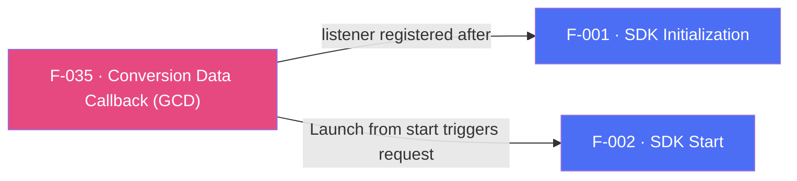

## Business Purpose
When a user installs the app after clicking an attributed link (or organically), the app often needs to know immediately — before the user even signs in — which campaign drove the install and whether it carries a deferred deep link, so it can personalize the very first session (e.g. show a specific onboarding screen or promo). "Get Conversion Data" (GCD) delivers this attribution/conversion payload to Dart right after install, through the `onConversionDataSuccess` and `onConversionDataFailure` streams. Without it, apps lose the ability to react to install-time attribution data and deferred-deep-link payloads inside the app itself.

---

## Trigger
The host app subscribes to `onConversionDataSuccess` and `onConversionDataFailure`, calls `registerConversionListener()` after `init()`, then follows the normal session-ready flow and calls `start()`. Listener registration only installs the delegate; the Launch sent by `start()` triggers the conversion-data request whose result reaches the streams. There is no init-time flag.

---

## Call Chain
Registration is an ordinary awaitable RPC. Results arrive on the **`af-events` EventChannel** as a native RPC JSON envelope, are parsed into a `_AppsFlyerEvent` (`name` + `data`), and are filtered by event name into the typed streams.

```
AppsFlyerSdk.onConversionDataSuccess.listen(...)                       [lib/src/appsflyer_sdk.dart]
AppsFlyerSdk.onConversionDataFailure.listen(...)
  → filters of the shared af-events broadcast stream

AppsFlyerSdk.registerConversionListener()
  → _invokeVoidRpc('registerConversionListener')
    → _invokeRpc → MethodChannel('af-api').invokeMethod('executeRpc', {method, params})
      → Android: AppsflyerSdkPlugin.dispatchRpc → AppsFlyerRpcHandler
      → iOS: AppsflyerSdkPlugin.dispatchRpc → AppsFlyerRPCBridge

Native conversion data arrives (Android RpcEventNotifier / iOS handleBridgeEvent):
  → Android: AppsFlyerEventBus.publish(json) → EventChannel('af-events'), buffered until a sink attaches
  → iOS: deliverEvent(json) on EventChannel('af-events'), buffered in pendingEvents until Dart subscribes
    → _AppsFlyerEvent.fromNative(json)                                 [lib/src/appsflyer_event.dart]
      → event.name == 'onConversionDataSuccess'
          → Map<String, dynamic> emitted on onConversionDataSuccess
      → event.name == 'onConversionDataFail'
          → Map<String, dynamic> emitted on onConversionDataFailure (raw payload, not an RPC exception)
```

Android also exposes `unregisterConversionListener()`; on iOS the call is ignored with a logged warning and no RPC is dispatched.

---

## Files
| File | Role |
|------|------|
| `lib/src/appsflyer_sdk.dart` | `onConversionDataSuccess` / `onConversionDataFailure` streams, `registerConversionListener()`, and the Android-only `unregisterConversionListener()` |
| `lib/src/appsflyer_event.dart` | `_AppsFlyerEvent.fromNative` — parses the RPC envelope (`event`, map-or-null `data`) |
| `android/.../AppsflyerSdkPlugin.kt` | `rpcEventNotifier` hops bridge events to the main thread and publishes them to `AppsFlyerEventBus`; `createEventSink` adapts this engine's `af-events` sink |
| `android/.../AppsFlyerEventBus.kt` | Process-scoped buffer and FIFO replay, so conversion data arriving while no engine is attached reaches the next subscriber |
| `ios/.../AppsflyerSdkPlugin.swift` | `handleBridgeEvent` / `deliverEvent` forward bridge events to the `af-events` sink and buffer them in `pendingEvents` until Dart subscribes |

---

## Input / Output
| | |
|--|--|
| **Input** | None from Dart beyond `registerConversionListener()`; the payload itself originates from AppsFlyer's attribution servers via the native SDK. |
| **Output** | `onConversionDataSuccess` emits `Map<String, dynamic>` (the raw conversion payload). `onConversionDataFailure` emits the raw failure payload as `Map<String, dynamic>` — not an RPC exception, since registration itself already succeeded. Payload shape differs by platform: Android sends `{"error": String}` with no error code; iOS sends `{"error": String, "code": int}`. `registerConversionListener()` returns `Future<void>` after synchronous listener registration; it does not wait for conversion data and has no request timeout. |

---

## Tests
`test/appsflyer_sdk_test.dart`:
- `filters conversion events from the raw RPC stream` — emits an `onConversionDataSuccess` envelope on `af-events` and asserts the decoded payload reaches `onConversionDataSuccess`.
- `listeners are registered explicitly` — asserts `registerConversionListener()` dispatches the `registerConversionListener` RPC.
- `maps every Android-only API` — asserts `unregisterConversionListener` dispatches the matching RPC with no params.
- `platform-only void calls are ignored without reaching the native RPC` — asserts `unregisterConversionListener` on iOS dispatches no RPC.

`test/appsflyer_sdk_test.dart` — `ignores transport-only envelope fields on conversion stream` covers the `onConversionDataSuccess` envelope shape (`event`, `data`).

---

## Known Limitations
- Subscribe to the streams **before** calling `registerConversionListener()`. The streams are broadcast filters over `af-events`, so events delivered before a subscription exists are not replayed by Dart.
- Registering the listener does not issue the conversion-data network request. The app must still call `start()` for the foreground cycle; otherwise no Launch is sent and no conversion result is expected.
- Both platforms buffer native events until Dart attaches to `af-events` (RD-65582), so an install-conversion event emitted before the stream is attached is not lost at the native layer. Android buffers in the process-scoped `AppsFlyerEventBus`, which also covers conversion data arriving while the Flutter engine is torn down; iOS buffers per plugin instance for the lifetime of the engine. Both buffers hold at most 64 events and drop the oldest beyond that.
- `onConversionDataFailure` passes through the raw native payload unchanged: on Android it never carries a `code` field (the native delegate only supplies an error message), while on iOS it does. Callers that need a `code` must handle its absence on Android rather than relying on a synthesized default.
- `unregisterConversionListener()` is Android-only; iOS integrations cannot stop conversion-data delivery through the RPC bridge.

---

## Dependencies

