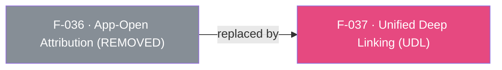

## Status: REMOVED in SDK 7

App-Open Attribution (OAOA) — the legacy `onAppOpenAttribution` / `registerOnAppOpenAttributionCallback` direct-deep-linking API — was **removed from both native AppsFlyer SDKs in v7** and is therefore **removed from the Flutter plugin**. There is no `onAppOpenAttribution` Dart method, no `registerOnAppOpenAttributionCallback` init flag, and no native handler for it.

Per the [API Removal Rule](/.cursor/rules/api-removal-rule.mdc), the plugin preserves SDK 7 behavior rather than SDK 6 APIs; OAOA is not kept as a no-op stub.

### Replacement
Use **Unified Deep Linking (UDL)** — `onDeepLinking(UDLCallback)` with `registerOnDeepLinkingCallback: true` in `initSdk()` (see F-037). UDL delivers both direct (app already installed) and deferred deep links through a single strongly-typed `DeepLinkResult`, superseding the legacy OAOA path. Install-time attribution/conversion data is still available via `onInstallConversionData` (GCD, F-035).

See [migration guide](/doc/migration-guide.md) for the full removal/replacement details.

> Note: the feature INDEX previously listed F-036 as active — that is stale. This feature is removed.

---

## Dependencies

