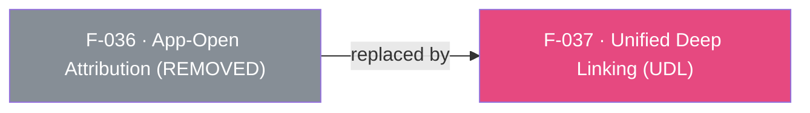

## Status: REMOVED in SDK 7

App-Open Attribution (OAOA) — the legacy `onAppOpenAttribution` / `registerOnAppOpenAttributionCallback` direct-deep-linking API — was **removed from both native AppsFlyer SDKs in v7** and is therefore **removed from the Flutter plugin**. There is no `onAppOpenAttribution` Dart method, no OAOA init flag, and no native handler for it.

Per the [API Removal Rule](/doc/migration-guide.md#api-removal-rule), the plugin preserves SDK 7 behavior rather than SDK 6 APIs; OAOA is not kept as a no-op stub.

### Replacement
Use **Unified Deep Linking (UDL)** — the `onDeepLinkReceived` stream plus an explicit `registerDeepLinkListener()` call (see F-037). There is no init-time callback flag: subscribe to the stream first, then register the native listener after `init()`.

```dart
final appsFlyer = AppsFlyerSdk.instance;

appsFlyer.onDeepLinkReceived.listen((DeepLinkResult result) {
  // result.status, result.deepLink, result.error
});

await appsFlyer.init(devKey: 'YOUR_DEV_KEY', appId: 'YOUR_APP_ID');
await appsFlyer.registerDeepLinkListener();
```

`registerDeepLinkListener()` maps to `subscribeForDeepLink` on Android and `registerDeeplinkListener` on iOS, and delivers both direct (app already installed) and deferred deep links as a single `DeepLinkResult`, superseding the legacy OAOA path. Android also exposes `unregisterDeeplinkListener()`, a soft unsubscribe that drops further bridge deep-link events; on iOS the call is ignored with a logged warning and no RPC is dispatched.

Install-time attribution/conversion data is still available via GCD (F-035), now as the `onConversionDataSuccess` and `onConversionDataFailure` streams with an explicit `registerConversionListener()` call — the SDK 6 `onInstallConversionData` callback no longer exists.

See the [migration guide](/doc/migration-guide.md) for the full removal/replacement details.

> Note: the feature INDEX previously listed F-036 as active — that is stale. This feature is removed.

---

## Dependencies

