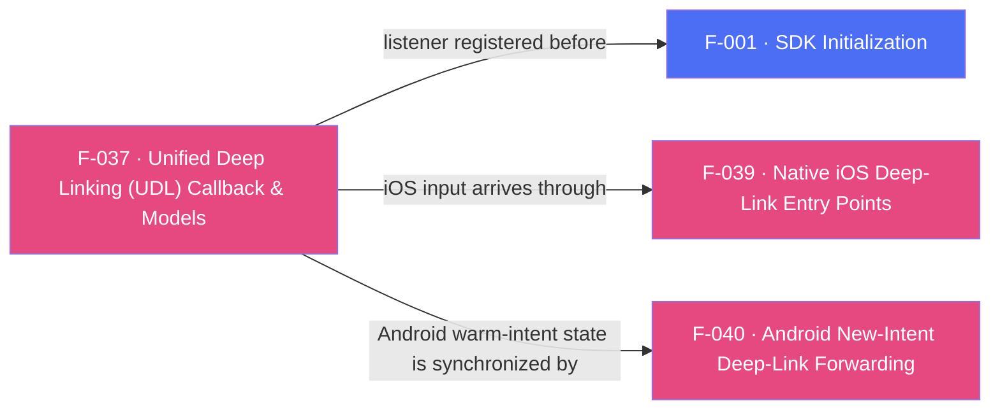

## Business Purpose
Unified Deep Linking is AppsFlyer's current recommended API for both direct and deferred deep linking: a single Dart callback (registered through `registerDeepLinkListener`) delivers one strongly-shaped result (`DeepLinkResult` — a `DeepLinkStatus`, an optional `DeepLinkFailure`, and an optional `DeepLink` payload) regardless of whether the link was clicked while the app was already installed or triggered a deferred install. It is the SDK 7 replacement for the legacy, now-removed OAOA path (F-036); install-time attribution is still available via GCD (F-035).

---

## Trigger
The host app calls `registerDeepLinkListener(onDeepLink)` **before** `init()`, passing the callback that receives the result. The native SDK then resolves a deep link (direct click while installed, or deferred deep link surfaced after a fresh install) and invokes its UDL delegate/listener. There is no init-time flag: registration is an explicit RPC call that maps to `subscribeForDeepLink` on Android and `registerDeeplinkListener` on iOS. The underlying native trigger differs per platform: on Android the SDK inspects the launch/new intent (F-040); on iOS it is `handleOpenUrl:`/`continueUserActivity:` buffered by `AppsFlyerAttribution` (F-039).

The pre-`init()` ordering is load-bearing on Android, not a style preference. `AppsFlyerLibCore.init()` calls `registerAndroidLifecycleListener(context)` synchronously, and because the plugin passes the **Activity** as the init context (`AppsflyerSdkPlugin.initFromRpc`), `AndroidLifecycleManagerImpl` replays `onActivityResumed` immediately. That reaches `AFDeepLinkManager.unifiedDeepLinking()`, whose deferred-resolution gate (`shouldRunDeferredDeeplinkFlow`) requires `listener != null`, and which then persists `ddl_sent = true` regardless of the outcome. A listener registered after `init()` loses that race — the plugin needs a second MethodChannel round trip — so the deferred resolution request is never sent for that install and is not retried on later launches. Direct deep links still work because they are resolved from the intent on each foreground. iOS has no equivalent gate (the delegate only has to be set before `start()`), but registration before `init()` is supported there too.

---

## Call Chain
Registration is an ordinary awaitable RPC. Results arrive on the **`af-events` EventChannel** as a native RPC JSON envelope, are parsed into a `_AppsFlyerEvent` (`name` + `data`), and are mapped into a `DeepLinkResult`.

```
AppsFlyerSdk.registerDeepLinkListener(onDeepLink)                      [lib/src/appsflyer_sdk.dart]
  → _ensureEventsSubscribed() — one af-events subscription for the plugin, attached on first registration
  → _listeners.on('onDeepLinking', …) and .on('onDeepLinkReceived', …)
      (the same callback for both platform event names; one slot each, replaced on re-registration)
  → _invokeVoidRpc(isAndroid ? 'subscribeForDeepLink' : 'registerDeeplinkListener')
    → _invokeRpc → MethodChannel('af-api').invokeMethod('executeRpc', {method, params})
      → Android: AppsflyerSdkPlugin.dispatchRpc → AppsFlyerRpcHandler
      → iOS: AppsflyerSdkPlugin.dispatchRpc → AppsFlyerRPCBridge

Native deep link resolved (via F-039 iOS entry points / F-040 Android intent handling):
  → Android: AppsFlyerEventBus.publish(json) → EventChannel('af-events'), buffered until a sink attaches
  → iOS: deliverEvent(json) on EventChannel('af-events'), buffered in pendingEvents until Dart subscribes
    → _AppsFlyerEvent.fromNative(json)                                 [lib/src/appsflyer_event.dart]
      → _AppsFlyerListenerRegistry.dispatch(event)                       [lib/src/appsflyer_listener_registry.dart]
        → DeepLinkResult._fromEvent(event, platform: _platform)           [lib/src/udl/deep_link_result.dart]
            status   = data['status'] normalized to DeepLinkStatus
            deepLink = DeepLink(decoded data['deepLink'])              [lib/src/udl/deeplink.dart]
            error    = Android ? DeepLinkFailure(type: ...) : DeepLinkFailure(message: ...)
        → onDeepLink(DeepLinkResult)
```

Android also exposes `unregisterDeeplinkListener()`, which dispatches `unsubscribeForDeepLink`; on iOS the call is ignored with a logged warning and no RPC is dispatched.

---

## Files
| File | Role |
|------|------|
| `lib/src/appsflyer_sdk.dart` | `registerDeepLinkListener(onDeepLink)` (platform-specific RPC name), the `OnDeepLinkReceived` typedef, and the Android-only `unregisterDeeplinkListener()` |
| `lib/src/appsflyer_listener_registry.dart` | `_AppsFlyerListenerRegistry` — one callback slot per native event name, replaced on re-registration |
| `lib/src/appsflyer_event.dart` | `_AppsFlyerEvent.fromNative` — parses the RPC envelope (`event`, map-or-null `data`) |
| `lib/src/udl/deeplink.dart` | `DeepLink` — the raw `clickEvent` map plus typed accessors (`deepLinkValue`, `matchType`, `clickHttpReferrer`, `mediaSource`, `campaign`, `campaignId`, `afSub1..5`, `isDeferred`) and `getStringValue(key)` |
| `lib/src/udl/deep_link_result.dart` | `DeepLinkResult` (`status`, `deepLink`, `error`, `toJson`), `DeepLinkResult._fromEvent`, `DeepLinkStatus` (`found`/`notFound`/`error`/`unknown`), and `DeepLinkFailure` (`type`, `message`) |
| `android/.../AppsflyerSdkPlugin.kt` | `rpcEventNotifier` hops the bridge deep-link event to the main thread and publishes it to `AppsFlyerEventBus`; `createEventSink` adapts this engine's `af-events` sink |
| `android/.../AppsFlyerEventBus.kt` | Process-scoped buffer and FIFO replay, so a deep link resolved while no engine is attached is delivered to the next subscriber instead of being lost |
| `android/.../AppsFlyerRpcBridge.kt` | Process-scoped owner of the `AppsFlyerRpcHandler` that holds the UDL listener, so `subscribeForDeepLink` after engine recreation reuses it |
| `ios/.../AppsflyerSdkPlugin.swift` | `deliverEvent` forwards the event to the `af-events` sink and buffers it in `pendingEvents` until Dart subscribes |

---

## Input / Output
| | |
|--|--|
| **Input** | None from Dart beyond `registerDeepLinkListener()`; the deep-link click event originates from AppsFlyer's OneLink resolution, delivered into the native SDK via F-039 (iOS) / F-040 (Android) entry points or the SDK's own intent/URL inspection. |
| **Output** | `DeepLinkResult { DeepLinkStatus status, DeepLink? deepLink, DeepLinkFailure? error }` passed to the registered `onDeepLink` callback. `DeepLink` exposes the raw click-event map plus typed getters. UDL privacy protection means new users' payloads are limited to `deep_link_value`/`deep_link_sub1-10`; other getters may return `null`. `DeepLinkResult.toJson()` serializes the result back to its JSON form. |

---

## Tests
`test/appsflyer_sdk_test.dart`:
- `normalizes Android and iOS deep-link status without hiding errors` — builds `DeepLinkResult._fromEvent` from an Android `onDeepLinking` envelope (`FOUND` + JSON-string `deepLink`) and an iOS `onDeepLinkReceived` failure envelope, asserting the mapped `DeepLinkStatus`, `deepLinkValue`, `isDeferred`, and that the iOS failure carries a `message` but no `type`.
- `listeners are registered explicitly` — asserts `registerDeepLinkListener(onDeepLink)` dispatches `subscribeForDeepLink` on Android and `registerDeeplinkListener` on iOS.
- `maps every Android-only API` — asserts `unregisterDeeplinkListener` dispatches `unsubscribeForDeepLink`.
- `platform-only void calls are ignored without reaching the native RPC` — asserts `unregisterDeeplinkListener` on iOS dispatches no RPC.

`test/appsflyer_sdk_test.dart` — `routes deep-link events with an object data payload` covers an `onDeepLinkReceived` envelope whose `data` is a JSON object.

---

## Known Limitations
- The plugin holds **one deep-link callback**, replaced on re-registration, matching the native SDK's single UDL listener slot; there is no public stream, so one resolved deep link cannot be routed twice by the app. A deep-link event arriving before `registerDeepLinkListener()` has run is logged and dropped by `_AppsFlyerListenerRegistry`.
- **Unrecognized status strings** fall back to `DeepLinkStatus.unknown`; `DeepLinkResult._fromEvent` never throws on an unexpected status.
- Failure detail is asymmetric by design: Android populates `DeepLinkFailure.type` (a stable error type) and iOS populates `DeepLinkFailure.message` (a localized string). Neither platform fills both.
- Android RPC 7.0.1 serializes the native click event via `org.json.JSONObject.toString()`, which is valid JSON. `_decodeDeepLink` decodes it directly with `jsonDecode` (types, including `is_deferred`, are preserved); a malformed/non-JSON string is treated as "no deep link" (`null`) rather than partially parsed.
- **`DeepLink.isDeferred` is unreliable on iOS**: the native `AppsFlyerDeepLink.clickEvent` dictionary never includes an `is_deferred` key (the flag lives on a separate native `isDeferred` property that the iOS RPC bridge's `didResolveDeepLink` does not forward). `isDeferred` always returns `null` for iOS deep links regardless of the actual deferred/direct outcome. Android reliably sets `is_deferred` on every resolved deep link. Fixing this requires a native iOS RPC change (forwarding `deepLink.isDeferred` alongside `clickEvent`) — out of scope for the Flutter plugin.
- `unregisterDeeplinkListener()` is an Android-only soft unsubscribe: the native SDK keeps its listener (it exposes no public unsubscribe API) and the RPC bridge drops subsequent deep-link events. Because the handler holding that reference is process-scoped on Android, the soft unsubscribe also outlives the engine that requested it — an app that unsubscribes on teardown must call `registerDeepLinkListener()` again after the next engine attaches.
- **Registration order is unenforced.** Nothing in the plugin prevents an app from calling `registerDeepLinkListener()` after `init()`, and nothing reports the resulting loss of Android deferred deep linking: the native gate fails silently (no `[DDL]` log covers the listener-null case) and `ddl_sent` makes it permanent for that install, so reproducing a fix requires a reinstall or a data wipe. Only the documentation and the example app express the requirement.
- Both platforms buffer native events until Dart attaches to `af-events` (RD-65582) and replay them on attach. Dart attaches that single subscription lazily on the first `register*Listener()` call, so the replay is not drained before a callback slot exists. Android buffers in the process-scoped `AppsFlyerEventBus`, so a deep link resolved while the Flutter engine is torn down (back press, then a link tap) survives engine recreation. iOS buffers per plugin instance and removes its bridge handler on engine detach (only if that instance still owns the bridge's single handler slot), so it has no equivalent cross-engine replay. Both buffers hold at most 64 events and drop the oldest beyond that.

---

## Dependencies

