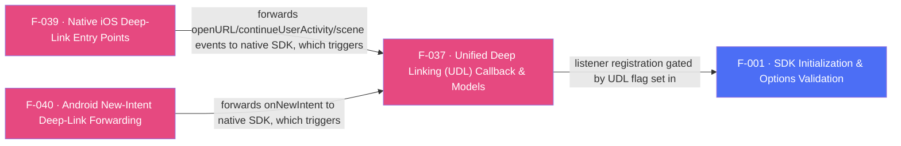

## Business Purpose
Unified Deep Linking is AppsFlyer's current recommended API for both direct and deferred deep linking: a single Dart callback (`onDeepLinking`) delivers one strongly-shaped result (`DeepLinkResult` — a `Status`, an optional `DeepLinkError`, and an optional `DeepLink` payload) regardless of whether the link was clicked while the app was already installed or triggered a deferred install. It is the SDK 7 replacement for the legacy, now-removed OAOA path (F-036); install-time attribution is still available via GCD (F-035).

---

## Trigger
Native SDK resolves a deep link (direct click while installed, or deferred deep link surfaced after a fresh install) and invokes its UDL delegate/listener — gated end-to-end by the `UDL` flag passed to `initSdk(registerOnDeepLinkingCallback: true)` (F-001) and by the Dart app having called `onDeepLinking(callback)` to subscribe before init. The native registration is performed from the init orchestration (`subscribeForDeepLink` on Android, `registerDeeplinkListener` on iOS). The underlying native trigger differs per platform: on Android the SDK inspects the launch/new intent (F-040); on iOS it is `handleOpenUrl:`/`continueUserActivity:` buffered by `AppsFlyerAttribution` (F-039).

---

## Call Chain
Registration is driven from init; results return over the **`af-events` EventChannel** as an `{id, deepLinkStatus, deepLinkError?, deepLinkObj?}` JSON envelope (there is no `callbacks` MethodChannel).
```
AppsflyerSdk.initSdk(registerOnDeepLinkingCallback: true, ...)                          [lib/src/appsflyer_sdk.dart]
  → validatedOptions[AF_UDL] = registerOnDeepLinkingCallback
  → _executeRpc('init', validatedOptions)   // MethodChannel af-api → executeRpc
    → Android: initFromRpc → if (getUdl) executeRpcSync('subscribeForDeepLink')         [android/.../AppsflyerSdkPlugin.java]
    → iOS: initFromRpc → if (isUDL) sequence += 'registerDeeplinkListener'              [ios/.../AppsflyerSdkPlugin.m]

AppsflyerSdk.onDeepLinking(UDLCallback callback)                                        [lib/src/appsflyer_sdk.dart]
  → _startListeningToUDL(callback, "onDeepLinking")                                     [lib/src/callbacks.dart]
    → _udlCallback = callback; subscribe to af-events

Native deep link resolved (via F-039 iOS entry points / F-040 Android intent handling):
  → normalized to {"id":"onDeepLinking", "deepLinkStatus", "deepLinkError"?, "deepLinkObj"?} on af-events
    → Dart: _dispatchCallListener [lib/src/callbacks.dart] → id == "onDeepLinking"
      → error  = callMap["deepLinkError"]?.errorFromString()         // DeepLinkError?
      → status = callMap["deepLinkStatus"]?.statusFromString() ?? Status.PARSE_ERROR
      → deepLink = callMap["deepLinkObj"] != null ? DeepLink(map) : null
      → _udlCallback(DeepLinkResult(error, deepLink, status))         [lib/src/udl/deep_link_result.dart, lib/src/udl/deeplink.dart]
```

---

## Files
| File | Role |
|------|------|
| `lib/src/appsflyer_sdk.dart` | `onDeepLinking(UDLCallback)` — registers the Dart UDL callback; `initSdk(registerOnDeepLinkingCallback:)` sets the `AF_UDL` init flag |
| `lib/src/callbacks.dart` | `_startListeningToUDL` — stores a single `_udlCallback` (not the keyed `_callbacksById` map); `_dispatchCallListener`'s `"onDeepLinking"` branch parses `deepLinkStatus`/`deepLinkError`/`deepLinkObj` into a `DeepLinkResult` |
| `lib/src/udl/deeplink.dart` | `DeepLink` — typed accessors (`deepLinkValue`, `matchType`, `mediaSource`, `campaign`, `afSub1..5`, `isDeferred`, etc.) over the raw click-event map |
| `lib/src/udl/deep_link_result.dart` | `DeepLinkResult` (`status`, `deepLink`, `error`), `Status` (`FOUND`/`NOT_FOUND`/`ERROR`/`PARSE_ERROR`), and the `DeepLinkError` (`TIMEOUT`/`NETWORK`/`HTTP_STATUS_CODE`/`UNEXPECTED`/`DEVELOPER_ERROR`) enum — renamed from `Error` to stop shadowing `dart:core Error`; `DeepLinkResult.error` is now `DeepLinkError?` |
| `android/.../AppsflyerSdkPlugin.java` | `initFromRpc` runs `subscribeForDeepLink` when `AF_UDL` is set; `processBridgeEvent`/`buildDeepLinkArgs` serialize the bridge deep-link event into the `deepLinkStatus`/`deepLinkError`/`deepLinkObj` af-events shape |
| `ios/.../AppsflyerSdkPlugin.m` | `initFromRpc` adds `registerDeeplinkListener` to the RPC sequence when the `UDL` flag is set; `handleBridgeEvent`/`deliverDeepLinkEvent` map the bridge `onDeepLinkReceived` event (found/notFound/failure → FOUND/NOT_FOUND/ERROR) into the same af-events shape |

---

## Input / Output
| | |
|--|--|
| **Input** | None from Dart beyond registering the callback; the deep-link click event originates from AppsFlyer's OneLink resolution, delivered into the native SDK via F-039 (iOS) / F-040 (Android) entry points or the SDK's own intent/URL inspection. |
| **Output** | `DeepLinkResult { Status status, DeepLink? deepLink, DeepLinkError? error }` delivered to the Dart callback passed to `onDeepLinking`. `DeepLink` exposes the raw click-event map plus typed getters (`deepLinkValue`, `matchType`, `clickHttpReferrer`, `mediaSource`, `campaign`, `campaignId`, `afSub1..5`, `isDeferred`). UDL privacy protection means new users' payloads are limited to `deep_link_value`/`deep_link_sub1-10`; other fields may return `null`. `DeepLinkResult.fromJson` reconstructs a result from its JSON form. |

---

## Tests
No dedicated test found. `test/appsflyer_sdk_test.dart` does not exercise `onDeepLinking`, `_startListeningToUDL`, or the `"onDeepLinking"` branch of `_dispatchCallListener` in `lib/src/callbacks.dart`.

---

## Known Limitations
- **Single global callback, no queueing/multi-subscriber support**: `_startListeningToUDL` stores the callback in a single module-level `_udlCallback`, so registering `onDeepLinking` more than once silently replaces the previous subscriber.
- **Unrecognized status/error strings**: `statusFromString`/`errorFromString` iterate the enum values and return `null` on no match (they do not throw). A missing/unrecognized `deepLinkStatus` falls back to `Status.PARSE_ERROR`; an unrecognized `deepLinkError` yields a `null` error.
- Documentation requires the Dart-side `onDeepLinking` implementation to be registered **before** SDK initialization; nothing in code enforces or warns about this ordering.
- Android buffers events that arrive before Dart subscribes to `af-events` (`pendingEvents`, RD-65582) and replays them on attach.

---

## Dependencies

