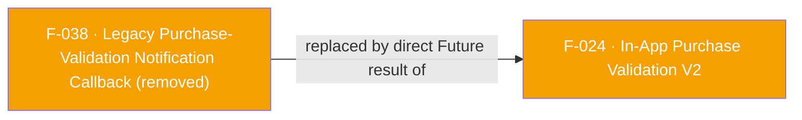

## Status: REMOVED in SDK 7

`onPurchaseValidation` — the callback registration that delivered the asynchronous, out-of-band result of the legacy V1 purchase-validation APIs (the `"validatePurchase"` event) — has been **removed from the Flutter plugin** in the SDK 7 migration.

It only ever existed to serve the V1 validation APIs (F-023), which are themselves removed. The transport it relied on is also gone: SDK 7 has no `"callbacks"` MethodChannel and no `AppsFlyerStreamHandler`; all reverse events now flow over the single `af-events` EventChannel, and there is no `"validatePurchase"` event on it.

**Replacement:** `validateAndLogInAppPurchase` (F-024) returns the validation result (or throws) directly on its own `Future` — no separate listener registration is needed.

See [`doc/migration-guide.md`](../../doc/migration-guide.md#removed-apis-and-their-replacements) and the [CHANGELOG](../../CHANGELOG.md).

---

## Dependencies

