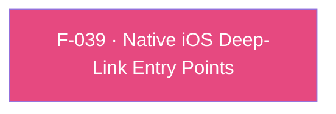

## Business Purpose
iOS only tells an app about an incoming deep link through OS delegate callbacks (`application:openURL:options:`, `application:continueUserActivity:...`) or, on the UIScene lifecycle (iOS 13+, and required by Flutter 3.41+'s UIScene migration), `scene:...` methods. The AppsFlyer SDK must intercept every one of these entry points — including the cold-start case where the OS delivers the launch URL/activity before the Flutter/Dart bridge exists — and pass it to the native AppsFlyer SDK so it can resolve OneLink attribution and, ultimately, deliver a `DeepLinkResult` to Dart via F-037. Without this interception layer, deep links opened while the app is fully cold (not yet running) would be silently lost. Flutter drives these entry points automatically (the plugin registers as an application/scene delegate), so the host `AppDelegate` does not need to forward `openURL`/`continueUserActivity` manually.

---

## Trigger
Fires whenever iOS launches or resumes the app via a deep link: URI-scheme opens (`application:openURL:options:`; the deprecated iOS 8 four-parameter form is not implemented because UIKit never calls it once `openURL:options:` exists, which `FlutterAppDelegate` provides), Universal Links (`continueUserActivity`), or — when the host app runs on Flutter's UIScene-based lifecycle — the equivalent `scene:openURLContexts:`, `scene:willConnectToSession:options:` (cold start), and `scene:continueUserActivity:` methods. The `scene:...` methods are always compiled (guarded only by `@available(iOS 13.0, *)`); what varies is whether they are ever *registered* — see Known Limitations.

---

## Call Chain
```
iOS OS-level deep-link delivery (app already running or resuming):
  application:openURL:options: (iOS 9+)                                    [ios/appsflyer_sdk/Sources/appsflyer_sdk/AppsflyerSdkPlugin.swift]
    → [[AppsFlyerAttribution shared] handleOpenUrl:url options:options]    [ios/appsflyer_sdk/Sources/appsflyer_sdk/AppsFlyerAttribution.swift]
  application:continueUserActivity:restorationHandler: (Universal Links)
    → [[AppsFlyerAttribution shared] continueUserActivity:userActivity]

iOS UIScene-based delivery (iOS 13+, only registered when the registrar responds to addSceneDelegate: — Flutter 3.41+):
  scene:openURLContexts: → for each context → [[AppsFlyerAttribution shared] handleOpenUrl:context.URL options:opts]
  scene:willConnectToSession:options: (cold start via UISceneConnectionOptions)
    → for each URLContext → handleOpenUrl:options:
    → for each userActivity of type NSUserActivityTypeBrowsingWeb → continueUserActivity:
  scene:continueUserActivity: → [[AppsFlyerAttribution shared] continueUserActivity:userActivity]

AppsFlyerAttribution (queueing singleton, isBridgeReady initially NO)                               [ios/appsflyer_sdk/Sources/appsflyer_sdk/AppsFlyerAttribution.swift]
  handleOpenUrl:.../continueUserActivity:...
    → executeOrQueue(PendingRequest) — the original URL/options or NSUserActivity, not a JSON envelope
      → if isBridgeReady == YES: [AppsFlyerLib shared] handleOpen:options: / continue:restorationHandler:
      → else: append the request to the pendingRequests queue

AppsflyerSdkPlugin initFromRpc:result: (Dart AppsFlyerSdk.init() → af-api executeRpc('init') → native init sequence)   [ios/appsflyer_sdk/Sources/appsflyer_sdk/AppsflyerSdkPlugin.swift]
  → runSequence: setPluginInfo → initialize
  → markBridgeReady(markedBy: pluginInstance)   [plugin-internal; not on the @objc surface]
    → isBridgeReady = YES, records the owning plugin instance, then drains pendingRequests into [AppsFlyerLib shared]
      → native SDK resolves the deep link → triggers F-037 (UDL) delivery to Dart
```
Deep-link listener registration is no longer part of the init sequence. Dart registers it explicitly with `AppsFlyerSdk.registerDeepLinkListener()`, which sends the `registerDeeplinkListener` RPC on iOS.

---

## Files
| File | Role |
|------|------|
| `ios/appsflyer_sdk/Sources/appsflyer_sdk/AppsflyerSdkPlugin.swift` | `application:openURL:options:`, `application:continueUserActivity:restorationHandler:`, and (registered only when the registrar responds to `addSceneDelegate:`) `scene:openURLContexts:`, `scene:willConnectToSession:options:`, `scene:continueUserActivity:` — all OS/Scene entry points, each forwarding into `AppsFlyerAttribution`; `initFromRpc:result:` calls plugin-internal `markBridgeReady(markedBy:)` once Dart's `init()` (`executeRpc('init')`) RPC sequence completes |
| Generated `appsflyer_sdk-Swift.h` | Exposes the `AppsFlyerAttribution` singleton interface to Objective-C: the `handleOpenUrl:options:` and `continueUserActivity:` entry points, both pinned with explicit `@objc(...)` selectors in the Swift source. Bridge readiness is opened only from `AppsflyerSdkPlugin` after `init()`; it is not a public `@objc` method. |
| `ios/appsflyer_sdk/Sources/appsflyer_sdk/AppsFlyerAttribution.swift` | Singleton implementation — private `isBridgeReady` flag and `pendingRequests` queue holding the original `URL`/options or `NSUserActivity`; `executeOrQueue` either calls `AppsFlyerLib` directly (`handleOpen(_:options:)`, `continue(_:restorationHandler:)`) or appends to the queue; plugin-internal `markBridgeReady(markedBy:)` records the owning engine, sets `isBridgeReady`, and drains that queue in arrival order |
| `ios/appsflyer_sdk/Sources/appsflyer_sdk/AppsflyerSdkPlugin.swift` (registration) | `@objc(AppsflyerSdkPlugin)` pins the runtime class name; scene-lifecycle support is registered at runtime via `registrar.responds(to: NSSelectorFromString("addSceneDelegate:"))` instead of a compile-time header check, since Swift has no `__has_include` equivalent for a framework subheader — the selector is looked up by name because `#selector` would not compile against a method the older Flutter header does not declare |

---

## Input / Output
| | |
|--|--|
| **Input** | `NSURL`/`NSDictionary` options (URI-scheme opens), `NSUserActivity` (Universal Links), or `UISceneConnectionOptions`/`UIOpenURLContext` sets (UIScene cold start/live events) — all supplied by iOS, not by Dart. |
| **Output** | No direct Dart-facing output from this feature; it forwards the URL/activity objects straight into `AppsFlyerLib`, which performs OneLink resolution and (if the deep-link listener is registered, F-037) surfaces a `DeepLinkResult` to the registered `registerDeepLinkListener` callback over the `af-events` EventChannel. |

---

## Tests
No dedicated test found — this logic lives entirely in Swift native code with no automated coverage found under `test/` (Dart tests only) or any discoverable native (XCTest) test target in `ios/`.

---

## Known Limitations
- **Queued as native objects**: `AppsFlyerAttribution` keeps every early event in the `pendingRequests` queue and drains them in arrival order, so multiple deep-link-shaped events during cold start are all forwarded. Each entry holds the original `URL` plus its options dictionary, or the original `NSUserActivity` — nothing is serialized, so no option value or activity property is lost on the way to the SDK.
- **`restorationHandler` is not forwarded**: `UIApplicationDelegate` requires the parameter on `continueUserActivity:`, but the AppsFlyer SDK ignores it, so the plugin passes `nil`. Handoff/UI restoration remains the host app's responsibility.
- **All delegate methods return `NO`**: every intercepted method (including `application:didFinishLaunchingWithOptions:`) explicitly returns `NO`. Flutter ORs the results of its registered delegates, so returning `NO` avoids blocking other plugins from handling the same URL — but it also means AppsFlyer's interception is invisible to code that checks the return value for "was this URL handled."
- **UIScene support is registered at runtime, not conditionally compiled**: Swift has no `__has_include` equivalent for a framework subheader, so the `scene:...` methods are always part of the binary (guarded only by `@available(iOS 13.0, *)`) and `addSceneDelegateIfSupported` decides at launch whether to register them, via `registrar.responds(to: NSSelectorFromString("addSceneDelegate:"))`. On a Flutter engine older than 3.41 the registrar does not respond, so the methods stay in the binary but are never invoked and only the `UIApplicationDelegate` path runs. Either way the host `AppDelegate` does not have to forward anything, because the plugin registers itself as a delegate.
- **Duplicate UIScene delivery is suppressed in `AppsFlyerAttribution`, not at the entry points.** Under the UIScene lifecycle UIKit delivers deep links through the `scene:...` methods, but Flutter *also* replays every scene event through the `UIApplicationDelegate` methods so plugins predating the migration keep working. Because this plugin implements both families, one user action reached `AppsFlyerAttribution` twice and Dart's `onDeepLinking` ran twice — measured on 2026-08-27 on an iPhone 17 Pro simulator (iOS 26.5) by temporarily adding `UIApplicationSceneManifest` to `example/ios/Runner/Info.plist`. `executeOrQueue` now drops a delivery whose link identity matches the previous one within one second (`isDuplicateDelivery(_:)`), and only for hosts that declare a scene manifest, so an app on the application-delegate lifecycle is untouched. **Do not "simplify" this by ignoring the application-delegate methods when the scene delegate is registered**: that variant was tried first and broke every host that forwards a URL manually from its own `AppDelegate` — including the example app's own QA harness, which made `phase_2` and `phase_7` fail outright. De-duplication must key on the link, not on which delegate delivered it. Verified 2026-08-27 on an iPhone 17 Pro simulator: the full iOS plan passes 43/43 both with and without the scene manifest, with exactly one delivery per deep-link phase in each configuration. Two over-suppression risks were measured rather than reasoned about — a *different* link fired 0.3 s after another is still delivered, and the *same* link repeated past the window is delivered again. The `NSUserActivity` branch has no phase (Universal Links are undeliverable in `example/`, see the next limitation), so it was covered by temporarily replaying one from the example's `AppDelegate`: three replays at +5.0 s, +5.3 s and +12.0 s produced three deliveries with no scene manifest — proving the SDK itself does not collapse them — and two with the manifest, the 0.3 s pair collapsing into one. The pre-`init()` queue path was covered the same way, since that is where de-duplication runs *before* `pendingRequests` and could in principle drop the queued copy along with the duplicate: replaying a pair synchronously from `didFinishLaunchingWithOptions` and again 0.3 s later produced two deliveries with no scene manifest and exactly one — not zero — with it, both landing after the pre-start APIs and before `start()` returned, which is the queue draining. **Still unverified:** `lastDelivery` being cleared on engine detach, a real UIKit `scene:willConnectToSession:options:` cold start (the cold phases replay through the application delegate instead), multi-window hosts (`UIApplicationSupportsMultipleScenes`), and any scene-lifecycle run on a physical device.
- **Universal Link delivery cannot be exercised in `example/`.** `example/ios/Runner/Runner.entitlements` declares the correct `applinks:` domain, but no build configuration in `Runner.xcodeproj` sets `CODE_SIGN_ENTITLEMENTS`, so the signed binary carries no `com.apple.developer.associated-domains` entitlement and iOS never claims the domain — a tap on a OneLink `https` URL opens Safari instead of the app. Wiring the setting in does not help on its own: verified on 2026-08-27 that `com.appsflyer.example` is registered to a different Apple team, and the wildcard provisioning profile the example signs with cannot carry Associated Domains by Apple's rules, so the build fails outright. Closing this needs either access to the team owning that identifier or a new bundle ID registered with the capability *and* a matching update to the OneLink dashboard so the AASA file keeps matching. Consequence for testing: iOS coverage of OS-delivered `https` links is currently a gap, and `.af-e2e/test-plan.json` restricts `phase_8` to Android for this reason. It does not affect the custom-scheme path or deferred resolution, neither of which needs the OS to hand the URL to the app.
- The bridge-ready handshake depends on Dart actually calling `AppsFlyerSdk.init()`; if the app never initializes the SDK (or does so much later), queued deep-link data waits indefinitely in `pendingRequests`. A failed init sequence returns the error to Dart without marking the bridge ready, so the queue is never drained for that launch. Only `markBridgeReady(markedBy:)` (plugin-internal) may open the gate; a parameterless public variant was removed because it opened the gate without recording an owner, so `resetBridgeStateIfOwned(by:)` on engine detach could not clear stale state. When the owning Flutter engine detaches, `resetBridgeStateIfOwned(by:)` clears the singleton gate and pending queue so a recreated engine does not inherit a stale open gate from the previous instance.
- **Lifecycle callbacks bypass the RPC bridge**: every UIKit entry point on this path — `handleLaunchOptions:`, `handleOpenUrl:options:`, `continueUserActivity:` — calls `AppsFlyerLib` directly instead of going through `AFRPCBridge`, matching the React Native plugin. These are native-to-native hops that no Dart call originates, and JSON is lossy for them: `handleLaunchOptions:` reads only the live `NSUserActivity` under `UIApplicationLaunchOptionsUserActivityDictionaryKey`, which the plugin's JSON sanitizer dropped, so the RPC form silently never set the pending-deeplink flag it exists to set; the RPC `continueUserActivity` handler likewise rebuilt a synthetic `NSUserActivity` carrying only `activityType` and `webpageURL`. Passing the original objects removes both losses. `handleLaunchOptions:` additionally needs no readiness gate — it has no `initialize` dependency and only sets the flag `registerSessionReadyListener` samples later — so it is called straight from the delegate without queueing. When AppsFlyerRPC exposes a typed lifecycle API, these call sites move to it.
- **No failure signal on the lifecycle path**: the SDK calls return nothing actionable (`continue(_:restorationHandler:)` returns a `BOOL` the SDK ignores), so nothing is logged or surfaced — UDL results arrive on `af-events` only.
- No test coverage exists for any of the buffering/forwarding logic described here.

---

## Dependencies

