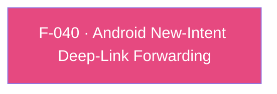

## Business Purpose
The native AppsFlyer Android SDK inspects the hosting `Activity`'s intent during its lifecycle (`onResume`). For a warm-started app, Android delivers a new `VIEW` intent through `onNewIntent`. Initialization attaches the native SDK to lifecycle handling, while the explicit F-037 listener registration subscribes for UDL results. This feature keeps the `Activity`'s current intent in sync so the SDK sees the newly delivered intent on the next resume.

---

## Trigger
Fires whenever Android calls `onNewIntent` on the host `Activity` while the Flutter engine's activity is attached — i.e. the app is warm (already running) and receives a new `Intent` (typically a `VIEW` intent from a deep-link click).

---

## Call Chain
```
Android delivers a new Intent to the running Activity (app already warm)
  → PluginRegistry.NewIntentListener.onNewIntent(Intent intent)                    [android/.../AppsflyerSdkPlugin.kt]
    → if (activity != null) activity.setIntent(intent)   // keep the Activity's intent in sync
    → return false                                       // does not claim exclusive handling
      // init() establishes SDK lifecycle handling; registerDeepLinkListener() separately
      // installs the UDL listener. The SDK examines the current VIEW intent on onResume.
        → afDeepLinkListener → onDeepLinking (F-037), delivered to Dart over the af-events EventChannel
```
Note: unlike SDK 6, the listener no longer calls `AppsFlyerLib.performOnDeepLinking(intent, ...)` from `onNewIntent`; the SDK's own lifecycle handling performs the resolution. The listener only synchronizes the `Activity` intent.

---

## Files
| File | Role |
|------|------|
| `android/src/main/kotlin/com/appsflyer/appsflyersdk/AppsflyerSdkPlugin.kt` | `onNewIntentListener` (`PluginRegistry.NewIntentListener`) — calls `activity.setIntent(intent)` (guarded by `activity != null`) and returns `false`; registered via `binding.addOnNewIntentListener(onNewIntentListener)` in both `onAttachedToActivity` and `onReattachedToActivityForConfigChanges` |

---

## Input / Output
| | |
|--|--|
| **Input** | The Android `Intent` delivered to `onNewIntent` (typically a `VIEW` intent carrying a deep-link/OneLink URI), plus the plugin's cached `Activity` reference. |
| **Output** | No direct Dart-facing output — the listener only syncs the `Activity`'s intent. The native SDK's lifecycle handling resolves the deep link and (if subscribed via F-037) delivers a `DeepLinkResult` over the `af-events` EventChannel. `onNewIntent` returns `false`, so it does not consume the intent for other listeners. |

---

## Tests
No dedicated test found — no native (JUnit/Robolectric) test target under `android/` covers `onNewIntentListener`, and `test/appsflyer_sdk_test.dart` (Dart-only) does not exercise this native-only code path.

---

## Known Limitations
- **Depends on activity attachment**: `setIntent` is only called `if (activity != null)`; a new intent arriving in a narrow window before `onAttachedToActivity` runs (or after teardown) is not synced.
- **Relies on SDK-internal onResume resolution**: correctness depends on the SDK's lifecycle subscription resolving the current intent on `onResume`. Listener registration is explicit in SDK 7, so if the app never called `registerDeepLinkListener()` (Android RPC `subscribeForDeepLink`), no UDL resolution occurs.
- **No iOS equivalent by nature**: iOS has no `onNewIntent`; the warm-start-equivalent cases are handled by the always-active `application:openURL:...`/`continueUserActivity:...`/`scene:...` delegate methods (F-039).
- `onNewIntent` always returns `false`, so other registered `NewIntentListener`s (e.g. app-level routing) still run.

---

## Dependencies

