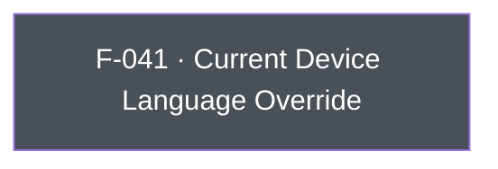

## Business Purpose
AppsFlyer's attribution and in-app-event reporting includes the device's language/locale as a dimension used for reporting and, for some integrated partners, for postback enrichment. Apps that manage their own in-app localization independently of the OS locale (e.g. a language switcher that doesn't change `NSLocale`) need a way to tell AppsFlyer which language the user is actually seeing, rather than relying on the OS-reported value. `setCurrentDeviceLanguage` provides that override. Without it, AppsFlyer would only ever see the OS-level device language, which can diverge from the language actually presented to the user and skew language-based reporting/segmentation.

---

## Trigger
Called by the host app whenever it needs to explicitly declare (or correct) the language reported to AppsFlyer — typically during startup configuration or right after an in-app language change.

---

## Call Chain
Generic RPC call over the single `executeRpc` entry point. The Dart method is iOS-guarded (`Platform.isIOS`), so on Android it is a no-op (no RPC is sent).
```
AppsflyerSdk.setCurrentDeviceLanguage(language)                          [lib/src/appsflyer_sdk.dart]
  → if (Platform.isIOS) _executeRpc('setCurrentDeviceLanguage', {'language': language})   // af-api → executeRpc
    → iOS: dispatchRpc → AppsFlyerRPCBridge executeJson("setCurrentDeviceLanguage") → SDK setCurrentDeviceLanguage:
```

---

## Files
| File | Role |
|------|------|
| `lib/src/appsflyer_sdk.dart` | `setCurrentDeviceLanguage(String language)` — iOS-guarded; sends the `setCurrentDeviceLanguage` RPC with `{language}` |
| `ios/appsflyer_sdk/Sources/appsflyer_sdk/AppsflyerSdkPlugin.m` | No per-method handler — the generic `executeRpc` → `dispatchRpc` forwards the JSON envelope to the `AppsFlyerRPC` bridge |

---

## Input / Output
| | |
|--|--|
| **Input** | `language` (String) — an IETF/ISO language code (e.g. `"en"`) forwarded as-is under the `language` param key; no format validation. |
| **Output** | `void` — fire-and-forget; the `_executeRpc` Future is discarded. |

---

## Tests
No dedicated test found. `test/appsflyer_sdk_test.dart` does not exercise `instance.setCurrentDeviceLanguage(...)`.

---

## Known Limitations
- **iOS-only**: no Android implementation exists. The Dart API is guarded by `Platform.isIOS`, so calling it on Android is a silent no-op (no RPC is dispatched).
- No dedicated automated test coverage.
- No validation of the `language` string (e.g. against a locale code list); malformed input is passed straight through to the underlying SDK.

---

## Dependencies

