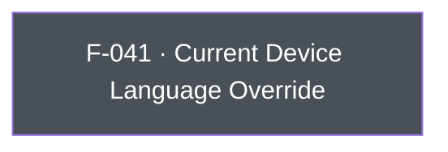

## Business Purpose
AppsFlyer's attribution and in-app-event reporting includes the device's language/locale as a dimension used for reporting and, for some integrated partners, for postback enrichment. Apps that manage their own in-app localization independently of the OS locale (e.g. a language switcher that doesn't change `NSLocale`) need a way to tell AppsFlyer which language the user is actually seeing, rather than relying on the OS-reported value. `setCurrentDeviceLanguage` provides that override. Without it, AppsFlyer would only ever see the OS-level device language, which can diverge from the language actually presented to the user and skew language-based reporting/segmentation.

---

## Trigger
Awaited by the host app whenever it needs to explicitly declare (or correct) the language reported to AppsFlyer — typically during startup configuration or right after an in-app language change.

---

## Call Chain
An awaitable RPC call over the single `executeRpc` entry point. Only iOS implements the method, but Dart does not gate it; on any other platform the RPC is still dispatched and the native "unknown method" answer surfaces as `AppsFlyerException`.

```
AppsFlyerSdk.setCurrentDeviceLanguage(language)                         [lib/src/appsflyer_sdk.dart]
  → off iOS: native RPC reports the method as unavailable → AppsFlyerException
  → _invokeVoidRpc('setCurrentDeviceLanguage', {'language': language})
    → _invokeRpc → MethodChannel('af-api').invokeMethod('executeRpc', {method, params})
      → iOS: AppsflyerSdkPlugin.dispatchRpc → AppsFlyerRPCBridge
        → AFRPCSimpleConfigHandler → sdk.currentDeviceLanguage = language
  → PlatformException is converted to AppsFlyerException
```

---

## Files
| File | Role |
|------|------|
| `lib/src/appsflyer_sdk.dart` | `setCurrentDeviceLanguage(String language)` — no Dart platform check; sends the `setCurrentDeviceLanguage` RPC with `{language}` |
| `ios/appsflyer_sdk/Sources/appsflyer_sdk/AppsflyerSdkPlugin.swift` | No per-method handler — the generic `executeRpc` → `dispatchRpc` forwards the JSON envelope to the `AppsFlyerRPC` bridge |

---

## Input / Output
| | |
|--|--|
| **Input** | `language` (`String`) — an IETF/ISO language code (e.g. `"en"`) forwarded as-is under the `language` param key; no format validation in Dart. |
| **Output** | `Future<void>` that completes after RPC validation and the synchronous native SDK property assignment. Validation or bridge failures throw `AppsFlyerException`; there is no native completion callback or timeout. On a non-iOS platform the call is still dispatched and completes with `AppsFlyerException` once the native RPC layer reports the method as unavailable. |

---

## Tests
`test/appsflyer_sdk_test.dart` — `maps every iOS-only API` asserts that `setCurrentDeviceLanguage('en')` dispatches RPC `setCurrentDeviceLanguage` with `{'language': 'en'}`. `platform-only calls are forwarded to the native RPC instead of being swallowed in Dart` calls `setCurrentDeviceLanguage('en')` on Android and asserts that the `setCurrentDeviceLanguage` RPC is dispatched there too.

---

## Known Limitations
- **iOS-only**: no Android implementation exists. Calling it on Android is not a no-op — the RPC is dispatched and the Android layer's "unknown method" answer surfaces to the calling code as `AppsFlyerException`, so the mismatch is visible to the caller rather than only in the device log.
- No validation of the `language` string (e.g. against a locale code list); malformed input is passed straight through to the underlying SDK.

---

## Dependencies

