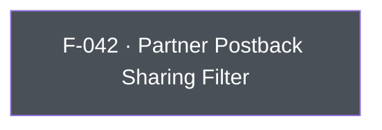

## Business Purpose
AppsFlyer forwards install/event data to integrated partner networks (ad networks, MMPs, analytics vendors) via server-to-server postbacks and API. Advertisers sometimes need to block that forwarding for specific partners or for all of them — to comply with GDPR/CCPA data-sharing restrictions, honor a user's opt-out choice, or enforce a business rule about which vendors may receive attribution data. `setSharingFilterForPartners` is the API surface for this; without it, the app would have no way to suppress third-party data sharing short of disabling the AppsFlyer SDK entirely via `stop()`, which would also break the advertiser's own attribution.

---

## Trigger
Called by the host app during startup configuration or in direct response to a user consent/opt-out event, whenever the set of partners allowed to receive S2S postback data needs to change.

---

## Call Chain
Generic RPC call over the single `executeRpc` entry point. (The legacy `setSharingFilter`/`setSharingFilterForAllPartners` Dart methods no longer exist — SDK 7 exposes only `setSharingFilterForPartners`.)
```
AppsflyerSdk.setSharingFilterForPartners(partners)                       [lib/src/appsflyer_sdk.dart]
  → _executeRpc('setSharingFilterForPartners', {'partners': partners})   // af-api → executeRpc
    → Android: dispatchRpc → AppsFlyerRpcHandler.execute("setSharingFilterForPartners") → SDK setSharingFilterForPartners
    → iOS: dispatchRpc → AppsFlyerRPCBridge executeJson("setSharingFilterForPartners") → SDK setSharingFilterForPartners:
```

---

## Files
| File | Role |
|------|------|
| `lib/src/appsflyer_sdk.dart` | `setSharingFilterForPartners(List<String> partners)` — sends the `setSharingFilterForPartners` RPC with `{partners}` |
| `android/src/main/java/com/appsflyer/appsflyersdk/AppsflyerSdkPlugin.java` | No per-method handler — the generic `executeRpc` → `dispatchRpc` forwards to the native RPC bridge |
| `ios/appsflyer_sdk/Sources/appsflyer_sdk/AppsflyerSdkPlugin.m` | No per-method handler — the generic `executeRpc` → `dispatchRpc` forwards to the native RPC bridge |

---

## Input / Output
| | |
|--|--|
| **Input** | `partners` (`List<String>`) — partner ID strings (e.g. `'facebook_int'`, `'googleadwords_int'`), or the literal `'all'` to block every partner. Sent under the `partners` param key. |
| **Output** | `void` — fire-and-forget; the `_executeRpc` Future is discarded. |

---

## Tests
`test/appsflyer_sdk_test.dart` — `setSharingFilterForPartners` asserts the RPC method is `setSharingFilterForPartners` and the `partners` param contains the given IDs.

---

## Known Limitations
- No validation in Dart or native code that partner ID strings are well-formed or recognized; typos silently fail to filter the intended partner.
- Fire-and-forget: no success/error is surfaced to Dart.

---

## Dependencies

