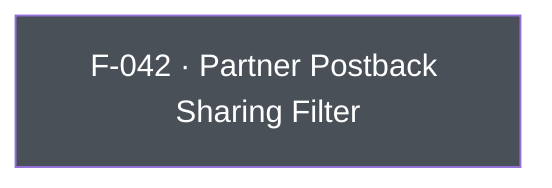

## Business Purpose
AppsFlyer forwards install/event data to integrated partner networks (ad networks, MMPs, analytics vendors) via server-to-server postbacks and API. Advertisers sometimes need to block that forwarding for specific partners or for all of them — to comply with GDPR/CCPA data-sharing restrictions, honor a user's opt-out choice, or enforce a business rule about which vendors may receive attribution data. `setSharingFilterForPartners` is the API surface for this; without it, the app would have no way to suppress third-party data sharing short of disabling the AppsFlyer SDK entirely via `stop()`, which would also break the advertiser's own attribution.

---

## Trigger
Called by the host app during startup configuration or in direct response to a user consent/opt-out event, whenever the set of partners allowed to receive S2S postback data needs to change.

---

## Call Chain
Awaitable RPC call over the single `executeRpc` entry point. (The legacy `setSharingFilter`/`setSharingFilterForAllPartners` Dart methods no longer exist — SDK 7 exposes only `setSharingFilterForPartners`.)

Clearing the filter — passing `null` or an empty list — is expressed on the wire as `partners: null`. Dart normalizes an empty list to `null` before dispatch so `null` and `[]` are interchangeable for callers. The plugin forwards every call to the native RPC layer and does not short-circuit clear requests in Dart.

```
AppsFlyerSdk.setSharingFilterForPartners(List<String>? partners)         [lib/src/appsflyer_sdk.dart]
  → empty list is normalized to null
  → _invokeVoidRpc('setSharingFilterForPartners', {'partners': partners})
    → _invokeNullableRpc → MethodChannel('af-api').invokeMethod('executeRpc', {method, params})
      → Android: dispatchRpc → AppsFlyerRpcHandler.execute("setSharingFilterForPartners") → SDK setSharingFilterForPartners
      → iOS: dispatchRpc → AppsFlyerRPCBridge executeJson("setSharingFilterForPartners") → SDK setSharingFilterForPartners:
  → PlatformException is converted to AppsFlyerException
```

On iOS, `null` clears the filter. On Android, the native SDK accepts a clear, but the current Android RPC request model rejects an empty partner list with validation error `422`; once that RPC-layer bug is fixed, the same Dart call will clear on Android without further plugin changes.

---

## Files
| File | Role |
|------|------|
| `lib/src/appsflyer_sdk.dart` | `Future<void> setSharingFilterForPartners(List<String>? partners)` — sends the `setSharingFilterForPartners` RPC with `{partners}` and normalizes an empty list to `null` |
| `android/src/main/kotlin/com/appsflyer/appsflyersdk/AppsflyerSdkPlugin.kt` | No per-method handler — the generic `executeRpc` → `dispatchRpc` forwards to the native RPC bridge |
| `ios/appsflyer_sdk/Sources/appsflyer_sdk/AppsflyerSdkPlugin.swift` | No per-method handler — the generic `executeRpc` → `dispatchRpc` forwards to the native RPC bridge |

---

## Input / Output
| | |
|--|--|
| **Input** | `partners` (`List<String>?`) — partner ID strings (e.g. `'facebook_int'`, `'googleadwords_int'`), or the literal `'all'` to block every partner. `null` or an empty list clears the filter; both are sent as `null` under the `partners` param key. |
| **Output** | `Future<void>` completes after native RPC validation and the synchronous SDK setter invocation. Validation or bridge failures throw `AppsFlyerException`; there is no native completion callback or timeout. A clear request on Android currently throws from the RPC bridge until the native validation fix lands. |

---

## Tests
`test/appsflyer_sdk_test.dart` → `'maps cross-platform configuration and identity APIs'` verifies that `setSharingFilterForPartners(['partner'])` dispatches RPC method `setSharingFilterForPartners` with `{'partners': ['partner']}`, and that both `null` and `[]` on iOS dispatch `{'partners': null}` — pinning the empty-to-null normalization. `'Android clear requests reach the native RPC layer'` verifies that both `null` and `[]` on Android dispatch `{'partners': null}` and surface the RPC bridge validation error as `AppsFlyerException`.

---

## Known Limitations
- Dart and the RPC request models do not verify that individual partner IDs are recognized. The native SDK can ignore or filter unsupported values without returning a per-ID result, so a typo is not observable through the completed Future.
- Clearing the filter on Android is blocked today by `SetSharingFilterForPartnersRequest` enforcing `require(partners.isNotEmpty())`, so the bridge rejects the only payload that expresses a clear. The native Android SDK's own `SharingFilter` does accept an empty set, so this is an RPC-layer gap rather than an SDK limitation. The plugin forwards the clear request so the failure is visible as `AppsFlyerException` instead of being swallowed in Dart.

---

## Dependencies

