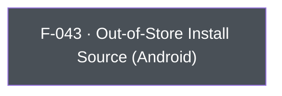

## Business Purpose
Android apps aren't limited to Google Play distribution — they can be side-loaded or distributed via third-party app stores (Facebook, Samsung Galaxy Store, Amazon Appstore, direct APK, etc.). Play Install Referrer, which AppsFlyer normally uses to attribute installs, isn't available for these channels. `setOutOfStore`/`getOutOfStore` let the app declare (and later read back) a custom install-source label so AppsFlyer can still attribute and report on installs that didn't come through Google Play. Without it, installs from alternative distribution channels would show up unattributed or misattributed in AppsFlyer reporting.

---

## Trigger
`setOutOfStore` is called by the host app during startup configuration, before or around SDK init, when the app is distributed through a channel other than Google Play. `getOutOfStore` is called on demand whenever the app (or its analytics layer) needs to read back the currently recorded out-of-store source label.

---

## Call Chain
Awaitable RPC calls over the single `executeRpc` entry point. Both Dart methods are Android-only: on any other platform the call is ignored with a logged warning and no RPC is dispatched — `setOutOfStore` simply returns, `getOutOfStore` returns `null`.
```
AppsFlyerSdk.setOutOfStore(String sourceName)                            [lib/src/appsflyer_sdk.dart]
  → not Android: log warning, return (no RPC dispatched)
  → _invokeVoidRpc('setOutOfStore', {'sourceName': sourceName})
    → _invokeRpc → MethodChannel('af-api').invokeMethod('executeRpc', {method, params})
      → Android: dispatchRpc → AppsFlyerRpcHandler.execute("setOutOfStore") → SDK setOutOfStore

AppsFlyerSdk.getOutOfStore()                                             [lib/src/appsflyer_sdk.dart]
  → not Android: log warning, return null (no RPC dispatched)
  → _invokeRpc<String>('getOutOfStore')
    → Android: dispatchRpc → AppsFlyerRpcHandler.execute("getOutOfStore") → SDK getOutOfStore
  → PlatformException is converted to AppsFlyerException
```

---

## Files
| File | Role |
|------|------|
| `lib/src/appsflyer_sdk.dart` | `Future<void> setOutOfStore(String sourceName)`, `Future<String?> getOutOfStore()` — Android-only via an Android platform check; send the `setOutOfStore`/`getOutOfStore` RPCs |
| `android/src/main/java/com/appsflyer/appsflyersdk/AppsflyerSdkPlugin.java` | No per-method handler — the generic `executeRpc` → `dispatchRpc` forwards to the native RPC bridge; `getOutOfStore`'s value is returned on the RPC reply |

---

## Input / Output
| | |
|--|--|
| **Input** | `setOutOfStore`: `sourceName` (String) — a custom install-source label (e.g. `"facebook_int"`), sent under the `sourceName` key. `getOutOfStore`: no input. |
| **Output** | `setOutOfStore`: `Future<void>` completing when the native request succeeds; `AppsFlyerException` on native errors or RPC timeouts. `getOutOfStore`: `Future<String?>` resolving to the previously-set source label, or `null` verbatim when the native SDK returns no value. Off Android neither method throws: `setOutOfStore` returns without dispatching an RPC and `getOutOfStore` logs a warning and returns `null`, so off-Android `null` also means "call ignored". |

---

## Tests
`test/appsflyer_sdk_test.dart` → `'maps every Android-only API'` verifies that `setOutOfStore('amazon')` dispatches RPC method `setOutOfStore` with `{'sourceName': 'amazon'}`. `'maps getters and native return values'` verifies that `getOutOfStore()` dispatches `getOutOfStore` and returns the mocked native value. Off-platform behavior is covered too: `'platform-only void calls are ignored without reaching the native RPC'` calls `setOutOfStore('source')` on iOS and asserts no RPC is dispatched, and `'platform-only value calls return a safe default off-platform'` asserts `getOutOfStore()` resolves to `null` on iOS with no RPC dispatched. The Dart harness cannot verify the native Android SDK read/write behavior.

---

## Known Limitations
- **Android-only**: no iOS implementation exists (out-of-store distribution is an Android-specific concern). Calling either Dart method on another platform is a no-op, but a logged one — the plugin emits a `debugPrint` warning and dispatches no RPC.
- `getOutOfStore()` cannot distinguish "never set" from "native returned nothing" — both surface as `null`, as does an off-Android call that was ignored.

---

## Dependencies

