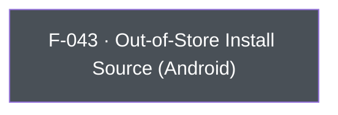

## Business Purpose
Android apps aren't limited to Google Play distribution — they can be side-loaded or distributed via third-party app stores (Facebook, Samsung Galaxy Store, Amazon Appstore, direct APK, etc.). Play Install Referrer, which AppsFlyer normally uses to attribute installs, isn't available for these channels. `setOutOfStore`/`getOutOfStore` let the app declare (and later read back) a custom install-source label so AppsFlyer can still attribute and report on installs that didn't come through Google Play. Without it, installs from alternative distribution channels would show up unattributed or misattributed in AppsFlyer reporting.

---

## Trigger
`setOutOfStore` is called by the host app during startup configuration, before or around SDK init, when the app is distributed through a channel other than Google Play. `getOutOfStore` is called on demand whenever the app (or its analytics layer) needs to read back the currently recorded out-of-store source label.

---

## Call Chain
Awaitable RPC calls over the single `executeRpc` entry point. Both methods are Android-only at the native RPC layer and route through `_invokeRpc` without a Dart guard.
```
AppsFlyerSdk.setOutOfStore(String sourceName)                            [lib/src/appsflyer_sdk.dart]
  → iOS: native RPC reports method not found → AppsFlyerException
  → _invokeVoidRpc('setOutOfStore', {'sourceName': sourceName})
    → _invokeRpc → MethodChannel('af-api').invokeMethod('executeRpc', {method, params})
      → Android: dispatchRpc → AppsFlyerRpcHandler.execute("setOutOfStore") → SDK setOutOfStore

AppsFlyerSdk.getOutOfStore()                                             [lib/src/appsflyer_sdk.dart]
  → _invokeNullableRpc<String?>('getOutOfStore')
    → Android: dispatchRpc → AppsFlyerRpcHandler.execute("getOutOfStore") → SDK getOutOfStore
    → iOS: native RPC reports method not found → AppsFlyerException (404)
  → PlatformException is converted to AppsFlyerException
```

---

## Files
| File | Role |
|------|------|
| `lib/src/appsflyer_sdk.dart` | `Future<void> setOutOfStore(String sourceName)`, `Future<String?> getOutOfStore()` — Android-only at the native RPC layer, with no Dart platform check; send the `setOutOfStore`/`getOutOfStore` RPCs |
| `android/src/main/kotlin/com/appsflyer/appsflyersdk/AppsflyerSdkPlugin.kt` | No per-method handler — the generic `executeRpc` → `dispatchRpc` forwards to the native RPC bridge; `getOutOfStore`'s value is returned on the RPC reply |

---

## Input / Output
| | |
|--|--|
| **Input** | `setOutOfStore`: non-empty `sourceName` (`String`) such as `"amazon"`, sent under the `sourceName` key. Android RPC rejects an empty string and the native SDK stores the value lowercased. `getOutOfStore`: no input. |
| **Output** | `setOutOfStore`: `Future<void>` completing after RPC validation and synchronous SDK invocation, with no callback or timeout. `getOutOfStore`: `Future<String?>` resolving to the native stored value, or `null` when none exists. Bridge/validation failures surface as `AppsFlyerException`. Off Android, both throw `AppsFlyerException` when the native RPC layer reports the method as unavailable. |

---

## Tests
`test/appsflyer_sdk_test.dart` → `'maps every Android-only API'` verifies that `setOutOfStore('amazon')` dispatches RPC method `setOutOfStore` with `{'sourceName': 'amazon'}`. `'maps getters and native return values'` verifies that `getOutOfStore()` dispatches `getOutOfStore` and returns the mocked native value. Off-platform behavior is covered too: `'platform-only calls are forwarded to the native RPC instead of being swallowed in Dart'` calls `setOutOfStore('source')` on iOS and asserts the RPC is dispatched there as well, and `'platform-only getters surface the native method-not-found error'` asserts `getOutOfStore()` throws `AppsFlyerException` with code `404` on iOS. The Dart harness cannot verify the native Android SDK read/write behavior.

---

## Known Limitations
- **Android-only**: no iOS implementation exists (out-of-store distribution is an Android-specific concern). On another platform both methods throw `AppsFlyerException` once the native RPC layer reports the method as unavailable, so a cross-platform call site must branch on `Platform.isAndroid` or catch the exception.
- `getOutOfStore()` cannot distinguish "never set" from "native returned nothing" on Android — both surface as `null`.
- The Android SDK normalizes the stored source name to lowercase; `getOutOfStore()` can therefore return a different casing from the input.

---

## Dependencies

