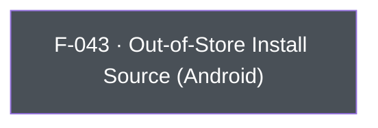

## Business Purpose
Android apps aren't limited to Google Play distribution — they can be side-loaded or distributed via third-party app stores (Facebook, Samsung Galaxy Store, Amazon Appstore, direct APK, etc.). Play Install Referrer, which AppsFlyer normally uses to attribute installs, isn't available for these channels. `setOutOfStore`/`getOutOfStore` let the app declare (and later read back) a custom install-source label so AppsFlyer can still attribute and report on installs that didn't come through Google Play. Without it, installs from alternative distribution channels would show up unattributed or misattributed in AppsFlyer reporting.

---

## Trigger
`setOutOfStore` is called by the host app during startup configuration, before or around SDK init, when the app is distributed through a channel other than Google Play. `getOutOfStore` is called on demand whenever the app (or its analytics layer) needs to read back the currently recorded out-of-store source label.

---

## Call Chain
Generic RPC calls over the single `executeRpc` entry point. Both Dart methods are Android-guarded (`Platform.isAndroid`); on iOS `setOutOfStore` is a no-op and `getOutOfStore` returns `null` without sending an RPC.
```
AppsflyerSdk.setOutOfStore(sourceName)                                   [lib/src/appsflyer_sdk.dart]
  → if (Platform.isAndroid) _executeRpc('setOutOfStore', {'sourceName': sourceName})   // af-api → executeRpc
    → Android: dispatchRpc → AppsFlyerRpcHandler.execute("setOutOfStore") → SDK setOutOfStore

AppsflyerSdk.getOutOfStore()                                             [lib/src/appsflyer_sdk.dart]
  → if (Platform.isAndroid) _executeRpc<String>('getOutOfStore')   // af-api → executeRpc; else returns null
    → Android: dispatchRpc → AppsFlyerRpcHandler.execute("getOutOfStore") → SDK getOutOfStore
```

---

## Files
| File | Role |
|------|------|
| `lib/src/appsflyer_sdk.dart` | `setOutOfStore(String sourceName)`, `getOutOfStore()` — Android-guarded; send the `setOutOfStore`/`getOutOfStore` RPCs |
| `android/src/main/java/com/appsflyer/appsflyersdk/AppsflyerSdkPlugin.java` | No per-method handler — the generic `executeRpc` → `dispatchRpc` forwards to the native RPC bridge; `getOutOfStore`'s value is returned on the RPC reply |

---

## Input / Output
| | |
|--|--|
| **Input** | `setOutOfStore`: `sourceName` (String) — a custom install-source label (e.g. `"facebook_int"`), sent under the `sourceName` key. `getOutOfStore`: no input. |
| **Output** | `setOutOfStore`: `void`, fire-and-forget. `getOutOfStore`: `Future<String?>` resolving to the previously-set source label (or `null` on iOS / when never set). |

---

## Tests
`test/appsflyer_sdk_test.dart` — `check setOutOfStore call` and `check getOutOfStore call` assert the mocked `af-api` channel receives the corresponding `executeRpc` calls. The Dart harness cannot verify the native Android SDK read/write behavior.

---

## Known Limitations
- **Android-only**: no iOS implementation exists (out-of-store distribution is an Android-specific concern). The Dart API is guarded by `Platform.isAndroid`, so on iOS `setOutOfStore` is a silent no-op and `getOutOfStore` returns `null` without dispatching an RPC.
- Fire-and-forget: `setOutOfStore` surfaces no success/error to Dart.

---

## Dependencies

