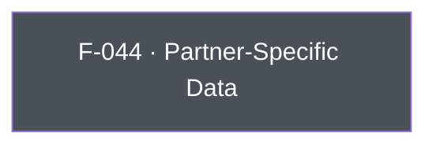

## Business Purpose
Some AppsFlyer-integrated partner networks accept custom, partner-defined fields alongside standard attribution data (e.g. a partner's own user ID, campaign metadata, or other identifiers that only that partner's integration understands). `setPartnerData` lets the host app attach an arbitrary key/value payload to a named partner integration so it gets forwarded on postbacks to that specific partner. Without it, the app would have no way to enrich a specific partner's data beyond the standard AppsFlyer event/attribution schema, limiting partner-side matching, deduplication, or reporting that depends on partner-specific fields.

---

## Trigger
Called by the host app whenever it needs to associate custom data with a named partner integration — typically during startup configuration or when the relevant partner-specific identifiers become available at runtime.

---

## Call Chain
Generic RPC call over the single `executeRpc` entry point.
```
AppsflyerSdk.setPartnerData(partnerId, partnerData)                      [lib/src/appsflyer_sdk.dart]
  → _executeRpc('setPartnerData', {'partnerId': partnerId, 'data': partnerData})   // af-api → executeRpc
    → Android: dispatchRpc → AppsFlyerRpcHandler.execute("setPartnerData") → SDK setPartnerData(partnerId, data)
    → iOS: dispatchRpc → AppsFlyerRPCBridge executeJson("setPartnerData") → SDK setPartnerDataWithPartnerId:partnerInfo:
```

---

## Files
| File | Role |
|------|------|
| `lib/src/appsflyer_sdk.dart` | `setPartnerData(String partnerId, Map<String, Object> partnerData)` — sends the `setPartnerData` RPC with `{partnerId, data}` |
| `android/src/main/java/com/appsflyer/appsflyersdk/AppsflyerSdkPlugin.java` | No per-method handler — the generic `executeRpc` → `dispatchRpc` forwards to the native RPC bridge |
| `ios/appsflyer_sdk/Sources/appsflyer_sdk/AppsflyerSdkPlugin.m` | No per-method handler — the generic `executeRpc` → `dispatchRpc` forwards to the native RPC bridge |

---

## Input / Output
| | |
|--|--|
| **Input** | `partnerId` (String) — the AppsFlyer partner integration identifier. `partnerData` (`Map<String, Object>`, non-nullable) — arbitrary key/value payload, sent under the `data` param key. |
| **Output** | `void` — fire-and-forget; the `_executeRpc` Future is discarded. |

---

## Tests
`test/appsflyer_sdk_test.dart` — `setPartnerData uses SDK 7 data key` asserts the `setPartnerData` RPC carries `partnerId` and the payload under the `data` key.

---

## Known Limitations
- No validation that `partnerId` corresponds to an actual integrated/configured partner — an unrecognized ID silently has no effect (the data is simply never forwarded by that partner's integration).
- No schema/type validation on the contents of `partnerData` — arbitrary object values are passed through the RPC as-is, so type mismatches would only surface as native-side runtime issues.
- Fire-and-forget: no success/error is surfaced to Dart.

---

## Dependencies

