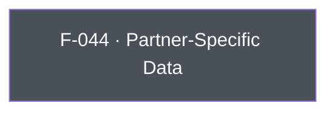

## Business Purpose
Some AppsFlyer-integrated partner networks accept custom, partner-defined fields alongside standard attribution data (e.g. a partner's own user ID, campaign metadata, or other identifiers that only that partner's integration understands). `setPartnerData` lets the host app attach an arbitrary key/value payload to a named partner integration so it gets forwarded on postbacks to that specific partner. Without it, the app would have no way to enrich a specific partner's data beyond the standard AppsFlyer event/attribution schema, limiting partner-side matching, deduplication, or reporting that depends on partner-specific fields.

---

## Trigger
Called by the host app whenever it needs to associate custom data with a named partner integration — typically during startup configuration or when the relevant partner-specific identifiers become available at runtime.

---

## Call Chain
Awaitable RPC call over the single `executeRpc` entry point.
```
AppsFlyerSdk.setPartnerData(String partnerId, Map<String, dynamic> data) [lib/src/appsflyer_sdk.dart]
  → _invokeVoidRpc('setPartnerData', {'partnerId': partnerId, 'data': data})
    → _invokeRpc → MethodChannel('af-api').invokeMethod('executeRpc', {method, params})
      → Android: dispatchRpc → AppsFlyerRpcHandler.execute("setPartnerData") → SDK setPartnerData(partnerId, data)
      → iOS: dispatchRpc → AppsFlyerRPCBridge executeJson("setPartnerData") → SDK setPartnerDataWithPartnerId:partnerInfo:
  → PlatformException is converted to AppsFlyerException
```

---

## Files
| File | Role |
|------|------|
| `lib/src/appsflyer_sdk.dart` | `Future<void> setPartnerData(String partnerId, Map<String, dynamic> data)` — sends the `setPartnerData` RPC with `{partnerId, data}` |
| `android/src/main/kotlin/com/appsflyer/appsflyersdk/AppsflyerSdkPlugin.kt` | No per-method handler — the generic `executeRpc` → `dispatchRpc` forwards to the native RPC bridge |
| `ios/appsflyer_sdk/Sources/appsflyer_sdk/AppsflyerSdkPlugin.swift` | No per-method handler — the generic `executeRpc` → `dispatchRpc` forwards to the native RPC bridge |

---

## Input / Output
| | |
|--|--|
| **Input** | `partnerId` (`String`) — the AppsFlyer partner integration identifier; both native RPC parsers require it to be non-empty. `data` (`Map<String, dynamic>`, non-nullable) — arbitrary key/value payload, sent under the `data` param key. |
| **Output** | `Future<void>` completes after native RPC validation and the synchronous SDK setter invocation. Validation or bridge failures throw `AppsFlyerException`; there is no native completion callback or timeout. |

---

## Tests
`test/appsflyer_sdk_test.dart` → `'maps cross-platform configuration and identity APIs'` verifies that `setPartnerData('partner', {'key': 'value'})` dispatches RPC method `setPartnerData` with `{'partnerId': 'partner', 'data': {'key': 'value'}}`.

---

## Known Limitations
- No validation that `partnerId` corresponds to an actual integrated/configured partner — an unrecognized ID silently has no effect (the data is simply never forwarded by that partner's integration). The awaited `Future` still completes successfully in that case.
- No schema/type validation on the contents of `data` — arbitrary values are passed through the RPC as-is, so type mismatches surface only as native-side RPC errors.

---

## Dependencies

