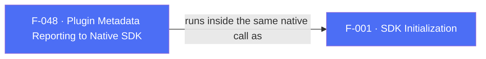

## Business Purpose
AppsFlyer maintains several wrapper SDKs on top of its native Android and iOS SDKs (Flutter, React Native, Cordova, Unity). The `setPluginInfo` RPC tells the native SDK that this install runs through the Flutter plugin at a specific version, so AppsFlyer's backend, support tooling, and internal dashboards can attribute traffic and bugs to the correct wrapper and version instead of treating every install as a bare native integration. It does not affect attribution logic or app behavior — it is an internal identification tag with no host-app-facing API.

---

## Trigger
Runs automatically as the first step of the native `init` orchestration on both platforms, so it is reported once per `AppsFlyerSdk.init` call. No public Dart parameter, option, or flag controls or disables it.

---

## Call Chain
`setPluginInfo` is dispatched natively, ahead of native initialization, so the plugin name and version reach the first session payload. It is not part of the `init` outcome on either platform.

```
AppsFlyerSdk.init(devKey: ..., appId: ...)                            [lib/src/appsflyer_sdk.dart]
  → _invokeVoidRpc('init', {devKey, appId?})
    → MethodChannel('af-api').invokeMethod('executeRpc', {method: 'init', params})
      → Android: AppsflyerSdkPlugin.initFromRpc                       [android/.../AppsflyerSdkPlugin.kt]
        → executeRpcSync('setPluginInfo', {plugin: "flutter", pluginVersion: PLUGIN_VERSION})
        → executeRpcSync('init', {devKey})
      → iOS: AppsflyerSdkPlugin initFromRpc:result:                   [ios/.../AppsflyerSdkPlugin.swift]
        → setPluginInfo {plugin: "flutter", pluginVersion: kAppsFlyerPluginVersion}
        → then an ordered sequence in its completion:
          → initialize {devKey, appId}
  → the setPluginInfo outcome is ignored on both platforms; only an initialize failure
    surfaces to Dart as an AppsFlyerException
```

Both platforms send `flutter` as the plugin name. The Android RPC resolver also accepts legacy `android_flutter` by stripping the `android_` prefix, but this plugin reports the short form on both sides.

---

## Files
| File | Role |
|------|------|
| `lib/src/appsflyer_sdk.dart` | `init()` — the Dart entry point whose native orchestration reports the metadata; `String get pluginVersion` exposes the Dart-side constant to the host app |
| `lib/src/appsflyer_constants.dart` | `PLUGIN_VERSION = "7.0.2"` returned by `pluginVersion` |
| `android/src/main/kotlin/com/appsflyer/appsflyersdk/AppsflyerSdkPlugin.kt` | `initFromRpc(...)` — dispatches the `setPluginInfo` RPC with `{plugin: AF_PLUGIN_NAME, pluginVersion: PLUGIN_VERSION}` before the `init` RPC, ignoring its result |
| `android/src/main/kotlin/com/appsflyer/appsflyersdk/AppsFlyerConstants.kt` | `AF_PLUGIN_NAME = "flutter"`, `PLUGIN_VERSION`, `RPC_METHOD_SET_PLUGIN_INFO` — the values reported to the native SDK |
| `ios/appsflyer_sdk/Sources/appsflyer_sdk/AppsflyerSdkPlugin.swift` | Dispatches the `setPluginInfo` RPC to the RPC bridge and runs the ordered init sequence from its completion, regardless of the outcome |
| `ios/appsflyer_sdk/Sources/appsflyer_sdk/AppsflyerSdkPlugin.swift` (constant) | `kAppsFlyerPluginVersion` — the version reported on iOS; a file-private Swift constant since the migration to Swift removed the public header that previously `#define`d it |

The plugin does not construct the native `PluginInfo`/`AFSDKPluginFlutter` types directly. It passes `plugin` and `pluginVersion` as RPC params, and the `AppsFlyerRpcHandler`/`AppsFlyerRPCBridge` maps them to the native SDK's `setPluginInfo` call.

---

## Input / Output
| | |
|--|--|
| **Input** | None from the host app — no Dart parameter exists. The reported values (`plugin: "flutter"` on both platforms, plus the native `PLUGIN_VERSION`/`kAppsFlyerPluginVersion` constant) are fixed in the plugin's source. |
| **Output** | Nothing is returned to Dart for this step. A `setPluginInfo` failure would only cost the integration label in reporting, so both platforms ignore its outcome and continue initializing; `init()` still succeeds. The metadata itself is transmitted by the native SDK as part of its own request payloads. |

---

## Tests
No dedicated test found. The RPC is dispatched inside the native init orchestration and is not a distinct Dart method, so it cannot be observed through `test/appsflyer_sdk_test.dart`'s mocked `af-api` channel: the init tests (`init sends the iOS initialization parameters`, `init does not send appId to Android`, `init allows Android without appId`) only see the single `executeRpc` invocation for `init`.

---

## Known Limitations
- The reported plugin version is a per-platform constant, currently aligned at `"7.0.2"` (Dart `_AppsFlyerConstants.PLUGIN_VERSION`, Android `PLUGIN_VERSION` in `AppsFlyerConstants.kt`, iOS `kAppsFlyerPluginVersion`). There is no single source of truth tying the three to each other or to `pubspec.yaml`; the `rc-release.yml` and `promote-release.yml` workflows rewrite all three during a release, so drift is only possible if a version is edited by hand.
- A `setPluginInfo` failure is not expected with the current fixed `"flutter"` value, which maps to `Plugin.FLUTTER`, but neither platform inspects the result. A future mapping or serialization regression would therefore be silent and would remove only the integration metadata, not fail `init()`.
- The Dart `pluginVersion` getter reads the Dart constant only. It reports what Dart believes the version is, not what the native side actually sent, so a drifted native constant would go unnoticed.
- No public Dart API exists to inspect, override, or disable the reported metadata; it always fires as part of init.
- The RPC is dispatched on every `init` call with no guard against reporting the metadata more than once if the app re-initializes.

---

## Dependencies

