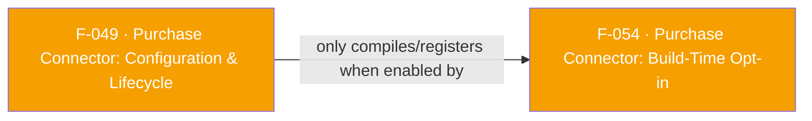

## Business Purpose
Apps that sell subscriptions or in-app purchases need AppsFlyer to automatically detect and validate those transactions server-side (ROI360 revenue measurement) instead of the app manually calling `logEvent` for every purchase. This feature is the on/off switch and settings panel for that automation: it creates the native `PurchaseConnector`/`PurchaseClient` singleton with the app's chosen options (log subscriptions, log in-apps, sandbox mode, StoreKit version on iOS) and then starts or stops the listener that watches the Play Billing Library / StoreKit transaction stream. Without it, no automatic purchase/subscription revenue would ever reach AppsFlyer — the app would be limited to manual event logging, losing ROI360 in-app revenue measurement entirely. It is also the foundational dependency for every other Purchase Connector capability (validation-result listeners, iOS combined callback, StoreKit version selection) — none of them can do anything until this configuration/lifecycle step has run.

---

## Trigger
- **Configure**: runs once, the first time the app calls `PurchaseConnector(config: PurchaseConnectorConfiguration(...))` in Dart (factory constructor of `_PurchaseConnectorImpl`).
- **Start/Stop observing**: runs whenever the app explicitly calls `afPurchaseClient.startObservingTransactions()` / `.stopObservingTransactions()` — typically right after `AppsFlyerSdk.instance.start()` (per [`doc/purchase-connector.md`](../../doc/purchase-connector.md)), and `stopObservingTransactions()` right before the core SDK's `stop()` if the user opts out of tracking.

---

## Call Chain
```
PurchaseConnector(config: ...)  →  _PurchaseConnectorImpl factory                          [lib/src/purchase_connector/purchase_connector.dart]
  → _PurchaseConnectorImpl._internal() builds configMap {logSubscriptionPurchase, logInAppPurchase, sandbox, storeKitVersion}
    → _methodChannel.invokeMethod("configure", configMap)   (channel "af-purchase-connector")
      → Android (include-connector): AppsFlyerPurchaseConnector.onMethodCall("configure") → configure(call, result)  [android/src/main/include-connector/.../AppsFlyerPurchaseConnector.kt]
        → new ConnectorWrapper(ctx, logSubs, logInApps, sandbox, arsListener, viapListener)                          [android/src/main/include-connector/.../ConnectorWrapper.kt]
          → PurchaseClient.Builder(context, Store.GOOGLE).setSandbox(...).logSubscriptions(...).autoLogInApps(...).build()
      → iOS: PurchaseConnectorPlugin.methodCallHandler("configure") → configure(call:result:)                       [ios/PurchaseConnector/PurchaseConnectorPlugin.swift]
        → connector = PurchaseConnector.shared(); connector.autoLogPurchaseRevenue = options; connector.isSandbox = sandbox; connector.setStoreKitVersion(.SK1/.SK2)

afPurchaseClient.startObservingTransactions()
  → _methodChannel.invokeMethod("startObservingTransactions")
    → Android: connectorOperation → connectorWrapper.startObservingTransactions() → PurchaseClient.startObservingTransactions()
    → iOS: connectorOperation → connector.startObservingTransactions()  (re-applies logOptions first, per StoreKit docs)

afPurchaseClient.stopObservingTransactions()
  → _methodChannel.invokeMethod("stopObservingTransactions")
    → Android: connectorWrapper.stopObservingTransactions()
    → iOS: connector.stopObservingTransactions()

Flutter engine attach (no Dart call involved)
  → Android: AppsFlyerPurchaseConnector.onAttachedToEngine(binding) → replace any stale `EngineAttachment` for that binding under `attachmentsLock`, then `dispose()` the removed attachment outside the lock (`stopObservingTransactions` may block on Play Billing)

Flutter engine attach (iOS, no Dart call involved)
  → iOS: PurchaseConnectorPlugin.register(with:) → `setMethodCallHandler(nil)` on the previous channel, then install this registrar's channel and record it as owner

Flutter engine detach (no Dart call involved)
  → Android: AppsflyerSdkPlugin.onDetachedFromEngine → AppsFlyerPurchaseConnector.onDetachedFromEngine(binding) → EngineAttachment.dispose()
  → iOS: AppsflyerSdkPlugin.detachFromEngineForRegistrar: → PurchaseConnectorPlugin.tearDownForEngineDetach(registrar:)   [skipped unless that registrar still owns the channel]
    → connector.stopObservingTransactions(); purchaseRevenueDelegate = nil; connector = nil; method channel handler cleared
```

---

## Files
| File | Role |
|------|------|
| `lib/src/purchase_connector/purchase_connector.dart` | `PurchaseConnector` factory + `_PurchaseConnectorImpl`: builds config map, singleton guard, `startObservingTransactions()`/`stopObservingTransactions()` |
| `lib/src/purchase_connector/purchase_connector_configuration.dart` | `PurchaseConnectorConfiguration` — `logSubscriptions`, `logInApps`, `sandbox`, `storeKitVersion` |
| `lib/src/purchase_connector/store_kit_version.dart` | `StoreKitVersion` enum (SK1=0, SK2=1) with `value`/`fromValue` int mapping sent over the channel |
| `lib/src/appsflyer_constants.dart` | Channel name (`af-purchase-connector`) and argument key string constants |
| `android/src/main/include-connector/com/appsflyer/appsflyersdk/AppsFlyerPurchaseConnector.kt` | Android native method-channel handler: `configure`, `startObservingTransactions`, `stopObservingTransactions`; engine state keyed per `FlutterPluginBinding` for multi-engine add-to-app |
| `android/src/main/include-connector/com/appsflyer/appsflyersdk/ConnectorWrapper.kt` | Wraps `PurchaseClient.Builder` (Play Billing) and the two validation listeners |
| `ios/PurchaseConnector/PurchaseConnectorPlugin.swift` | iOS native method-channel handler: `configure`, `startObservingTransactions`, `stopObservingTransactions`; owns the `PurchaseConnector.shared()` singleton and releases it in `tearDownForEngineDetach(registrar:)` when its own engine detaches |

---

## Input / Output
| | |
|--|--|
| **Input** | `configure`: `logSubscriptionPurchase` (bool), `logInAppPurchase` (bool), `sandbox` (bool), `storeKitVersion` (int, iOS only: 0=SK1, 1=SK2). `startObservingTransactions`/`stopObservingTransactions`: no arguments. |
| **Output** | The Dart factory returns the singleton immediately; its native `configure` channel Future is not awaited. `startObservingTransactions()` and `stopObservingTransactions()` also return Dart `void` and do not await their channel Futures. Native success values are therefore not observable at the public Dart call site, and native `"401"` (already configured) / `"404"` (not configured) errors are not exposed as typed return values. |

---

## Tests
No dedicated test found. `test/appsflyer_sdk_test.dart` contains no references to `PurchaseConnector`, `configure`, `startObservingTransactions`, or `stopObservingTransactions` on either platform.

---

## Known Limitations
- Re-configuration is silently ignored, not rejected: on the Dart side, calling the `PurchaseConnector(config: ...)` factory again after the singleton already exists just logs `AppsflyerConstants.RE_CONFIGURE_ERROR_MSG` through the plugin's gated `_log` and returns the existing instance — and that log is suppressed in release builds unless `enableDebug(true)` was called, so the warning is normally invisible in production — the new config is dropped with no exception, which can mask an app bug where a second call believed it changed sandbox/logging settings. On the native side (Android/iOS) a second raw `configure` MethodChannel call does return an explicit `"401"` error, so Dart and native disagree on how loudly a re-configure attempt is reported.
- `startObservingTransactions`/`stopObservingTransactions` on the Dart side are fire-and-forget (`_methodChannel.invokeMethod(...)` result is not awaited or checked) — if native returns the `"404"` "not configured" error, the Dart caller never sees it.
- iOS StoreKit 2 selection silently falls back to StoreKit 1 on iOS < 15.0 (`PurchaseConnectorPlugin.configure`), with only a `print` statement — an app targeting iOS 15+ that assumed SK2 semantics on an older OS gets SK1 behavior with no error surfaced to Dart.
- `doc/purchase-connector.md` documents calling `startObservingTransactions` right after core [`start`](../../doc/getting-started.md#start) and `stopObservingTransactions` right before `stop()` as best practice, but nothing in code enforces or checks core-SDK start state — the ordering is a documentation convention only, not a code dependency.
- Entire feature is a no-op unless the app opted in at build time (see F-054); nothing in the Dart-only view (this file's code) tells the caller whether the native side is even present.
- iOS keeps one connector and one channel per process, so with several Flutter engines the last one to register owns both and earlier engines stop receiving validation callbacks — Android instead keys them per `FlutterPluginBinding`. Engine detach is ownership-checked on iOS, so a detaching engine no longer stops observation for a live one, but per-engine connectors remain Android-only.

---

## Dependencies

