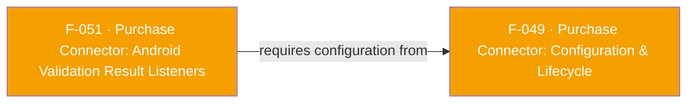

## Business Purpose
On Android, F-049's `startObservingTransactions()` makes the native purchase-connector library automatically send every subscription (ARS) and in-app purchase (VIAP) transaction to AppsFlyer's server for validation, but that validation happens out-of-band from the app's own code. `setSubscriptionValidationResultListener` and `setInAppValidationResultListener` are how the app finds out the outcome of that server round trip — a typed success/failure result per purchase — so it can, for example, gate premium content on a confirmed-valid purchase or log a diagnostic when validation fails. Without these listeners the app would have automatic revenue attribution but zero visibility into whether any individual purchase was actually validated.

---

## Trigger
- **Registration**: whenever the app calls `afPurchaseClient.setSubscriptionValidationResultListener(onResponse, onFailure)` / `setInAppValidationResultListener(onResponse, onFailure)`. This only stores the callbacks in Dart instance fields — no native call is made.
- **Delivery**: whenever Google Play Billing reports a subscription or in-app purchase transaction and the Android `purchase-connector` library finishes validating it against AppsFlyer's server (success, i.e. any 200/OK response including an invalid-purchase verdict, or failure, i.e. a network exception or non-200 response).

---

## Call Chain
Registration (Dart-only, no channel call):
```
afPurchaseClient.setSubscriptionValidationResultListener(onResponse, onFailure)   [lib/src/purchase_connector/purchase_connector.dart]
  → stores _arsOnResponse / _arsOnFailure
afPurchaseClient.setInAppValidationResultListener(onResponse, onFailure)
  → stores _viapOnResponse / _viapOnFailure
```

Reverse direction — native listener fires → data serialized → delivered to Dart:
```
Google Play Billing purchase event → PurchaseClient (Android purchase-connector lib) validates with AppsFlyer server
  → PurchaseClient.SubscriptionPurchaseValidationResultListener.onResponse/onFailure   (anonymous impl set in PurchaseClient.Builder)   [android/.../include-connector/ConnectorWrapper.kt]
    → result.mapValues { it.toJsonMap() } → arsListener.onResponse(...)  /  arsListener.onFailure(result, error)
      → arsListener (MappedValidationResultListener)  →  methodChannel.invokeMethodOnUI("SubscriptionPurchaseValidationResultListener:onResponse" / ":onFailure", data)   [android/.../include-connector/AppsFlyerPurchaseConnector.kt]
        → Dart _methodCallHandler(call)  [lib/src/purchase_connector/purchase_connector.dart]
          → _handleSubscriptionPurchaseValidationResultListenerOnResponse/OnFailure
            → SubscriptionValidationResultMap.fromJson(...) / JVMThrowable.fromJson(...) → _arsOnResponse!(...) / _arsOnFailure!(...)
```
The in-app path is identical, via `viapListener` → `InAppValidationResultListener:onResponse`/`:onFailure` → `_handleInAppValidationResultListenerOnResponse`/`OnFailure` → `_viapOnResponse`/`_viapOnFailure`.

---

## Files
| File | Role |
|------|------|
| `lib/src/purchase_connector/purchase_connector.dart` | `setSubscriptionValidationResultListener`/`setInAppValidationResultListener` setters; `_methodCallHandler` routing; `_handle*` parse-and-dispatch methods |
| `lib/src/purchase_connector/connector_callbacks.dart` | `OnResponse<T>` / `OnFailure` typedefs |
| `lib/src/purchase_connector/models/subscription_validation_result.dart` | `SubscriptionValidationResult(success, subscriptionPurchase, failureData)` + `SubscriptionValidationResultMap` wrapper |
| `lib/src/purchase_connector/models/in_app_purchase_validation_result.dart` | `InAppPurchaseValidationResult(success, productPurchase, failureData)` + `InAppPurchaseValidationResultMap` wrapper |
| `lib/src/purchase_connector/models/validation_failure_data.dart` | `ValidationFailureData(status, description)` |
| `lib/src/purchase_connector/models/jvm_throwable.dart` | `JVMThrowable(type, message, stacktrace, cause)` — models a JVM `Throwable`; Android/JVM-specific concept |
| `lib/src/appsflyer_constants.dart` | Method-name string constants for the four callback events |
| `android/src/main/include-connector/com/appsflyer/appsflyersdk/AppsFlyerPurchaseConnector.kt` | `arsListener`/`viapListener` (`MappedValidationResultListener`), `invokeMethodOnUI` bridging to Dart |
| `android/src/main/include-connector/com/appsflyer/appsflyersdk/ConnectorWrapper.kt` | Wires `PurchaseClient.Builder`'s validation listeners to `arsListener`/`viapListener`; `toJsonMap()`/`Throwable.toMap()` converters |

---

## Input / Output
| | |
|--|--|
| **Input** | `onResponse: Function(Map<String, T>? result)` where `T` is `SubscriptionValidationResult` or `InAppPurchaseValidationResult`; `onFailure: Function(String result, JVMThrowable? error)`. Native payloads arrive as a JSON string (`JSONObject(args).toString()` on Kotlin, `jsonDecode(call.arguments)` on Dart). |
| **Output** | Invokes the app-supplied `onResponse`/`onFailure` with parsed Dart model instances. If no listener was registered when the event arrives, `_handleValidationResultListenerOnResponse`/`OnFailure` silently drop it (no buffering/replay). |

---

## Tests
No dedicated test found. Grepping `test/` for `PurchaseConnector`, `SubscriptionValidationResult`, `InAppPurchaseValidationResult`, or `JVMThrowable` returns no matches.

---

## Known Limitations
- **Separator contract (fixed as CR-075)**: the Dart method-name constants in `lib/src/appsflyer_constants.dart` and the strings `AppsFlyerPurchaseConnector.kt` invokes over the channel now both use a `:` separator (`"SubscriptionPurchaseValidationResultListener:onResponse"`/`":onFailure"`, `"InAppValidationResultListener:onResponse"`/`":onFailure"`), so `_methodCallHandler`'s `switch` matches and delivery works. A prior `#` separator on the Dart side silently broke delivery (Dart matched nothing Kotlin sent); this was corrected under CR-075. Both sides must be kept in lock-step — changing the separator on only one side would re-break delivery. The Dart `default` case now logs via `debugPrint` instead of throwing, so a future mismatch fails silently rather than crashing.
- No listener exists on iOS for these two method names — they are only ever invoked from Android's `AppsFlyerPurchaseConnector.kt`. Calling either setter on iOS compiles and stores the handler but it will never fire (see F-052 for the iOS equivalent).
- `JVMThrowable` models a JVM stack trace as a single joined string plus a recursively nested `cause` — a concept meaningless outside this Android validation-result path.
- Android's Purchase Connector source (`AppsFlyerPurchaseConnector.kt`, `ConnectorWrapper.kt`) only compiles when `appsflyer.enable_purchase_connector=true` in `gradle.properties` (Gradle selects the `include-connector` vs `exclude-connector` source set). If not opted in, the `exclude-connector` stub `AppsFlyerPurchaseConnector` object has no method-channel handler at all, and these listeners never receive anything even though the Dart setters succeed silently (see F-054).

---

## Dependencies

