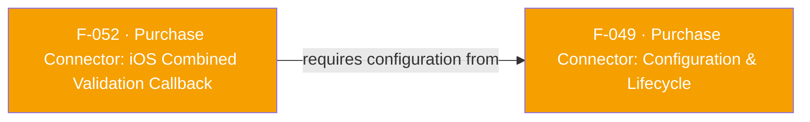

## Business Purpose
On iOS, once F-049's `startObservingTransactions()` is active, the native `PurchaseConnector` SDK automatically sends every StoreKit transaction (subscription or in-app purchase) to AppsFlyer's server for revenue validation. `setDidReceivePurchaseRevenueValidationInfo` is the app's only window into that outcome on iOS — a single combined callback carrying the raw validation info and/or an error. Without it, revenue would still be attributed automatically, but the app would have no way to confirm a given purchase was validated (e.g. to gate premium content unlock, or to log/alert on validation failures).

---

## Trigger
- **Registration**: whenever the app calls `afPurchaseClient.setDidReceivePurchaseRevenueValidationInfo(callback)` — stores the callback in a Dart instance field, no native call is made.
- **Delivery**: whenever the native iOS `PurchaseConnector`'s StoreKit transaction observer (active once F-049's `startObservingTransactions` has run and the delegate was assigned during F-049's `configure`) finishes validating a transaction's revenue with AppsFlyer's server, success or failure.

---

## Call Chain
Registration (Dart-only, no channel call):
```
afPurchaseClient.setDidReceivePurchaseRevenueValidationInfo(callback)   [lib/src/purchase_connector/purchase_connector.dart]
  → stores _didReceivePurchaseRevenueValidationInfo
```

Reverse direction — native delegate fires → data serialized → delivered to Dart:
```
StoreKit transaction observed (via F-049 startObservingTransactions)
  → native PurchaseConnector iOS SDK validates revenue with AppsFlyer server
    → PurchaseConnectorPlugin.didReceivePurchaseRevenueValidationInfo(_:error:)   [ios/PurchaseConnector/PurchaseConnectorPlugin.swift]
      (delegate conformance to `PurchaseRevenueDelegate`; `connector.purchaseRevenueDelegate = self` assigned during F-049's `configure`)
      → resMap = ["validationInfo": validationInfo, "error": error?.asDictionary]
        → DispatchQueue.main.async { methodChannel?.invokeMethod("didReceivePurchaseRevenueValidationInfo", arguments: resMap.toJSONString()) }
          → Dart _methodCallHandler(call)   [lib/src/purchase_connector/purchase_connector.dart]
            → case AppsflyerConstants.DID_RECEIVE_PURCHASE_REVENUE_VALIDATION_INFO
              → _handleDidReceivePurchaseRevenueValidationInfo(callMap)
                → validationInfo = callMap["validationInfo"] as Map<String, dynamic>?  (untyped, passed through as-is)
                  error = callMap["error"] != null ? IosError.fromJson(...) : null
                    → _didReceivePurchaseRevenueValidationInfo!(validationInfo, error)
```

---

## Files
| File | Role |
|------|------|
| `lib/src/purchase_connector/purchase_connector.dart` | `setDidReceivePurchaseRevenueValidationInfo` setter; `_handleDidReceivePurchaseRevenueValidationInfo` parse-and-dispatch |
| `lib/src/purchase_connector/connector_callbacks.dart` | `DidReceivePurchaseRevenueValidationInfo` typedef: `Function(Map<String,dynamic>? validationInfo, IosError? error)` |
| `lib/src/purchase_connector/models/ios_error.dart` | `IosError(localizedDescription, domain, code)` |
| `lib/src/appsflyer_constants.dart` | `DID_RECEIVE_PURCHASE_REVENUE_VALIDATION_INFO`, `VALIDATION_INFO`, `ERROR` key constants |
| `ios/PurchaseConnector/PurchaseConnectorPlugin.swift` | `PurchaseRevenueDelegate` conformance, `didReceivePurchaseRevenueValidationInfo`, `Error.asDictionary` extension, `Dictionary.toJSONString()` extension |

---

## Input / Output
| | |
|--|--|
| **Input** | `callback: DidReceivePurchaseRevenueValidationInfo = Function(Map<String, dynamic>? validationInfo, IosError? error)`. |
| **Output** | `validationInfo` is delivered as a raw, untyped `Map<String, dynamic>?` — there is no parsed Dart model for its shape (unlike Android's typed `SubscriptionValidationResult`/`InAppPurchaseValidationResult` in F-051). `error` is a typed `IosError` (`localizedDescription`, `domain`, `code`) populated from `NSError` when available, else `localizedDescription` only with `domain`/`code` absent from the map (Swift's `Error.asDictionary` only adds those keys for `NSError`). |

---

## Tests
No dedicated test found. Grepping `test/` for `setDidReceivePurchaseRevenueValidationInfo`, `didReceivePurchaseRevenueValidationInfo`, or `IosError` returns no matches.

---

## Known Limitations
- `validationInfo` is untyped (`Map<String, dynamic>?`) — callers must know the native `PurchaseRevenueDelegate` payload shape themselves; there is no equivalent of Android's `SubscriptionPurchase`/`ProductPurchase` models on the iOS side.
- One combined callback serves both subscriptions and in-app purchases with no discriminator field surfaced by the Dart API — the app must inspect `validationInfo`'s contents itself to tell them apart. Contrasts with Android's two separate typed listeners (F-051).
- `IosError` only captures `domain`/`code` when the underlying error is an `NSError`; a plain Swift `Error` yields `localizedDescription` only.
- No native counterpart exists on Android for this method name — the Dart setter compiles and stores the handler cross-platform, but it is only ever invoked from `PurchaseConnectorPlugin.swift`; on Android it never fires.
- Entire feature is a no-op unless the app opted into the Purchase Connector at build time (`$AppsFlyerPurchaseConnector = true` in the Podfile, gating the `PurchaseConnector` podspec subspec and its `ENABLE_PURCHASE_CONNECTOR=1` flag) — otherwise `ios/PurchaseConnector/PurchaseConnectorPlugin.swift` isn't compiled into the app at all (see F-054).

---

## Dependencies

