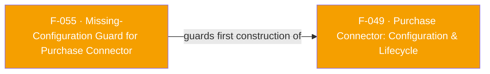

## Business Purpose
`PurchaseConnector` is a Dart-side singleton that must be seeded with a `PurchaseConnectorConfiguration` the first time it is created. Later observation and listener calls assume that configuration exists. If the first call is `PurchaseConnector()` with no config, this guard throws `MissingConfigurationException` immediately instead of leaving the native connector uninitialized. Configuration is supplied through `PurchaseConnector(config: ...)`; there is no public Dart `configure()` method, even though the current exception string incorrectly tells the caller to use one.

---

## Trigger
Runs synchronously inside the `_PurchaseConnectorImpl` factory constructor every time `PurchaseConnector({config})` is invoked. It throws specifically when `_instance == null && config == null` — i.e. no singleton has been created yet, and the caller did not supply a `PurchaseConnectorConfiguration` on this call either.

---

## Call Chain
```
PurchaseConnector({config})                                            [lib/src/purchase_connector/purchase_connector.dart]
  → factory _PurchaseConnectorImpl({config})
    → if (_instance == null && config == null)
      → throw MissingConfigurationException()                          [lib/src/purchase_connector/missing_configuration_exception.dart]
        (message defaults to AppsflyerConstants.MISSING_CONFIGURATION_EXCEPTION_MSG
         = "Configuration is missing. Call PurchaseConnector.configure() first.")
```
No native/method-channel hop — this guard is pure Dart and fires before any `MethodChannel` is even constructed.

---

## Files
| File | Role |
|------|------|
| `lib/src/purchase_connector/missing_configuration_exception.dart` | Defines `MissingConfigurationException implements Exception`, carrying a `message` field and a `toString()` override (`'ConfigurationException: $message'`) |
| `lib/src/purchase_connector/purchase_connector.dart` | `_PurchaseConnectorImpl` factory constructor — the sole place this exception is thrown (`if (_instance == null && config == null) throw MissingConfigurationException();`) |
| `lib/src/appsflyer_constants.dart` | `MISSING_CONFIGURATION_EXCEPTION_MSG` string constant used as the default message |

---

## Input / Output
| | |
|--|--|
| **Input** | Implicit: the current state of the static `_PurchaseConnectorImpl._instance` field (null or not) and whether the caller passed a non-null `config` argument to the `PurchaseConnector(...)` factory. |
| **Output** | A thrown `MissingConfigurationException` (uncaught by the plugin — propagates to the app's call site) whose `toString()` yields `"ConfigurationException: Configuration is missing. Call PurchaseConnector.configure() first."`. If the guard condition is false, output is instead a valid `_PurchaseConnectorImpl` instance (see F-049). |

---

## Tests
No dedicated test found. `test/appsflyer_sdk_test.dart` never imports or references `PurchaseConnector`, `_PurchaseConnectorImpl`, or `MissingConfigurationException`, so neither the throw path nor the singleton-reuse path is covered by CI.

---

## Known Limitations
- No test coverage — a future refactor of the singleton logic (e.g. changing the `_instance == null && config == null` condition) could silently stop throwing, or start throwing on valid calls, without any CI signal.
- The exception message text ("Call `PurchaseConnector.configure() first`") references a `configure()` method that does not exist in the Dart API — configuration is actually supplied via the `PurchaseConnector({config})` factory constructor itself, not a separate `configure()` call. This is a documentation/message mismatch that could mislead a developer debugging the exception (there is a native-side `"configure"` MethodChannel method name, but it is not a Dart-callable API).
- The guard only protects the *first* construction. Once any instance exists, subsequent calls to `PurchaseConnector(config: ...)` with a *different* config are not guarded at all — they are silently ignored (see F-049 Known Limitations), which is a related but distinct gap this feature does not cover.
- Because the check is purely on Dart-side static state (`_instance`), it has no knowledge of whether the native Purchase Connector was actually compiled into the build (see F-054). An app could pass a valid config and never hit this guard, yet still get a native `MissingPluginException` on the very next call if it never opted in at build time — this guard cannot detect or report that separate failure mode.

---

## Dependencies

