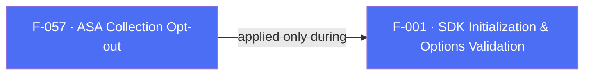

## Business Purpose
The native iOS SDK automatically queries Apple's Search Ads Attribution API (ASA) to enrich attribution data for installs originating from Apple Search Ads campaigns. Some apps — for privacy/compliance reasons, or because they don't run Apple Search Ads campaigns and want to avoid the extra API call/data collection — need to opt out of this automatic collection at init time. `disableCollectASA` is the init-time switch that turns it off before the SDK starts. A companion runtime iOS-only method, `disableAppleAdsAttribution(bool)`, dispatches the `setDisableAppleAdsAttribution` RPC; the iOS SDK needs **both** to fully suppress Apple Search Ads attribution.

---

## Trigger
`disableCollectASA` is set once by the host app as part of `AppsFlyerOptions` (or the raw options `Map`) passed to the `AppsflyerSdk` constructor, and applied during the `init` orchestration before the SDK starts. iOS only in effect — Apple Search Ads has no Android equivalent.

---

## Call Chain
```
AppsFlyerOptions(disableCollectASA: true)                              [lib/src/appsflyer_options.dart]
  → AppsflyerSdk.initSdk(...)                                          [lib/src/appsflyer_sdk.dart]
    → _validateAFOptions / _validateMapOptions
      → validatedOptions[DISABLE_COLLECT_ASA] = options.disableCollectASA   [copied when non-null, no Platform.isIOS guard]
      → _executeRpc('init', validatedOptions)
        → MethodChannel "af-api".invokeMethod('executeRpc', {method:'init', params})
          → iOS: AppsFlyerRPCBridge init orchestration applies disableCollectASA to the native SDK   [ios/.../AppsflyerSdkPlugin.m]
          → Android: the key is ignored (no Apple Search Ads equivalent)

# Runtime iOS-only companion
AppsflyerSdk.disableAppleAdsAttribution(disable)                       [lib/src/appsflyer_sdk.dart]
  → if (Platform.isIOS) _executeRpc('setDisableAppleAdsAttribution', {'disable': disable})
```

---

## Files
| File | Role |
|------|------|
| `lib/src/appsflyer_options.dart` | `AppsFlyerOptions.disableCollectASA` (`bool?`, optional named constructor param) |
| `lib/src/appsflyer_sdk.dart` | `_validateAFOptions` / `_validateMapOptions` — copies `disableCollectASA` into the validated options (no `Platform.isIOS` guard); `disableAppleAdsAttribution(bool)` runtime iOS-only method |
| `lib/src/appsflyer_constants.dart` | `DISABLE_COLLECT_ASA = "disableCollectASA"` — shared Dart↔native key |
| `ios/appsflyer_sdk/Sources/appsflyer_sdk/AppsflyerSdkPlugin.m` | Init orchestration applies `disableCollectASA`; RPC bridge forwards `setDisableAppleAdsAttribution` |
| `doc/installation-guide.md`, `doc/api-reference.md` | Document `disableCollectASA` as "Opt-out of the Apple Search Ads attributions" |

---

## Input / Output
| | |
|--|--|
| **Input** | `disableCollectASA` (`bool?`) via `AppsFlyerOptions` or the equivalent Map key, read at init time; plus the runtime iOS-only `disableAppleAdsAttribution(bool)`. |
| **Output** | `void` — applied to the native iOS SDK during init (and via the runtime RPC); no confirmation returned to Dart. On Android the init value is silently ignored and the runtime method is a no-op. |

---

## Tests
No dedicated test found. `test/appsflyer_sdk_test.dart`'s init test only asserts that the `init` RPC is dispatched; it does not construct `AppsFlyerOptions` with `disableCollectASA` set, nor assert the resulting params contain the key, nor exercise the iOS-only native path (Dart `flutter test` runs on the host OS, not `Platform.isIOS`).

---

## Known Limitations
- Android-side handling doesn't exist: Apple Search Ads is an Apple-only concept, so the Android bridge ignores the `disableCollectASA` init key and `disableAppleAdsAttribution` is a Dart no-op there. A host app setting `disableCollectASA: true` gets no feedback that it had no effect on Android.
- Dart-side validation copies `disableCollectASA` into the validated options unconditionally (not gated behind `Platform.isIOS` like `timeToWaitForATTUserAuthorization` and `appId` are) — inconsistent with how the same method gates other iOS-only fields.
- Fully suppressing ASA on iOS requires **both** `disableCollectASA` (init) and `disableAppleAdsAttribution(true)` (runtime).
- No getter exists to confirm whether ASA collection is currently disabled after init.

---

## Dependencies

